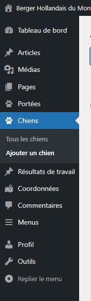
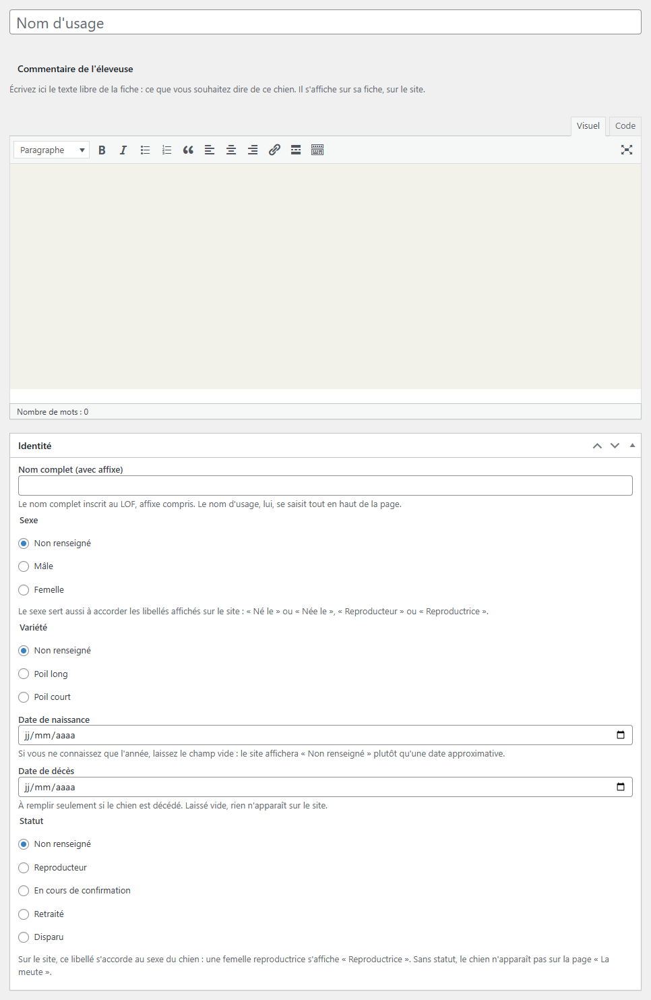
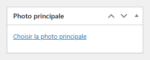
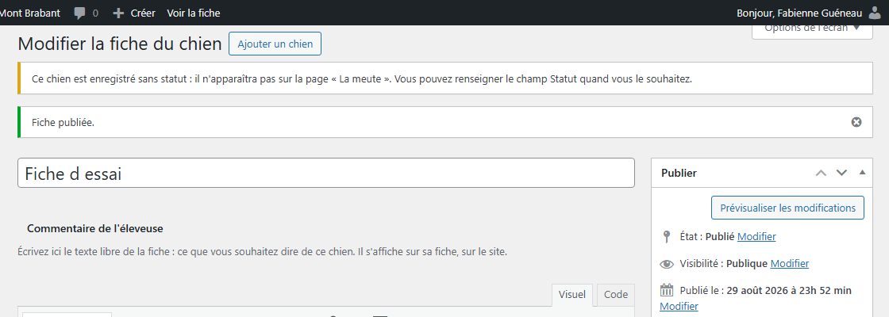
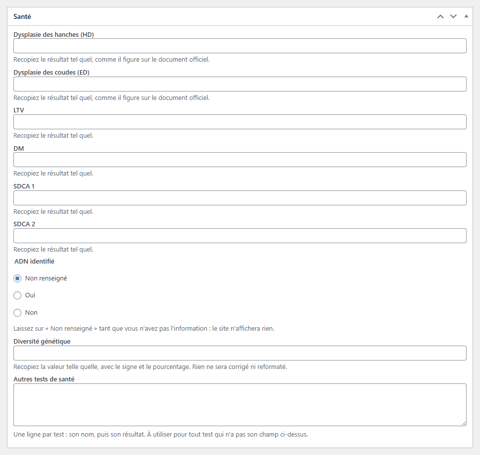
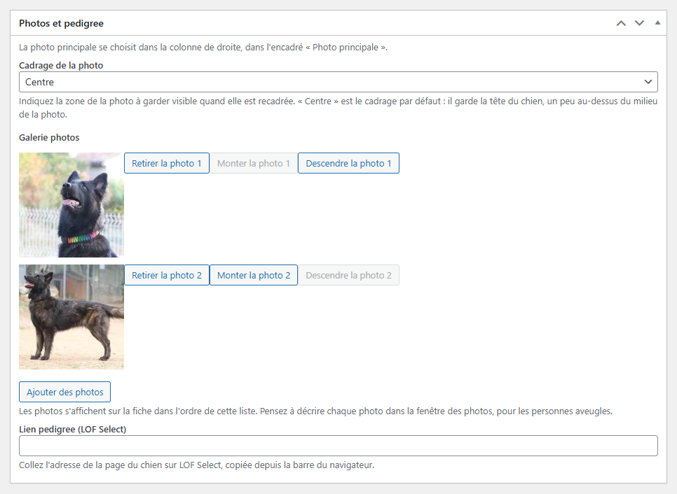

# Ajouter un chien

**Quand** : dès qu'un chien doit apparaître sur le site, ou dès que vous avez ses papiers sous la main.
**Temps** : 5 minutes pour l'essentiel. **Rattrapable** : oui. Tout se modifie ensuite, autant de fois
que vous voulez.

**Aucun champ n'est obligatoire.** Vous pouvez publier une fiche avec le seul nom du chien et la
compléter dans six mois. Un champ laissé vide affiche **Non renseigné** sur le site : jamais un tiret,
jamais un blanc, et jamais une valeur inventée à votre place.

---

## Les étapes

1. Dans le menu de gauche, cliquez sur **Chiens**, puis sur **Ajouter un chien**.

   

2. Tout en haut de la page, dans le grand champ, tapez le **Nom d'usage** du chien : son nom court,
   celui qui deviendra le titre de sa fiche.

3. Descendez dans la section **Identité** et remplissez ce que vous connaissez. Choisissez le
   **Statut** : c'est lui qui fait apparaître le chien sur la page **La meute**.

   

4. Continuez dans les sections suivantes — **Parents**, **Taille et robe**, **Santé**,
   **Titres et brevets**, **Photos et pedigree** — en remplissant seulement ce que vous avez sous la
   main. Le reste attendra.

5. Dans la colonne de droite, encadré **Photo principale**, cliquez sur
   **Choisir la photo principale** et prenez la photo qui représente le chien.

   

6. Cliquez sur **Publier**, en haut à droite.

7. Lisez le message qui s'affiche en haut de la page après l'enregistrement : c'est là que le site
   vous dit ce qui manque ou ce qui n'a pas été compris.

8. Cliquez sur **Voir la fiche** pour vérifier le résultat sur le site.

> Vous pouvez vous arrêter après l'étape 6 : la fiche existe, elle est en ligne, et vous la reprendrez
> quand vous voudrez en cliquant sur son nom dans **Tous les chiens**.

---

## Ce qui se met à jour tout seul

- La page **La meute** : le chien rejoint le groupe de son statut, à la bonne place, sans rien
  recopier.
- Les fiches des autres chiens : si vous avez choisi ce chien comme père ou comme mère ailleurs, le
  lien entre les deux fiches se fait tout seul.
- Les libellés du site s'accordent au sexe : *Reproductrice*, *Retraitée*, *Disparue*, *Née le*,
  *Décédée le*. **Vous n'avez jamais à corriger un accord à la main.**

---

## Section **Identité**

- **Nom complet (avec affixe)** — le nom inscrit au LOF, affixe compris (pour vos chiens :
  « du Mont Brabant »). Le nom court, lui, reste tout en haut de la page.
- **Sexe** — **Mâle** ou **Femelle**. Il sert aussi à accorder les libellés du site.
- **Variété** — **Poil long** ou **Poil court**.
- **Date de naissance** — écrivez la date en entier, sous la forme jj/mm/aaaa. **Si vous ne
  connaissez que l'année, laissez le champ vide.** Le site écrira **Non renseigné**, ce qui vaut
  mieux qu'une date approximative que quelqu'un recopiera. Si la date n'est pas comprise, un message
  vous le dit et **celle qui était déjà enregistrée est conservée** : vous ne perdez rien.
- **Date de décès** — à remplir seulement si le chien est décédé. Laissée vide, rien n'apparaît sur
  le site.
- **Statut** — quatre choix : **Reproducteur** · **En cours de confirmation** · **Retraité** ·
  **Disparu**, plus **Non renseigné**.

### Le statut, en deux phrases

Si vous laissez **Non renseigné**, **le chien n'apparaît pas sur la page La meute**. Vous n'avez pas à
le deviner : après l'enregistrement, un message vous prévient —
« Ce chien est enregistré sans statut : il n'apparaîtra pas sur la page « La meute ». Vous pouvez
renseigner le champ Statut quand vous le souhaitez. » Rouvrez la fiche, choisissez un statut,
cliquez sur **Mettre à jour**, c'est réglé.

Pour une femelle, le site écrit *Reproductrice*, *Retraitée*, *Disparue*. Vous choisissez le statut,
le site accorde.

---

## Section **Parents**

Pour le père comme pour la mère, deux façons de faire, au choix :

- **Le parent a déjà sa fiche sur le site** : choisissez-la dans la liste **Père** ou **Mère**. Le
  lien entre les deux fiches se fait tout seul. Une fiche encore en préparation est proposée elle
  aussi, suivie de son état — par exemple **— brouillon**. Vous pouvez la choisir : le nom du parent
  s'affichera, et le lien apparaîtra le jour où vous publierez sa fiche.
- **Le parent n'a pas de fiche** : laissez la liste sur **Non renseigné** et remplissez **Nom** et
  **Élevage** dans l'encadré **Père — étalon extérieur** ou **Mère — hors élevage**. Le parent
  s'affichera à la même place et de la même façon, simplement sans lien à cliquer.

Un chien ne peut pas être son propre père ni sa propre mère : il n'apparaît pas dans sa propre liste.

---

## Section **Taille et robe**

**Taille**, **Couleur**, **Masque**, **Génétique de robe** : recopiez la mention telle qu'elle figure
sur le document, avec son unité et sa ponctuation. Rien n'est corrigé, rien n'est mis en majuscules.

---

## Section **Santé**

Huit champs nommés : **Dysplasie des hanches (HD)** · **Dysplasie des coudes (ED)** · **LTV** ·
**DM** · **SDCA 1** · **SDCA 2** · **ADN identifié** · **Diversité génétique**.

**Recopiez chaque résultat exactement comme il figure sur le document officiel.** Le site ne vérifie
rien, ne corrige rien, ne reformate rien. **C'est voulu** : le site ne connaît pas les grilles
officielles, il ne se permet donc jamais de juger une valeur — c'est vous qui savez. Une valeur qui
commence par un chevron, comme celles de diversité génétique, passe sans dommage.

**ADN identifié** n'est pas une case à cocher : trois réponses possibles.

| Ce que vous choisissez | Ce que ça veut dire | Ce que le site affiche |
|---|---|---|
| **Oui** | le test a été fait, il est identifié | Oui |
| **Non** | le test dit non | Non |
| **Non renseigné** | vous n'avez pas encore l'information | Non renseigné |

« Non » et « Non renseigné » ne disent pas la même chose, et le site ne remplacera jamais le second
par le premier.

**Autres tests de santé** — une ligne par test : son nom, puis son résultat. C'est là que va tout test
qui n'a pas son champ nommé ci-dessus.

---

## Section **Titres et brevets**

**TC** · **CSAU** · **Cotation LOF** · **Confirmation** · **N° LOF** : là aussi, recopiez la mention
telle quelle, y compris la date et le lieu si le document les porte. Aucune vérification, aucune
correction automatique.

**Autres titres et brevets** — une ligne par titre.
**Les résultats d'exposition se notent ici**, pas dans **Résultats de travail**.

---

## Section **Photos et pedigree**

- **Photo principale** — se choisit dans la **colonne de droite**, encadré **Photo principale**.
  C'est la photo qui représente le chien partout sur le site.
- **Cadrage de la photo** — cinq choix : **Haut gauche** · **Haut** · **Centre** · **Haut droite** ·
  **Bas**, **Centre** par défaut. Il sert à choisir quelle partie de la photo reste visible quand elle
  est recadrée. Si le chien est dans le haut de l'image, choisissez **Haut** ; sinon, ne touchez à
  rien.
- **Galerie photos** — cliquez sur **Ajouter des photos**. La fenêtre **Photos de la galerie** s'ouvre
  sur l'onglet **Téléverser des fichiers** : cliquez sur l'onglet **Médiathèque**, juste à côté, pour
  voir les photos déjà présentes sur le site. Choisissez vos photos, puis cliquez sur
  **Ajouter à la galerie**, en bas à droite. Elles s'affichent sur la fiche dans l'ordre de la liste. Sous chaque
  photo, trois boutons : **Retirer la photo 1**, **Monter la photo 1**, **Descendre la photo 1**. Le
  numéro suit le rang de la photo : montez celle que vous voulez voir en premier.
- **Lien pedigree (LOF Select)** — collez l'adresse de la page du chien sur LOF Select, copiée depuis
  la barre du navigateur. C'est ce lien qui remplace un arbre généalogique sur le site : le visiteur y
  trouve l'ascendance complète.

### Décrire chaque photo

Dans la fenêtre des photos, cliquez sur une photo : la colonne de droite s'ouvre. Le premier des quatre
champs s'appelle **Description de la photo (pour les personnes aveugles)** — il vient avant **Titre**,
**Légende** et **Description**. C'est là, et nulle part ailleurs, que vous prenez trente secondes pour
écrire ce que montre la photo — le chien de profil dans l'herbe, la portée dans son parc. Ce texte
n'est pas affiché à l'écran : il est **lu à voix haute** aux personnes aveugles qui visitent le site,
et il s'affiche à la place de la photo quand celle-ci ne se charge pas. Une photo sans description est
une photo qui n'existe pas pour elles.

**N'écrivez pas dans le dernier des quatre**, celui qui s'appelle **Description** tout court, plus bas
dans la même colonne : il ne sert à rien ici. Deux champs de cette colonne commencent par le mot
« Description » — fiez-vous au rang, pas au nom.

*Si ce premier champ porte un jour un autre nom, dites-le-nous : rien ne sera cassé, mais nous voulons
le savoir. Écrivez votre description dedans en attendant, c'est bien le bon.*

---

## La zone **Commentaire de l'éleveuse**

Sous le nom d'usage, la grande zone de texte intitulée **Commentaire de l'éleveuse** : écrivez-y
librement ce que vous voulez dire de ce chien. C'est le seul endroit de la fiche où vous n'avez aucune
règle à suivre.

**Les photos ne s'ajoutent pas ici.** Elles ont leur place à elles, dans **Galerie photos** et dans
**Photo principale**. C'est ce qui leur donne le bon cadrage et la bonne taille partout sur le site,
sur un grand écran comme sur un téléphone — une photo posée au milieu d'un texte, elle, sortirait du
cadre.

**Votre texte n'est jamais perdu.** Le site garde les versions précédentes de ce commentaire : si
vous l'effacez par mégarde et que vous enregistrez, appelez-nous, il se récupère. Les autres champs
de la fiche, eux, ne sont pas gardés de cette façon — raison de plus pour ne jamais vider un champ
« pour voir ».

**Vous n'avez pas de couleur à choisir.** Votre texte prend tout seul la mise en forme du site :
mêmes lettres, mêmes couleurs, même allure que sur toutes les autres pages. C'est ce qui fait que le
site se tient d'un bout à l'autre, sans que vous ayez à y penser. Écrivez, mettez en gras ou en
italique si vous voulez, et laissez faire le reste.

---

## En cas de doute

**Ce que vous pouvez faire sans risque :**

- Publier une fiche à moitié remplie. Rien ne casse, rien ne s'affiche de travers.
- Laisser un champ vide. Le site écrit **Non renseigné** et passe à la suite.
- Revenir sur une fiche autant de fois que vous voulez : **Chiens** → **Tous les chiens** → le nom du
  chien → **Mettre à jour**.
- Changer le statut, le sexe, le cadrage : rien n'est perdu, l'affichage suit.
- Supprimer une fiche. Pour supprimer un chien, ouvrez sa fiche et cliquez sur
  **Déplacer dans la corbeille**. Elle disparaît aussitôt de la page **La meute**, et le lien vers
  elle disparaît des fiches où vous l'aviez choisie comme père ou comme mère. Elle reste récupérable
  depuis la corbeille : ouvrez **Chiens**, cliquez sur **Corbeille** en haut de la liste, puis sur
  **Restaurer**. Tout ce que vous aviez saisi revient avec elle.

  **Une fiche rétablie revient en brouillon**, c'est-à-dire hors du site : ouvrez-la et cliquez sur
  **Publier** pour qu'elle réapparaisse sur **La meute**. Tant que vous ne l'avez pas fait, vous la
  voyez dans **Tous les chiens**, mais les visiteurs, eux, ne la voient pas.

**Ce qui n'a aucune importance :**

- L'ordre dans lequel vous remplissez les sections.
- Le **Cadrage de la photo** si votre photo est déjà bien centrée : **Centre** convient.
- La couleur et la taille du texte de votre commentaire : le site s'en occupe.
- La boîte **Adresse de la page**, tout en bas de l'écran : elle se remplit toute seule à partir du
  nom d'usage. C'est le seul endroit où l'adresse d'une fiche se change, et vous n'avez à y toucher
  que si elle est fausse.

**Ce qu'il vaut mieux ne pas faire :**

- **Ne corrigez jamais un accord à la main** : n'écrivez pas « Reproductrice » ailleurs que dans le
  champ prévu, ne mettez ni parenthèse ni point au milieu d'un mot. Choisissez le **Sexe**, choisissez
  le **Statut**, le site fait le reste.
- **N'inventez jamais une date ni un résultat** pour ne pas laisser un vide. Un vide honnête vaut
  mieux qu'une date fausse, qui finira recopiée ailleurs.
- **Ne créez pas une deuxième fiche pour le même chien.** Si vous ne retrouvez pas une fiche, cherchez
  son nom dans **Tous les chiens** avant d'en ajouter une.

**Si quelque chose vous inquiète** : ne supprimez rien, notez le nom du chien et l'heure, et
appelez-nous. Une fiche mal remplie n'a jamais cassé un site.

---

## Des fiches que vous n'avez pas saisies, dans « Tous les chiens »

En ouvrant **Chiens** → **Tous les chiens**, vous verrez peut-être **quelques fiches que vous n'avez
pas créées**, portant des prénoms qui ne sont pas ceux de vos chiens. Ce sont des **exemples de
test**, posés là pour vérifier que les écrans s'affichent bien. **Ils ne viennent pas de votre
élevage et ils disparaîtront** quand le site sera installé pour de vrai.

**Ne les supprimez pas vous-même** : c'est notre affaire, pas la vôtre.

**Comment les reconnaître à coup sûr.** Dans la liste, **rien ne les distingue** : leur nom d'usage
est un prénom ordinaire, comme celui d'un vrai chien. Le repère est **à l'intérieur de la fiche** :
ouvrez-la, et regardez le **nom complet**, sous le nom d'usage. Celui d'un chien d'exemple **finit
toujours par « de Démonstration »**. Aucun de vos chiens ne porte cette mention.

**Ces fiches sont au nombre de cinq** : **Rex**, **Luna**, **César**, **Vega** et **Nova**. Aucun de
ces noms ne vient de votre élevage. **Et si vous hésitez sur une fiche, ne la supprimez pas** : un
champ corrigé se retape en dix secondes, une fiche supprimée ne se retrouve pas de la même façon.

En cas de doute sur une fiche, **laissez-la et signalez-la** — c'est toujours la bonne réponse.
