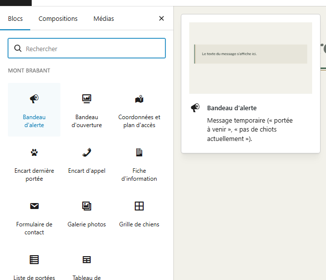
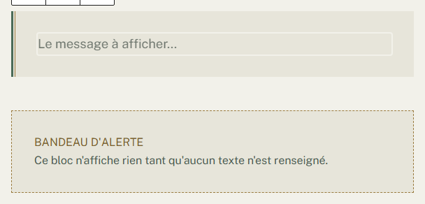
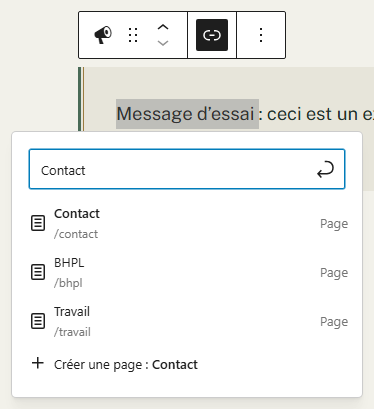
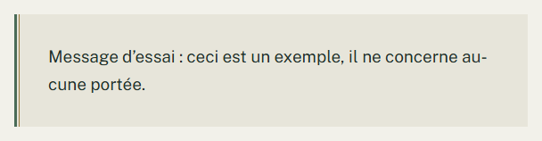
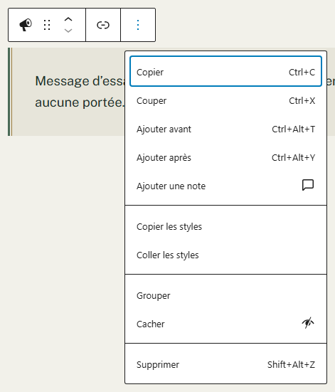

# Afficher un message temporaire sur une page

**Quand** : quand vous avez quelque chose à annoncer pendant quelques semaines — « une portée est
prévue pour le printemps », « pas de chiots actuellement », « nous sommes absents jusqu'au 15 ».
**Temps** : 2 minutes. **Rattrapable** : oui, entièrement. Vous pouvez corriger le message, l'effacer,
ou enlever le composant, autant de fois que vous voulez.

Le composant s'appelle **Bandeau d'alerte**. Dans la liste des composants, il se présente ainsi :

> Message temporaire (« portée à venir », « pas de chiots actuellement »).

Vous le posez sur une **page** — l'accueil, le plus souvent — vous tapez votre phrase, et vous
l'enlevez quand elle n'a plus lieu d'être. C'est tout ce qu'il fait, et c'est voulu.

Il se pose dans une page, jamais dans une fiche de portée, de chien ou de résultat : **les pages se
composent, les fiches se remplissent.** Sur l'écran d'une portée ou d'un chien, il n'y a d'ailleurs
pas de bouton **+** — ces écrans sont des cases à remplir de haut en bas.

---

## Avant de taper : le site sait peut-être déjà le dire

**Pour annoncer qu'il n'y a pas de chiots, la disponibilité de la portée est plus juste qu'un message
tapé à la main.** Sur l'écran d'une portée, l'encadré **La portée** contient une liste
**Disponibilité** : **Chiots disponibles**, **Tous réservés**, **Portée passée**. Ce que vous y
choisissez s'affiche tout seul partout où la portée apparaît, et une seule correction suffit à mettre
le site entier d'accord. Voir « Changer une disponibilité », dans la fiche
« Ajouter une portée ».

**Le Bandeau d'alerte est fait pour ce que le site ne calcule pas** : une absence, une date de retour,
une annonce qui n'existe nulle part ailleurs dans vos saisies.

---

## Les étapes

1. Dans le menu de gauche, cliquez sur **Pages**, puis sur **Toutes les pages**, puis sur le titre de
   la page où le message doit apparaître.

2. Cliquez à l'endroit de la page où vous voulez le message — en général juste sous le haut de page —
   puis sur le bouton **+**, en haut à gauche de l'écran — il s'appelle
   **Outil d'insertion de bloc**. *(Vous pouvez aussi taper `/` sur une ligne vide : la même liste
   s'ouvre.)*

3. Dans la liste qui s'ouvre, **Mont Brabant** est la première rubrique : cliquez sur
   **Bandeau d'alerte**. Si vous préférez chercher, tapez « alerte », « message », « annonce »,
   « temporaire » ou « bandeau » dans le champ **Rechercher**, en haut de la liste : il sort avec
   chacun de ces mots.

   

4. **Tapez votre phrase directement** : le composant s'insère avec le curseur déjà dedans, vous n'avez
   rien à cliquer. Tant que vous n'avez rien tapé, le champ affiche en gris
   « Le message à afficher… » : c'est une invitation, pas un texte, et elle disparaît au premier
   caractère.

   

5. *Facultatif* — pour renvoyer vers une page du site : sélectionnez un ou plusieurs mots de votre
   phrase, cliquez sur le bouton **Lien** — en forme de maillon de chaîne — dans la petite barre
   d'outils qui apparaît au-dessus, puis choisissez la page voulue (par exemple **Placement**).
   Le raccourci clavier est **Ctrl+K**. C'est le **seul** enrichissement du message.

   

6. Cliquez sur **Publier**, ou sur **Mettre à jour** si la page existait déjà, en haut à droite.

Ouvrez ensuite la page sur le site, ou cliquez sur **Aperçu**, pour voir le résultat.

**Tant que vous n'avez pas cliqué sur Publier ou Mettre à jour, rien n'est publié.** Vous pouvez
quitter la page sans enregistrer : elle reste comme elle était.

---

## Ce que vous pouvez régler : le texte, et rien d'autre

C'est le composant le plus simple du site, et c'est une **garantie** : il n'y a aucun réglage à
comprendre, aucune colonne de droite à ouvrir, et **rien que vous puissiez y faire ne peut abîmer
l'allure du site.**

| Ce que vous faites | Ce que ça donne |
|---|---|
| Vous tapez votre phrase | Elle s'affiche dans un encadré au fond légèrement creusé, barré d'un double filet vertical à gauche |
| Vous mettez un lien sur quelques mots | Ces mots deviennent cliquables, dans l'allure des liens du site |
| Vous tapez plusieurs lignes | Elles s'affichent l'une sous l'autre, dans le même encadré |

**Ne sont pas réglables, et c'est normal** : la couleur, la taille des lettres, le gras, l'italique, le
soulignement, l'alignement, la largeur, les marges. Il n'y a pas non plus de « niveau » d'alerte
(information, attention, danger) ni d'icône : **c'est votre phrase qui dit la gravité**, pas une
couleur ni un dessin. Un message écrit en rouge ne se lit pas mieux ; une phrase claire, si.

---

## Trois choses à savoir, et elles ne sont pas toutes agréables

**Un seul message par page.** Une fois le composant posé, **Bandeau d'alerte** apparaît en gris dans la
liste du bouton **+** et ne se laisse plus cliquer **pour cette page-là**. Ce n'est pas une panne :
une page n'a qu'une seule annonce. Pour changer le message, modifiez celui qui est déjà là.

**La touche `Entrée` va à la ligne.** Elle n'ajoute pas un second message : elle insère un saut de
ligne dans celui que vous êtes en train d'écrire. C'est voulu.

**Le message vaut pour une page, et une seule.** Pour l'afficher sur l'accueil **et** sur
**Placement**, vous devez le taper **deux fois**, et le retirer deux fois. C'est la seule recopie de
tout le site, et elle est écrite ici plutôt que découverte : un message temporaire se pose là où il a
du sens. Si vous souhaitez un message visible sur **toutes** les pages à la fois, dites-le-nous —
c'est un autre dispositif, qui n'existe pas encore.

---

## Enlever le message — deux façons, et elles ne font pas la même chose

**Effacer le texte** (le plus simple) : sélectionnez tout le message, effacez-le, puis cliquez sur
**Mettre à jour**. Le composant **reste dans la page**, un encadré gris vous explique que rien ne
s'affiche, et **les visiteurs ne voient rien du tout**. C'est le bon geste quand le message reviendra
bientôt : l'emplacement est prêt, il n'attend qu'une phrase.

**Le supprimer pour de bon** : cliquez sur l'encadré dans la page, puis sur le bouton à trois points de
sa petite barre d'outils, et, **tout en bas du menu**, cliquez sur **Supprimer**. Cliquez ensuite sur
**Mettre à jour**.

*Le menu n'a pas la même longueur selon le composant, mais **Supprimer** en est toujours la dernière
entrée : descendez jusqu'au bout, c'est là.*

Dans les deux cas, rien d'autre n'est touché : ni le texte de la page, ni les photos, ni les portées.
Et rien n'est définitif avant **Mettre à jour** : si vous vous êtes trompée, quittez la page sans
enregistrer.

---

## Si vous laissez le champ vide

**Côté visiteurs : rien.** Pas un encadré, pas un cadre vide, pas un espace blanc, pas un trou dans la
page. La page s'affiche exactement comme s'il n'y avait aucun message. **Vous ne pouvez pas abîmer une
page avec un message vide.**

**Côté écran de modification** : un encadré gris au contour en tirets prend la place, portant sur deux
lignes **BANDEAU D'ALERTE** puis « Ce bloc n'affiche rien tant qu'aucun texte n'est renseigné. »

**C'est normal, c'est voulu, et ce n'est pas une panne.** Cet encadré n'existe que pour vous, pendant
que vous modifiez la page : il vous dit « il manque une phrase ici, rien de grave ». Vous retrouverez
le même encadré, avec le même contour en tirets et une phrase adaptée, sur les autres composants du
site.

---

## En cas de doute

**C'est normal, vous n'avez rien à faire :**

- **Un encadré gris à contour en tirets porte BANDEAU D'ALERTE et « Ce bloc n'affiche rien tant
  qu'aucun texte n'est renseigné. »** Le message est vide. **Ce qu'il faut faire** : cliquez dans
  l'encart juste au-dessus et tapez votre phrase — l'encadré gris disparaît tout seul. Ou laissez-le :
  les visiteurs ne voient rien.
- **Le champ affiche « Le message à afficher… » en gris.** C'est l'invitation à écrire, pas un texte.
  Elle ne s'affiche jamais sur le site.
- **Dans la liste du bouton +, un aperçu montre un encadré portant « Le texte du message s'affiche
  ici. »** C'est un exemple, pour vous montrer l'allure du composant. Ce texte ne s'ajoute jamais à
  votre page.
- **Bandeau d'alerte est en gris dans la liste du bouton +.** Cette page en a déjà un.
- **Bandeau d'alerte ne se propose pas dans une fiche de portée, de chien ou de résultat.** Ces fiches
  se remplissent, elles ne se composent pas.
- **Vous ne trouvez ni gras, ni couleur, ni taille dans la barre d'outils du message.** Il n'y en a
  pas, exprès. Seul le lien est disponible.
- **Un doute sur l'allure** : cliquez sur **Aperçu**, ou ouvrez la page sur le site. C'est le rendu qui
  compte ; la page en cours de modification s'affiche dans une fenêtre plus étroite.

**Ce n'est pas normal, signalez-le :**

- Le bouton **+** ne propose aucune rubrique **Mont Brabant**.
- Un message que vous avez effacé s'affiche encore sur le site après **Mettre à jour**.
- L'encadré du message apparaît sur le site **sans son filet vertical à gauche**, ou sans son fond
  légèrement creusé.
- L'encadré gris d'attente apparaît sans son contour en tirets, sans le nom du composant, ou sans sa
  phrase.

**Ce qu'il vaut mieux ne pas faire :**

- **N'écrivez pas le message dans un paragraphe ordinaire** pour aller plus vite. Il n'aurait pas
  l'allure d'une annonce, et vous ne sauriez plus, dans six mois, quel paragraphe était temporaire.
- **N'annoncez pas l'absence de chiots par un message tapé** si une portée est déjà saisie : sa
  **Disponibilité** le dit toute seule, partout, et se corrige en un seul endroit.
- **N'oubliez pas de le retirer.** C'est le seul texte du site que rien ne met à jour pour vous. Une
  annonce de printemps encore affichée en octobre est plus gênante que pas d'annonce du tout.

**Si quelque chose vous inquiète** : ne cliquez pas sur **Mettre à jour**, quittez la page sans
enregistrer, notez le titre de la page et l'heure, et appelez-nous. Une page en cours de modification
n'a jamais cassé un site.
