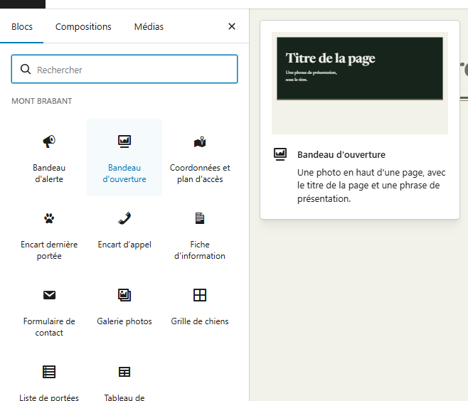
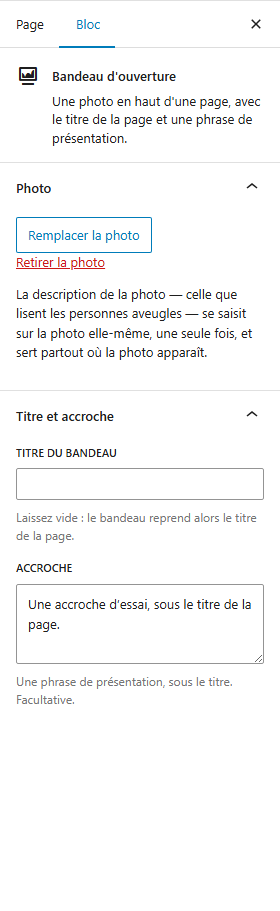
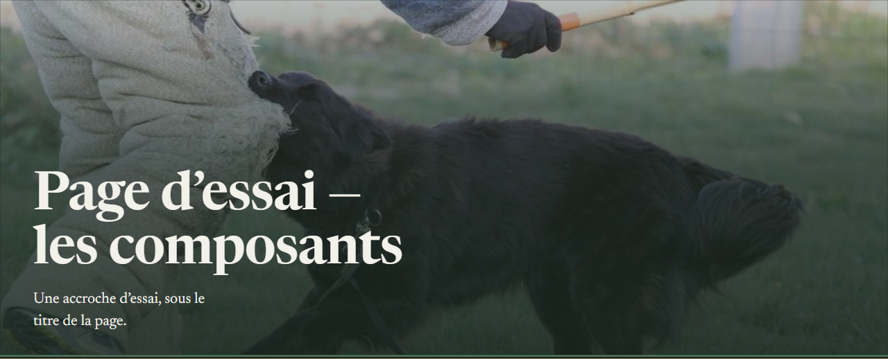
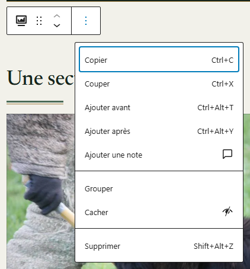
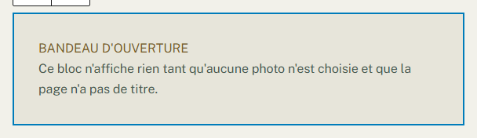

# Mettre une photo en haut d'une page

**Quand** : quand une page doit s'ouvrir sur une grande photo, avec son titre et une phrase de
présentation — l'accueil, **Placement**, **Travail**, **La meute**, **Contact**.
**Temps** : 3 minutes. **Rattrapable** : oui. Vous pouvez changer la photo, changer la phrase, ou
enlever le bandeau en entier, autant de fois que vous voulez.

Le composant s'appelle **Bandeau d'ouverture**. Vous le posez tout en haut de la page, vous choisissez
une photo, et **le titre de la page vient dedans tout seul** : vous n'avez pas à le retaper.

Ce composant se pose dans une **page**, jamais dans une fiche de portée, de chien ou de résultat :
**les pages se composent, les fiches se remplissent.** Sur l'écran d'une portée ou d'un chien, il n'y a
d'ailleurs pas de bouton **+** — ces écrans sont des cases à remplir de haut en bas.

---

## Les étapes

1. Dans le menu de gauche, cliquez sur **Pages**, puis sur **Toutes les pages**, puis sur le titre de
   la page à modifier.

2. Placez le curseur **tout en haut du contenu de la page**, avant le premier paragraphe, puis cliquez
   sur le bouton **+**, en haut à gauche de l'écran. Ce bouton s'appelle
   **Outil d'insertion de bloc**.

3. Dans la liste qui s'ouvre, **Mont Brabant** est la première rubrique : cliquez sur
   **Bandeau d'ouverture**.

   

   *Ce qui apparaît alors dépend de la page. Si la page a déjà un titre, le bandeau se montre
   aussitôt, **avec le titre de la page déjà écrit dedans**, sur fond vert foncé : il ne lui manque que
   la photo. Si la page n'a pas encore de titre, un encadré d'attente prend sa place — voir « En cas de
   doute », en bas de cette page. Dans les deux cas, rien n'est cassé.*

4. Dans la colonne de droite, le panneau **Photo** est déjà ouvert : cliquez sur
   **Choisir une photo**.

   *Si la colonne de droite n'est pas affichée, ouvrez-la avec le bouton en forme de roue dentée, en
   haut à droite de l'écran.*

   **C'est le seul endroit d'où la photo se choisit.** Il n'y a pas de bouton sur le bandeau
   lui-même, et c'est voulu : un seul chemin, jamais deux.

5. La fenêtre des photos s'ouvre sur l'onglet **Téléverser des fichiers**. Si votre photo est déjà sur
   le site, cliquez d'abord sur l'onglet **Médiathèque**, juste à côté : c'est là que sont les photos
   déjà présentes. Cliquez ensuite sur votre photo, puis sur **Sélectionner**, en bas à droite. Le
   bandeau prend aussitôt son allure définitive, photo comprise.

6. Juste en dessous, dans le panneau **Titre et accroche**, écrivez votre phrase de présentation dans
   **Accroche**. **Laissez le champ Titre du bandeau vide** (pourquoi, deux sections plus bas).

   

7. Cliquez sur **Mettre à jour**, en haut à droite.

Ouvrez ensuite la page sur le site, ou cliquez sur **Aperçu**, pour voir le bandeau dans la page
entière.

**Tant que vous n'avez pas cliqué sur Mettre à jour, rien n'est publié.** Vous pouvez quitter la page
sans enregistrer : elle reste comme elle était.

---

## Le titre de la page se déplace dans le bandeau

C'est la seule chose de cette page qui peut vous inquiéter, et **il n'y a rien de cassé.**

Quand le bandeau est le premier élément de la page, **le titre de la page n'apparaît plus à sa place
habituelle, au-dessus du texte : il est maintenant dans le bandeau, sur la photo.** C'est le même
titre, le vôtre, celui que vous avez tapé en haut de la page. Il n'a pas été effacé, il n'a pas été
recopié, il a simplement changé d'endroit — et il s'affiche une seule fois, comme il faut.

Si vous enlevez le bandeau, le titre revient tout seul à sa place habituelle.

**Donnez toujours un titre à votre page.** Une page sans titre donne un bandeau sans titre : le site
n'en invente jamais un.

---

## Ce qui se met à jour tout seul

- **Le titre.** Vous corrigez le titre de la page, le bandeau suit. Une seule saisie, deux endroits.
- **La description de la photo** — celle que lisent les personnes aveugles — se saisit **sur la photo
  elle-même**, dans la fenêtre des photos, **une seule fois**, et sert partout où cette photo
  apparaît. Vous n'avez rien à écrire dans le bandeau pour cela, et une correction faite là se
  propage d'elle-même.
- **La taille de la photo.** Le site sert la photo à la bonne taille selon l'écran, grand écran comme
  téléphone. Vous n'avez rien à découper ni à réduire avant de l'envoyer.

---

## Les trois réglages, et ce qu'ils font

| Panneau, champ | Ce que vous y mettez | Si vous le laissez vide |
|---|---|---|
| **Photo** → **Choisir une photo** | La grande photo du haut de page. Une fois choisie, le bouton s'intitule **Remplacer la photo**, et un lien **Retirer la photo** apparaît en dessous. | Le bandeau devient **une bande de texte sur fond vert foncé**, avec le titre et l'accroche. C'est une allure finie, pas un trou. Si la page n'a en plus aucun titre, rien ne s'affiche du tout aux visiteurs. |
| **Titre et accroche** → **Titre du bandeau** | Rien, dans presque tous les cas. | **Le bandeau reprend le titre de la page** — c'est le bon fonctionnement. |
| **Titre et accroche** → **Accroche** | Une phrase de présentation, sous le titre. | Rien ne s'affiche sous le titre. La page reste juste. |

### Pourquoi laisser **Titre du bandeau** vide

Si vous remplissez **Titre du bandeau**, le bandeau affiche **ce texte-là** au lieu du titre de la
page. Vous vous retrouvez alors avec deux titres à tenir à jour : celui de la page et celui du
bandeau. Le jour où vous corrigez l'un, l'autre reste faux, et rien ne vous le signale.

Laissé vide, il n'y a qu'un seul titre à écrire, en haut de la page, et le bandeau le reprend.
**Ne recopiez jamais le titre de la page dans ce champ.**

Le champ existe pour un seul cas : quand la photo doit porter un texte **différent** du titre de la
page — par exemple un titre plus court, parce que celui de la page est long.

---

## Le bandeau va tout en haut, et il n'y en a qu'un

**Tout en haut.** Si vous le posez plus bas dans la page, l'éditeur vous prévient, en jaune, juste
au-dessus du bandeau :

> « Ce bandeau n'est pas le premier bloc de la page : le titre s'affichera deux fois. Déplacez-le tout
> en haut. »

Et c'est vrai : le titre apparaîtra deux fois sur le site, une fois à sa place habituelle et une fois
dans le bandeau. **Ce qu'il faut faire** : attrapez le bandeau et faites-le glisser tout en haut de la
page. L'avertissement disparaît de lui-même. Rien n'est perdu — ni la photo, ni l'accroche.

**Un seul par page.** Dès qu'une page contient un bandeau, **Bandeau d'ouverture** apparaît en gris
dans la liste du bouton **+** et ne se laisse plus cliquer. **C'est voulu, ce n'est pas une panne** :
une page n'a qu'un seul haut de page. Pour changer de photo, ne posez pas un second bandeau —
utilisez **Remplacer la photo** dans celui qui est déjà là.

---

## Enlever le bandeau

Cliquez sur le bandeau dans la page, puis sur le bouton à trois points de sa petite barre d'outils.
Dans le menu qui s'ouvre, **tout en bas**, cliquez sur **Supprimer**. Cliquez ensuite sur
**Mettre à jour**.

*Le menu n'a pas la même longueur selon le composant, mais **Supprimer** en est toujours la dernière
entrée : descendez jusqu'au bout, c'est là.*

**Il n'y a rien à craindre :**

- Le titre de la page **revient tout seul** à sa place habituelle, au-dessus du texte.
- La photo **n'est pas supprimée du site** : elle reste dans la bibliothèque de photos, avec sa
  description, prête à resservir ici ou ailleurs.
- Le texte de la page n'est pas touché.
- Vous pouvez reposer un **Bandeau d'ouverture** plus tard, au même endroit, en trois clics.

Et rien n'est définitif avant **Mettre à jour** : si vous vous êtes trompée, quittez la page sans
enregistrer.

---

## Ce qui n'est pas réglable, et c'est normal

- **La largeur.** Le bandeau occupe **toute la largeur de la fenêtre**, du bord gauche au bord droit,
  sur un grand écran comme sur un téléphone. Vous n'avez rien à régler pour l'obtenir, et il n'y a
  aucun réglage pour le rétrécir.
- **Les couleurs, les lettres, la taille du titre, la hauteur de la bande et le voile sombre posé sous
  le texte** sont fixés par le design du site. C'est ce voile qui garantit que votre titre reste
  lisible, même sur une photo très claire — vous n'avez donc jamais à vous demander si le texte
  passera.
- **Le titre et l'accroche ne se mettent ni en gras, ni en italique, et ne portent pas de lien.** Ce
  sont deux champs de texte simple, exprès : sur une photo, un lien ne serait pas assez lisible.
- **La partie de la photo qui reste visible** n'est pas réglable depuis la page. Le bandeau garde le
  milieu de la photo, un peu au-dessus du centre — là où se trouve la tête d'un chien photographié en
  entier. **Choisissez donc une photo dont le sujet n'est pas dans le bas.**

---

## En cas de doute

**C'est normal, vous n'avez rien à faire :**

- **Le titre de la page a disparu de sa place habituelle.** Il est dans le bandeau. Voir plus haut :
  c'est le bon fonctionnement.
- **Un doute sur l'allure du bandeau** : cliquez sur **Aperçu**, ou ouvrez la page sur le site. C'est
  le rendu qui compte, et la page en cours de modification s'affiche dans une fenêtre plus étroite que
  celle du site.
- **À la place du bandeau, un encadré au contour en tirets**, portant sur deux lignes
  **BANDEAU D'OUVERTURE** puis « Ce bloc n'affiche rien tant qu'aucune photo n'est choisie et que la
  page n'a pas de titre. » : la page n'a pas encore de titre et aucune photo n'est choisie. **Ce qu'il
  faut faire** : donnez un titre à la page, ou choisissez une photo dans la colonne de droite, panneau
  **Photo**, bouton **Choisir une photo**. L'encadré est remplacé par le bandeau dès que l'un des deux
  est fait. C'est un emplacement en attente : il ne casse rien et ne demande rien d'urgent.

  

- **Cet encadré n'est jamais visible par les visiteurs.** Une page dont le bandeau est encore vide
  n'affiche **pas de bandeau du tout** : ni cadre, ni trou, ni message — la page reste normale.
  L'encadré n'existe que pour vous, pendant que vous modifiez. **Vous ne pouvez pas casser la page
  avec un bandeau vide.**
- Vous retrouverez un encadré de la même famille sur les autres composants du site : le même contour
  en tirets, le nom du composant, puis une phrase qui dit ce qui manque. Cela veut partout dire la
  même chose — « il manque quelque chose ici, rien de grave ». Le détail change d'un composant à
  l'autre : certains ajoutent un bouton pour compléter tout de suite, comme **Ajouter des photos**
  dans la **Galerie photos**. Fiez-vous à la phrase, c'est elle qui vous dit quoi faire.
- **La photo se décrit dans le premier des quatre champs de la colonne de droite** de la fenêtre des
  photos, celui qui s'appelle **Description de la photo (pour les personnes aveugles)**. C'est là qu'on
  écrit ce que montre la photo, pour les personnes aveugles.
- **Bandeau d'ouverture** est en gris dans la liste du bouton **+** : la page en a déjà un.
- **Bandeau d'ouverture** ne se propose pas dans une fiche de portée, de chien ou de résultat : ces
  fiches se remplissent, elles ne se composent pas.

**Ce n'est pas normal, signalez-le :**

- Le bouton **+** ne propose aucune rubrique **Mont Brabant**.
- **Dans la fenêtre des photos, le premier des quatre champs porte un autre nom que
  « Description de la photo (pour les personnes aveugles) ».** Rien n'est cassé et rien n'est perdu :
  écrivez votre description dans ce premier champ comme d'habitude, et dites-le-nous.
- **L'encadré d'attente apparaît sans son contour en tirets, sans le nom du composant, ou sans sa
  phrase.** Ces trois-là sont toujours présents : s'il en manque un, signalez-le.
- Après **Mettre à jour**, la page publiée montre le titre deux fois alors que le bandeau est bien le
  premier élément de la page.
- Le message « Le fichier choisi n'est pas une photo. Choisissez une photo. » s'affiche alors que vous
  avez bien choisi une photo. Dans ce cas, cliquez sur **Remplacer la photo** et reprenez-en une : si
  le message revient, appelez-nous.

**Ce qu'il vaut mieux ne pas faire :**

- **Ne recopiez pas le titre de la page dans Titre du bandeau.** Vous auriez deux titres à corriger au
  lieu d'un.
- **N'écrivez pas un titre à la main au-dessus du bandeau** pour « remplacer » celui qui a bougé : il
  ferait doublon et il ne se corrigerait pas tout seul.
- **Ne posez pas une photo au milieu de votre texte** pour ouvrir la page. Une photo posée dans le
  bandeau est cadrée et dimensionnée correctement partout ; une photo posée dans un paragraphe, non.
- **Ne posez pas le bandeau à l'intérieur d'un autre bloc** (un groupe, une colonne). Il ne serait
  plus le premier élément de la page, et le titre s'afficherait deux fois.

**Si quelque chose vous inquiète** : ne cliquez pas sur **Mettre à jour**, quittez la page sans
enregistrer, notez le titre de la page et l'heure, et appelez-nous. Une page en cours de modification
n'a jamais cassé un site.
