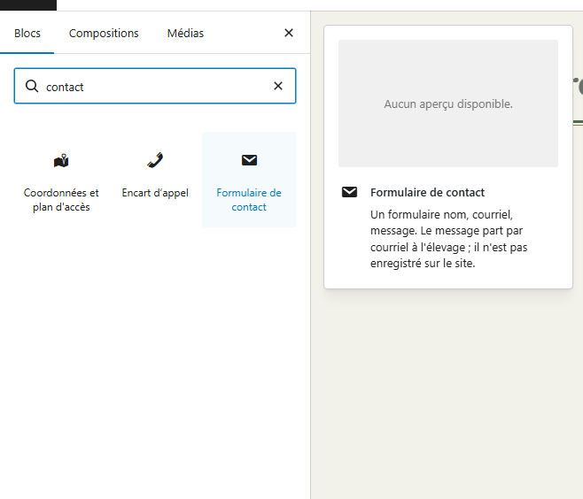
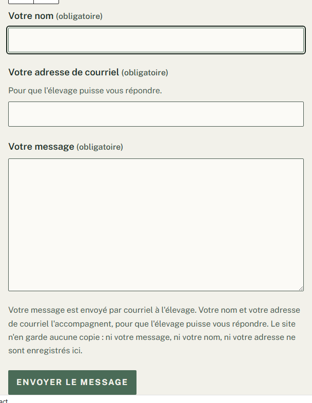
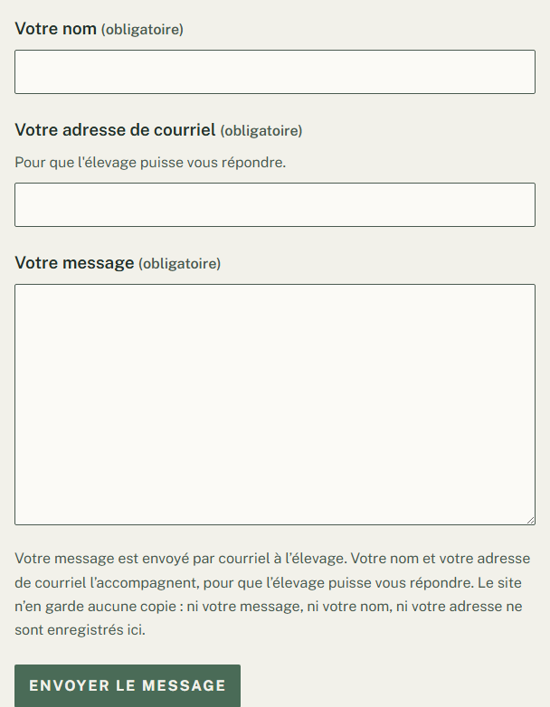
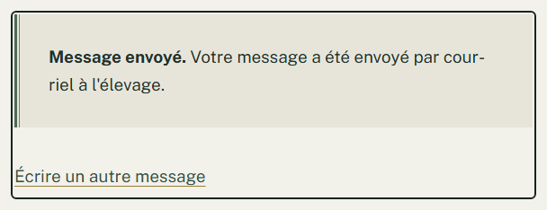
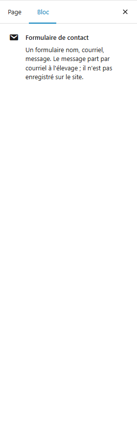
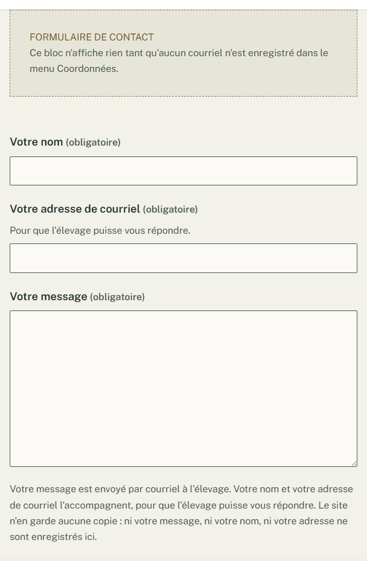
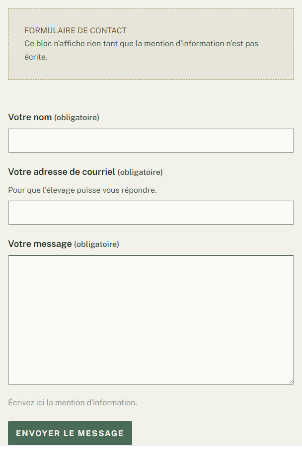
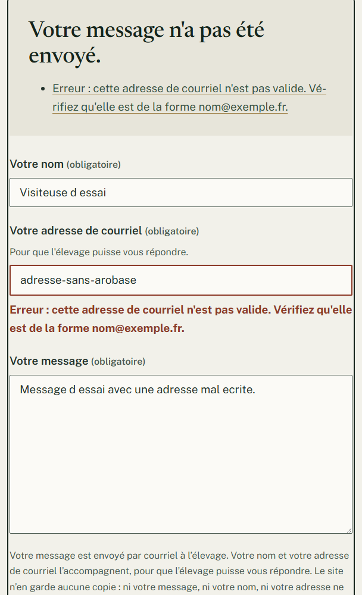
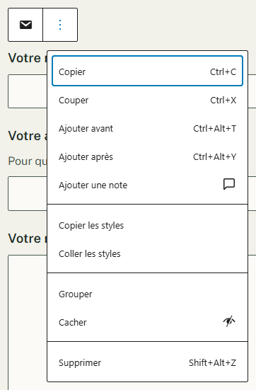

# Recevoir les messages des visiteurs par courriel

**Quand** : une seule fois, sur votre page **Contact**, pour que les familles puissent vous écrire
depuis le site.
**Temps** : 2 minutes. **Rattrapable** : oui. Vous pouvez l'enlever et le reposer autant de fois que
vous voulez, sans rien perdre.

Le composant s'appelle **Formulaire de contact**. Sa phrase de présentation dit à quoi il sert :

> Un formulaire nom, courriel, message. Le message part par courriel à l'élevage ; il n'est pas
> enregistré sur le site.

**Vous le posez, et il est déjà complet.** Les trois champs, le bouton et la phrase d'information sont
déjà écrits : vous n'avez rien à remplir pour qu'il fonctionne. **Il n'a aucun réglage dans la colonne
de droite** — son seul texte modifiable se tape directement dedans.

---

## Avant de poser : l'adresse qui reçoit les messages

**Les messages partent à l'adresse de courriel enregistrée dans le menu Coordonnées** — celle-là, et
pas une autre. Ce n'est pas un réglage du formulaire : il n'y a **rien à taper ici** pour choisir la
destination.

**Un seul endroit à corriger, et tout le site suit.** Le jour où votre adresse change, vous la changez
dans le menu **Coordonnées** et le formulaire écrit à la nouvelle, sans que vous rouvriez la page
**Contact**. Voir *Modifier vos coordonnées, une fois pour tout le site*.

**À savoir avant de vider ce champ** : si le champ **Courriel** du menu **Coordonnées** est vide, ou
s'il ne contient pas une adresse de courriel valide, **le formulaire disparaît entièrement du site**.
Les visiteurs ne voient plus rien du tout à sa place — pas de cadre vide, pas de trou dans la page. Il
revient tout seul dès que l'adresse est retapée, **sans rouvrir ni republier la page Contact**. *(La
fiche des coordonnées dit « Laissez vide pour retirer le courriel de tout le site » : c'est vrai, et
cela retire aussi le formulaire de contact.)*

**Un point à connaître** : **le titre que vous avez tapé au-dessus du formulaire, lui, reste.** Le
visiteur lit alors une invitation à vous écrire, suivie de rien. Si vous vouliez vraiment retirer le
formulaire, retirez aussi ce titre.

---

## Les étapes

1. Dans le menu de gauche, cliquez sur **Pages**, puis sur la page **Contact**, puis sur **Modifier**.

2. Cliquez à l'endroit de la page où vous voulez le formulaire — le plus souvent après votre texte
   d'accueil — puis sur le bouton **+**. Ce bouton s'appelle **Outil d'insertion de bloc**.

3. Le composant est rangé dans la rubrique **Mont Brabant**, la première de la liste. Vous pouvez aussi
   taper **contact** dans le champ **Rechercher**, en haut de la liste. Cliquez ensuite sur
   **Formulaire de contact**.

   

4. **Le formulaire apparaît complet**, avec sa phrase d'information déjà écrite. **Vous pouvez vous
   arrêter là.** Si vous voulez la réécrire, cliquez dans cette phrase et tapez la vôtre.

   

5. Cliquez sur **Mettre à jour**. C'est en ligne.

Ouvrez ensuite la page sur le site : c'est là que le formulaire est à sa vraie allure, et le seul
endroit où il fonctionne vraiment.

**Tant que vous n'avez pas cliqué sur Mettre à jour, rien n'est publié.** Vous pouvez quitter la page
sans enregistrer : elle reste comme elle était.

---

## Ce que le visiteur voit, et ce qu'il tape

Trois champs, tous les trois obligatoires, et un bouton :

| Ce qu'il lit | Ce qu'il tape |
|---|---|
| **Votre nom (obligatoire)** | son nom |
| **Votre adresse de courriel (obligatoire)**, avec en dessous « Pour que l'élevage puisse vous répondre. » | son adresse |
| **Votre message (obligatoire)** | son message |
| Bouton **Envoyer le message** | |

Quand c'est parti, il lit **Message envoyé.** suivi de « Votre message a été envoyé par courriel à
l'élevage. », et un lien **Écrire un autre message**. **Cet écran dit que le site a bien confié le
message au courrier** — il ne peut pas savoir, lui, s'il est arrivé dans votre boîte. C'est à vous de
le constater une fois, le jour de la mise en ligne.

**Le courriel que vous recevez** est fait pour se reconnaître d'un coup d'œil dans votre boîte, même
sur un téléphone : son sujet doit se lire « Message de », le nom du visiteur, puis « — site de
l'élevage ». L'adresse du visiteur doit se retrouver dans le corps du message, pour que vous puissiez
lui répondre directement.

**Pour lui répondre, cliquez simplement sur « Répondre » dans votre messagerie.** Votre réponse part à
l'adresse du visiteur, celle qu'il a tapée dans le formulaire : **vous n'avez aucune adresse à
recopier à la main.** Ne vous fiez pas à l'expéditeur affiché — le message arrive **de la part du
site**, et non au nom du visiteur. C'est normal, et cela n'empêche rien : le bouton **Répondre**
écrit bien à la bonne personne.

**Vérifiez ces deux points sur votre premier message d'essai** — voir « Votre envoi d'essai, le jour de
la mise en ligne », plus bas. C'est un envoi d'une minute, et c'est le seul moyen de le savoir : si le
sujet ou l'adresse ne sont pas là, dites-le-nous, cela se corrige.

---

## Votre envoi d'essai, le jour de la mise en ligne

**Faites-le une fois, et une seule** : c'est le geste qui vous garantit que les familles vous
joindront.

1. Ouvrez la page **Contact** **sur le site**, pas dans l'écran de modification : le formulaire ne
   fonctionne que sur le site.
2. Remplissez les trois champs avec votre propre nom et **votre propre adresse de courriel**, et un
   message quelconque — « essai » suffit.
3. Cliquez sur **Envoyer le message**. S'il vous répond que le message est parti trop vite, recliquez
   sur **Envoyer le message** : c'est normal, voir « Vous tomberez dessus en essayant votre propre
   formulaire », plus bas.
4. Vous devez lire **Message envoyé.**
5. Ouvrez votre boîte de courriel. **Regardez aussi le dossier « indésirables » (ou « spam ») :** c'est
   là qu'un tout premier message arrive souvent.

**Ce que vous devez y trouver** : un message dont le sujet commence par « Message de » et se termine
par « — site de l'élevage », et dans lequel figure l'adresse que vous venez de taper. S'il est dans les
indésirables, marquez-le comme légitime : les suivants arriveront directement.

**S'il n'arrive rien au bout de dix minutes, indésirables compris** : ne touchez à rien sur le site et
appelez-nous. Le formulaire, lui, n'est pas en cause — c'est la remise du courriel qu'il faut
regarder, et cela se règle sans rien modifier dans vos pages.

---

## Trois choses à savoir, et elles ne sont pas agréables

**1. Le site ne garde aucune copie des messages.** Le message part par courriel, et c'est tout. Il
n'existe **aucune liste des messages reçus** dans l'administration, et il n'y en aura pas : c'est une
décision prise exprès, pour qu'aucune donnée personnelle de vos visiteurs ne dorme sur le site.

**2. Un courriel perdu est perdu.** S'il n'arrive pas — boîte pleine, panne du fournisseur, message
classé en courrier indésirable — **personne ne pourra le retrouver**, ni vous, ni nous. Il n'existe
nulle part ailleurs.

**Ce qu'il faut faire** : **regardez votre dossier « indésirables » (ou « spam ») de temps en temps**,
et si vous y trouvez un message du site, marquez-le comme légitime — les suivants arriveront
directement. C'est le seul filet de sécurité, et il est entre vos mains.

**3. Un double-clic sur Envoyer le message envoie deux courriels identiques.** Ce n'est pas une panne,
et ce n'est pas deux personnes différentes : c'est la même, qui a cliqué deux fois. Le site ne peut pas
s'en apercevoir, puisqu'il ne garde rien pour comparer. **Ce qu'il faut faire** : quand deux messages
identiques arrivent à la minute près, répondez une seule fois.

---

## La phrase d'information : votre seul texte à vous

C'est la phrase grise au-dessus du bouton. Elle dit au visiteur ce que devient son message avant qu'il
ne l'envoie — c'est sa raison d'être, et c'est pour cela qu'elle est là plutôt qu'en bas de page.

**Elle arrive déjà écrite**, mot pour mot :

> Votre message est envoyé par courriel à l'élevage. Votre nom et votre adresse de courriel
> l'accompagnent, pour que l'élevage puisse vous répondre. Le site n'en garde aucune copie : ni votre
> message, ni votre nom, ni votre adresse ne sont enregistrés ici.

**Vous pouvez la réécrire**, c'est prévu : cliquez dedans et tapez. Vous pouvez aussi poser un lien sur
quelques mots : sélectionnez-les, puis cliquez sur le bouton **Lien** — en forme de maillon de chaîne —
dans la petite barre d'outils qui apparaît au-dessus. Le raccourci clavier est **Ctrl+K**.
**Rien d'autre ne se règle** : ni gras, ni couleur, ni taille.

**Ces trois phrases décrivent ce que le site fait réellement.** Si vous les réécrivez, **elles doivent
rester vraies** :

- ne promettez pas que le message est conservé, ni qu'il sera effacé au bout d'un délai — le site n'en
  garde aucune copie, donc il n'y a rien à conserver ni à effacer ;
- **n'écrivez jamais « vous pouvez demander la suppression de votre message ».** C'est la phrase la
  plus tentante à recopier d'un autre site, et c'est celle qu'il ne faut pas faire : le site n'a rien
  à supprimer, puisqu'il ne garde rien. Elle vous engagerait, vous, à vider votre propre boîte de
  courriels à la demande — et rien ne vous y oblige.

**Ce que cette phrase ne dit pas, et pourquoi.** Elle ne parle **ni de durée de conservation, ni de
droit d'accès ou de suppression, ni de responsable des données**. C'est délibéré : ce sont des
engagements que **personne ne peut prendre à votre place**, et le nom officiel de l'élevage n'est
encore écrit nulle part sur le site. Si vous voulez les écrire, **ces phrases-là vous appartiennent** :
tapez-les ici, ou dites-le-nous et nous les rédigerons avec vous.

**Pourquoi cette phrase s'est allongée.** Elle tenait autrefois en deux phrases. Nous y avons ajouté
**ce qui était vérifiable, et rien d'autre** : à quoi sert le message (vous permettre de répondre), ce
qui part avec lui (votre visiteur donne son nom et son adresse), et qu'aucune copie n'en est gardée
ici. Ce qui reste absent l'est toujours pour la même raison qu'avant : cela ne se vérifie pas, cela se
promet.

**Si vous effacez entièrement cette phrase**, le formulaire **disparaît du site**. Dans l'écran de
modification, la case grise vous le dit ; les visiteurs, eux, ne voient rien du tout. Retapez une
phrase et il revient.

---

## Où le poser, et où ne pas le poser

**Posez-le dans une page** — la page **Contact**, tout simplement.

**Un seul formulaire par page.** Une fois posé, WordPress ne vous laisse pas en poser un second sur la
même page. Ce n'est pas une panne : une page n'a qu'un formulaire.

**Il n'a sa place que dans le contenu d'une page.** C'est là qu'il est conçu pour vivre, et le seul
endroit où nous l'avons vu fonctionner.

**Ne le posez pas dans une fiche de portée, de chien ou de résultat.** Ces fiches se remplissent, elles
ne se composent pas.

---

## Ce qui n'est pas réglable, et c'est normal

- **La colonne de droite ne propose aucun réglage** pour ce composant. Ce n'est pas un oubli : il n'y a
  rien à régler. Le seul texte modifiable est la phrase d'information, et elle se tape dans le
  formulaire lui-même.

  

- **Les trois champs sont les trois champs** : nom, courriel, message. On n'en ajoute ni n'en enlève.
- **Le libellé du bouton est toujours Envoyer le message.** Le même sur tout le site.
- **L'adresse de destination ne se tape pas ici** : c'est celle du menu **Coordonnées**.
- **Les couleurs, les lettres, la largeur des champs** sont fixées par le design du site.

**Vous ne pouvez rien casser avec ce composant.** Au pire, il ne s'affiche pas — et il suffit de
retaper l'adresse dans **Coordonnées**, ou la phrase d'information, pour qu'il revienne.

---

## Quand le formulaire ne s'affiche pas sur le site

Dans l'écran de modification, une case grise vous dit **laquelle des trois raisons** s'applique. Elle
n'existe que pour vous ; les visiteurs, eux, ne voient rien du tout à la place du formulaire.

| Ce que dit la case grise | Ce qu'il faut faire |
|---|---|
| « Ce bloc n'affiche rien tant qu'aucun courriel n'est enregistré dans le menu Coordonnées. » | Ouvrez le menu **Coordonnées**, retapez votre adresse dans **Courriel**, **Enregistrer** |
| « Ce bloc n'affiche rien tant que l'adresse enregistrée dans le menu Coordonnées n'est pas une adresse de courriel valide. » | Le champ **Courriel** contient bien quelque chose, mais ce n'est pas une adresse. Corrigez-la dans le menu **Coordonnées** |
| « Ce bloc n'affiche rien tant que la mention d'information n'est pas écrite. » | Cliquez à la place de la phrase d'information et retapez une phrase |

**Cette case grise est calculée à l'ouverture de l'écran.** Si vous corrigez vos coordonnées dans un
autre onglet, elle ne bouge pas toute seule : **rechargez l'écran de modification** pour la voir
disparaître. Ce n'est pas une panne, et le site, lui, est déjà à jour.

---

## Si un visiteur n'arrive pas à envoyer

**Le formulaire se protège des robots tout seul**, sans image à déchiffrer et sans passer par aucun
service extérieur. Deux situations peuvent toucher une vraie personne :

- elle envoie **moins de trois secondes** après l'ouverture de la page ;
- la page est restée ouverte **plus d'une heure** avant qu'elle ne clique.

Dans les deux cas, le site lui demande de recliquer sur **Envoyer le message**, et **son texte est
conservé** : elle ne retape rien. Ce n'est pas une panne, et cela ne vous demande rien.

### Vous tomberez dessus en essayant votre propre formulaire

**C'est presque certain, et il vaut mieux le savoir avant.** Quand vous testez votre formulaire, vous
savez déjà quoi taper : vous remplissez les trois champs et vous cliquez en deux secondes. **Le site
refuse alors l'envoi**, et affiche en tête du formulaire :

> **Votre message n'a pas été envoyé.**
>
> Erreur : le message est parti moins de trois secondes après l'ouverture de la page. Cliquez de
> nouveau sur le bouton **Envoyer le message** : vos réponses sont conservées.

**Ce n'est pas une panne, et votre formulaire n'est pas cassé.** C'est la protection contre les robots,
qui remplissent un formulaire en un instant. **Ce qu'il faut faire** : recliquez simplement sur
**Envoyer le message**. Tout ce que vous aviez tapé est toujours là, et le message part cette fois-ci.

**Aucun message n'est parti la première fois.** Vous n'en recevrez donc pas deux.

**Si l'envoi échoue vraiment**, le visiteur n'est jamais laissé sans solution : le site **réaffiche son
message** — il ne perd pas ce qu'il a tapé — et lui donne **votre adresse de courriel et votre
téléphone** pour vous écrire directement. Ces deux lignes viennent du menu **Coordonnées** ; si un des
deux champs y est vide, la ligne correspondante n'apparaît pas.

---

## Enlever le formulaire

Cliquez sur le formulaire dans la page, puis sur le bouton à trois points de sa petite barre d'outils.
Dans le menu qui s'ouvre, **tout en bas**, cliquez sur **Supprimer**. Cliquez ensuite sur
**Mettre à jour**.

*Le menu n'a pas la même longueur selon le composant, mais **Supprimer** en est toujours la dernière
entrée : descendez jusqu'au bout, c'est là.*

**Il n'y a rien à craindre :**

- **Rien d'autre n'est touché** : ni le texte de la page, ni votre adresse de courriel, qui n'est pas
  rangée ici mais dans le menu **Coordonnées**.
- **Aucun message n'est perdu** en l'enlevant : ceux qui sont déjà arrivés sont dans votre boîte, et le
  site n'en détient aucun.
- Vous pouvez le reposer plus tard, en trois clics, et il reviendra complet comme la première fois. Si
  vous aviez réécrit la phrase d'information, **notez-la avant** : elle repart avec le composant.
- Rien n'est définitif avant **Mettre à jour** : si vous vous êtes trompée, quittez la page sans
  enregistrer.

---

## En cas de doute

**C'est normal, vous n'avez rien à faire :**

- **La colonne de droite ne montre aucun réglage.** Ce composant n'en a aucun. C'est voulu.
- **Vous ne trouvez nulle part la liste des messages reçus.** Elle n'existe pas : les messages sont
  dans votre boîte de courriel, et uniquement là.
- **Vous recevez deux fois le même message, à la minute près.** Le visiteur a cliqué deux fois.
  Répondez une seule fois.
- **Dans l'écran de modification, les champs ne se remplissent pas.** C'est normal : ce n'est qu'un
  aperçu, on ne peut rien envoyer depuis l'administration. Le formulaire ne fonctionne que sur le site.
- **Formulaire de contact ne se laisse pas poser une seconde fois sur la même page.** Cette page en a
  déjà un.
- **Une case grise annonce que le composant n'affiche rien.** Voir le tableau ci-dessus : elle dit
  elle-même ce qui manque.

**Ce n'est pas normal, signalez-le :**

- Le bouton **+** ne propose pas **Formulaire de contact** quand vous tapez « contact ».
- Le formulaire ne s'affiche pas sur le site alors que votre courriel est bien enregistré dans
  **Coordonnées** et que la phrase d'information est écrite.
- Vous envoyez un message d'essai depuis le site et **vous ne le recevez pas** — regardez d'abord votre
  dossier « indésirables ».
- Un message arrive avec un nom ou un texte tronqué, ou avec des caractères que le visiteur n'a pas
  tapés.

**Ce qu'il vaut mieux ne pas faire :**

- **N'écrivez pas votre adresse de courriel à la main dans le texte de la page** « au cas où ». Il
  faudrait la corriger ici le jour où elle change ; le formulaire, lui, suit le menu **Coordonnées**
  tout seul.
- **Ne videz pas le champ Courriel du menu Coordonnées** sans savoir que le formulaire disparaîtra du
  site en même temps.
- **N'attendez pas d'un message qu'il vous attende sur le site.** Traitez-le depuis votre boîte : il
  n'y a pas de seconde copie.

**Si quelque chose vous inquiète** : ne supprimez rien, ne cliquez pas sur **Mettre à jour**, notez
l'heure et appelez-nous. Une page en cours de modification n'a jamais cassé un site.

---

Pour changer l'adresse qui reçoit les messages, voir *Modifier vos coordonnées, une fois pour tout le
site*. Pour afficher votre adresse et un plan d'accès sur la page, voir *Afficher vos coordonnées et
un plan d'accès*.

