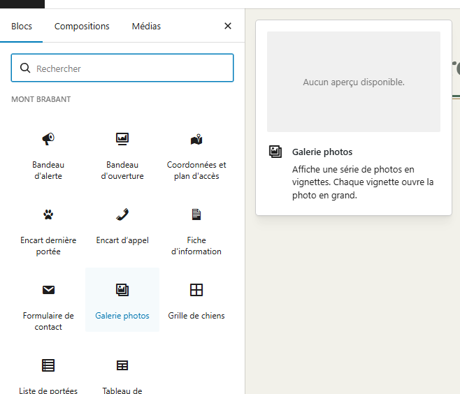
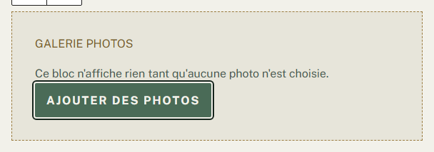
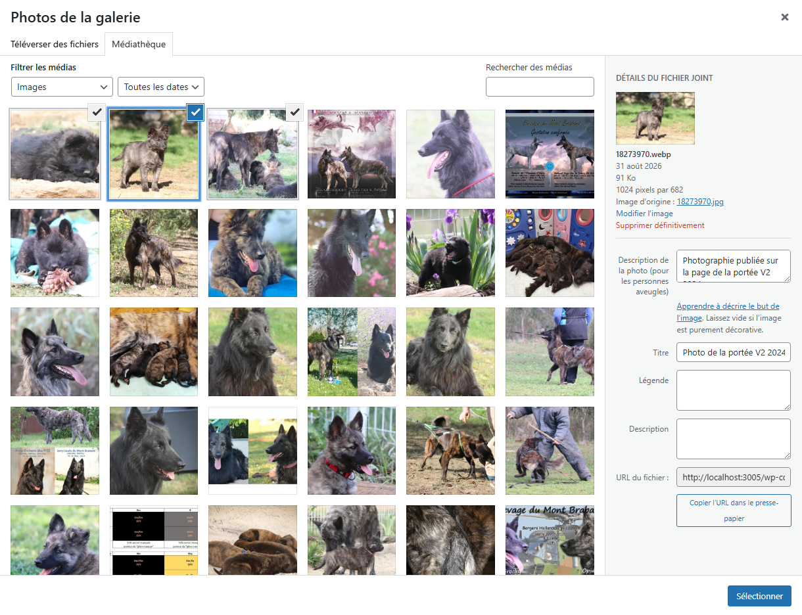
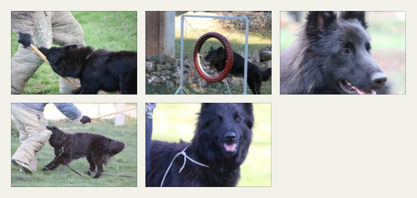
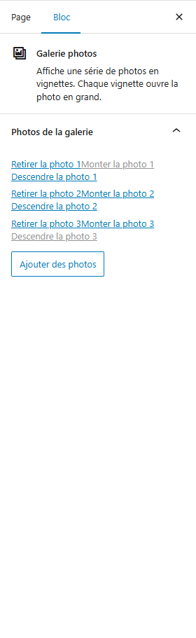
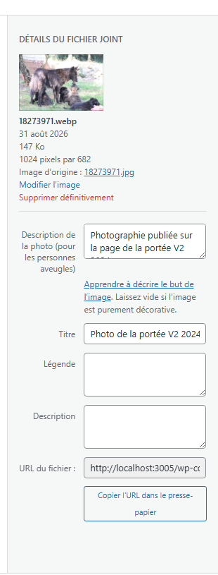
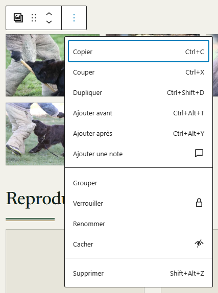
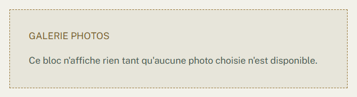

# Ajouter des photos dans une page

**Quand** : quand vous voulez montrer plusieurs photos sur une page du site — une page de présentation,
une page d'accueil, une page libre.
**Temps** : 3 minutes. **Rattrapable** : oui. Vous pouvez changer les photos, changer leur ordre, en
retirer ou tout enlever, autant de fois que vous voulez.

Le composant s'appelle **Galerie photos**. Vous choisissez des photos, vous les rangez dans l'ordre
voulu, et c'est tout : le site s'occupe de leur taille, de leur cadrage et de leur disposition.

---

## Deux choses portent le nom **Galerie photos** — à lire avant tout le reste

C'est la seule chose qui peut vous embrouiller ici, alors la voici en premier.

| Où vous êtes | Ce que vous employez |
|---|---|
| Sur une **portée**, un **chien** ou un **résultat de travail** | Le champ **Galerie photos**, déjà présent dans l'écran de saisie. Vous savez déjà le remplir. |
| Sur une **page** du site | Le composant **Galerie photos**, que vous ajoutez vous-même. C'est l'objet de cette fiche. |

**Les pages se composent, les fiches se remplissent.** Une portée, un chien, un résultat : ce sont des
cases à remplir de haut en bas, et il n'y a rien à y ajouter — leurs photos ont déjà leur champ
**Galerie photos**. Une page, elle, se compose : vous y posez ce que vous voulez, et c'est là que le
composant **Galerie photos** sert.

**Vous ne pouvez pas ajouter ce composant dans une fiche de portée, de chien ou de résultat**, et vous
n'avez pas à essayer : le champ y est déjà. Si vous cherchez à ajouter des photos à une portée, allez
voir « Ajouter une portée » ; pour un chien, « Ajouter un chien ».

Les deux se ressemblent d'ailleurs beaucoup à l'usage : mêmes mots, mêmes boutons — **Ajouter des
photos**, **Retirer la photo 1**, **Monter la photo 1**, **Descendre la photo 1**. C'est voulu : rien de
nouveau à apprendre.

---

## Les étapes

1. Dans le menu de gauche, cliquez sur **Pages**, puis sur le titre de la page à modifier.
2. Placez le curseur à l'endroit où vous voulez les photos, puis cliquez sur le bouton **+**, en haut à
   gauche de l'écran. Ce bouton s'appelle **Outil d'insertion de bloc**.
3. Dans la liste qui s'ouvre, **Mont Brabant** est la première rubrique : cliquez sur
   **Galerie photos**.

   

4. Un cadre apparaît dans la page, avec la mention **GALERIE PHOTOS** et la phrase
   « Ce bloc n'affiche rien tant qu'aucune photo n'est choisie. » Cliquez sur **Ajouter des photos**.

   

5. La fenêtre **Photos de la galerie** s'ouvre sur l'onglet **Téléverser des fichiers**. Cliquez sur
   l'onglet **Médiathèque**, juste à côté, pour voir les photos déjà présentes sur le site.
6. **Cochez chaque photo par la petite case, dans le coin en haut à droite de sa vignette.**
   Elle apparaît quand vous passez la souris sur la photo, et reste visible tant que la photo est
   cochée. Recliquez-la pour décocher. Prenez-les dans n'importe quel ordre.

   **Ne cliquez pas au milieu d'une vignette pour en ajouter une deuxième** : ici, un clic au milieu
   remplace votre choix par cette seule photo. Si cela arrive, rien n'est perdu : reprenez par les
   cases.

   *Plus rapide, si vous êtes à l'aise :* gardez la touche **Ctrl** enfoncée en cliquant les vignettes
   (**Cmd** sur un Mac). Les photos s'ajoutent les unes aux autres, sans effacer les précédentes.

   *Dans l'écran d'une portée ou d'un chien, un simple clic sur la vignette ajoute bien la photo. Dans
   cette fenêtre-ci, non — la case, elle, marche dans les deux.*
7. Cliquez sur **Sélectionner**, en bas à droite de la fenêtre. Les photos s'ajoutent, et l'aperçu
   se dessine dans la page.

   

8. Cliquez sur **Mettre à jour**, en haut à droite. C'est en ligne.

**Tant que vous n'avez pas cliqué sur Mettre à jour, rien n'est publié.** Vous pouvez quitter la page
sans enregistrer : elle reste comme elle était.

---

## Ranger les photos dans l'ordre voulu

L'ordre des vignettes sur le site est l'ordre de la liste, et vous le réglez dans la colonne de droite.

1. Cliquez sur le composant dans la page.
2. Dans la colonne de droite, ouvrez le panneau **Photos de la galerie**.
3. Sous chaque photo, trois boutons : **Retirer la photo 2**, **Monter la photo 2**,
   **Descendre la photo 2**. Le chiffre suit le rang de la photo et se recalcule tout seul.
4. Cliquez sur **Mettre à jour**.

Sur la première photo, **Monter la photo 1** est grisé ; sur la dernière, **Descendre** l'est aussi.
C'est normal : il n'y a rien au-dessus de la première ni en dessous de la dernière.

---

## **Ajouter des photos** ajoute, il ne remplace pas

La fenêtre s'ouvre toujours vide, sans cocher ce qui est déjà dans la galerie. Les photos que vous
choisissez viennent **s'ajouter à la fin** de la liste. Une photo déjà présente n'est pas ajoutée une
seconde fois.

Vous pouvez donc y revenir dix fois, par petits paquets : rien n'est effacé au passage. C'est exactement
le comportement du champ **Galerie photos** d'une fiche de chien ou de portée.

---

## Décrire chaque photo, une seule fois pour tout le site

Pour chaque photo, écrivez en une phrase quel chien on voit et ce qu'il fait. Ce texte n'est pas affiché
à l'écran : il est **lu à voix haute** aux personnes aveugles qui visitent le site, et il s'affiche à la
place de la photo quand celle-ci ne se charge pas.

**Cette description appartient à la photo, pas à la page.** Vous la corrigez une fois, et **toutes** les
pages qui montrent cette photo suivent. Vous n'avez jamais à repasser page par page.

Pour l'écrire ou la corriger :

1. Cliquez sur **Ajouter des photos**.
2. La fenêtre **Photos de la galerie** s'ouvre sur l'onglet **Téléverser des fichiers** : cliquez sur
   l'onglet **Médiathèque**, juste à côté, puis sur la photo concernée.
3. Écrivez sa description dans la colonne de droite de la fenêtre, dans le champ
   **Description de la photo (pour les personnes aveugles)** — c'est le premier des quatre, avant
   **Titre**, **Légende** et **Description**.
4. Refermez la fenêtre avec la croix en haut à droite : ce bouton s'appelle **Fermer**, mais n'affiche
   pas ce mot à l'écran. Si vous ne voulez rien ajouter à la galerie, refermez sans cliquer sur
   **Sélectionner** : votre correction est enregistrée quand même.

**Deux champs de cette colonne commencent par le mot « Description » : fiez-vous au rang, pas au nom.**
Celui qu'on remplit est **le premier des quatre**. **N'écrivez pas dans le dernier des quatre**, celui
qui s'appelle **Description** tout court : il ne sert à rien ici.

*Une exception à connaître, pour ne pas la chercher :* si vous posez une photo avec le bouton **+** en
choisissant **Image** ou **Galerie** au lieu de **Galerie photos**, le panneau de réglages de la page,
à droite, appelle encore ce champ **Texte alternatif**. C'est le même champ et il sert à la même chose :
écrivez votre description dedans. Nous n'avons pas la main sur ce nom-là.

**Une photo sans description ne casse rien.** Le site annonce alors la vignette comme
« Photo 3 sur 12 » : la galerie reste utilisable au clavier et à la voix. Mais le nom du chien, lui, est
perdu pour quelqu'un qui ne voit pas l'image. Trente secondes par photo, et ce n'est plus le cas.

---

## Ce qui se règle tout seul, et pourquoi c'est une bonne nouvelle

**Vous n'avez rien à régler d'autre que les photos et leur ordre.** Il n'y a ni nombre de colonnes, ni
taille de vignette, ni couleur, ni écart à choisir — c'est voulu.

- **La disposition s'adapte d'elle-même** au nombre de photos et à la taille de l'écran : deux colonnes
  sur un téléphone, davantage sur un ordinateur. Une seule photo se pose à gauche, sans être étirée.
- **Les vignettes sont toutes à la même forme**, un rectangle couché. Une photo verticale est donc
  rognée en haut et en bas dans sa vignette : **le cadre gagne toujours**, c'est ce qui garde la galerie
  bien alignée. Ce n'est pas un défaut. Le cadrage entier reste visible quand on clique la photo.
- **Les couleurs, les lettres et les espacements sont fixés par le design du site.** Vos galeries se
  ressemblent d'une page à l'autre sans que vous ayez à y penser.
- **Le poids des photos est géré pour vous** : le site envoie une petite version aux téléphones et une
  plus grande aux grands écrans.

Vous pouvez mettre **plusieurs galeries dans une même page**, si vous voulez séparer deux séries.

---

## Ce qu'un visiteur voit quand il clique une photo

La photo s'ouvre en grand. **Aujourd'hui, elle s'ouvre à la place de la page** : le visiteur voit le
fichier seul, et il revient à la page avec le bouton de retour de son navigateur. Il n'y a pas encore de
visionneuse avec des flèches pour passer d'une photo à la suivante ; elle viendra plus tard.

Rien n'est cassé, et rien ne sera à refaire : le jour où la visionneuse arrive, vos galeries en
profiteront sans que vous y touchiez.

---

## Enlever une photo, ou enlever toute la galerie

**Retirer une photo ne la supprime jamais du site.** Dans le panneau **Photos de la galerie**, cliquez
sur **Retirer la photo 2**, puis sur **Mettre à jour**. La photo sort de cette galerie et reste
disponible pour la remettre ou pour l'employer ailleurs. Les numéros se resserrent tout seuls.

**Pour enlever le composant en entier** : cliquez sur le composant, puis sur le bouton à trois points de
sa petite barre d'outils. Dans le menu qui s'ouvre, **tout en bas**, cliquez sur **Supprimer**.
**Aucune photo n'est perdue** : elles restent toutes dans la bibliothèque de photos, et vous pouvez
reposer une galerie plus tard.

*Le menu n'a pas la même longueur selon le composant, mais **Supprimer** en est toujours la dernière
entrée : descendez jusqu'au bout, c'est là.*

Rien n'est définitif avant **Mettre à jour** : si vous vous êtes trompée, quittez la page sans
enregistrer.

---

## En cas de doute

**C'est normal, vous n'avez rien à faire :**

- Le cadre affiche « Ce bloc n'affiche rien tant qu'aucune photo n'est choisie. » : vous n'avez pas
  encore choisi de photos. Cliquez sur **Ajouter des photos**.
- Le cadre affiche « Ce bloc n'affiche rien tant qu'aucune photo choisie n'est disponible. » : vos
  photos **avaient bien été choisies**, mais les fichiers ne sont plus dans la bibliothèque. Ce n'est
  pas la même chose que la phrase précédente. Ajoutez d'autres photos, ou remettez celles qui
  manquaient.

  

- **Vous avez cliqué plusieurs photos et une seule s'est ajoutée.** Dans cette fenêtre, un clic au
  milieu d'une vignette remplace le choix précédent. Reprenez par la petite case en haut à droite
  de chaque vignette.
- Une galerie sans photo **n'affiche rien du tout** aux visiteurs : ni cadre, ni trou, ni message. La
  page reste normale. Ce cadre n'existe que pour vous, pendant que vous modifiez.
- Une vignette a disparu de la galerie : la photo a été supprimée de la bibliothèque. La numérotation se
  resserre, et **il n'y a rien à réparer**. Si vous remettez la photo, la galerie se rétablit d'elle-même.
- **Monter la photo 1** est grisé sur la première photo, **Descendre** sur la dernière.
- Une photo verticale est rognée en haut et en bas dans sa vignette.
- **Dans la page en cours de modification, la galerie est plus étroite que sur le site, et montre donc
  moins de colonnes.** C'est normal : la page en cours de modification s'affiche dans une fenêtre plus
  étroite que celle du site. Les photos et leur ordre sont les bons. Cliquez sur **Aperçu**, ou ouvrez
  la page sur le site : c'est le rendu qui compte.
- Le composant **Galerie photos** ne se propose pas dans une fiche de portée, de chien ou de résultat.
  C'est voulu : ces fiches ont déjà leur champ **Galerie photos**.

**Ce n'est pas normal, signalez-le :**

- Les photos s'affichent dans un ordre qui n'est pas celui du panneau **Photos de la galerie**, après un
  **Mettre à jour**.
- Une photo **cochée par sa case** dans la fenêtre n'apparaît pas dans la liste du panneau.
- **Dans la fenêtre des photos, le premier des quatre champs porte un autre nom que
  « Description de la photo (pour les personnes aveugles) ».** Rien n'est cassé et rien n'est perdu :
  écrivez votre description dans ce premier champ comme d'habitude, et dites-le-nous. C'est vous qui
  voyez cet écran, pas nous.
- Le bouton **+** ne propose aucune rubrique **Mont Brabant**.
- La galerie s'affiche sur la page en cours de modification, mais pas sur le site.

**Ce qu'il vaut mieux ne pas faire :**

- **Ne recopiez pas une galerie d'une page à l'autre.** Reposez un composant **Galerie photos** et
  choisissez les photos : c'est plus rapide, et les descriptions suivent d'elles-mêmes.
- **Ne corrigez pas une description page par page.** Corrigez-la une fois sur la photo, comme expliqué
  plus haut.
- **N'ajoutez pas ce composant dans une fiche** : le champ **Galerie photos** y est déjà.

**Si quelque chose vous inquiète** : ne supprimez rien, ne cliquez pas sur **Mettre à jour**, notez le
titre de la page et l'heure, et appelez-nous. Une page en cours de modification n'a jamais cassé un
site.
