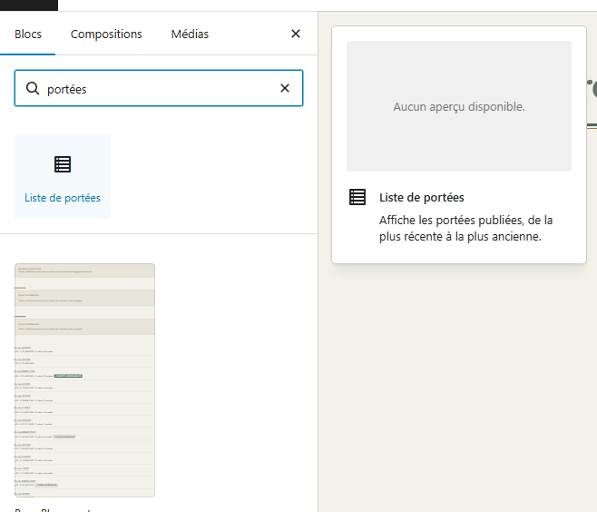
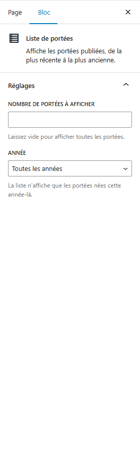
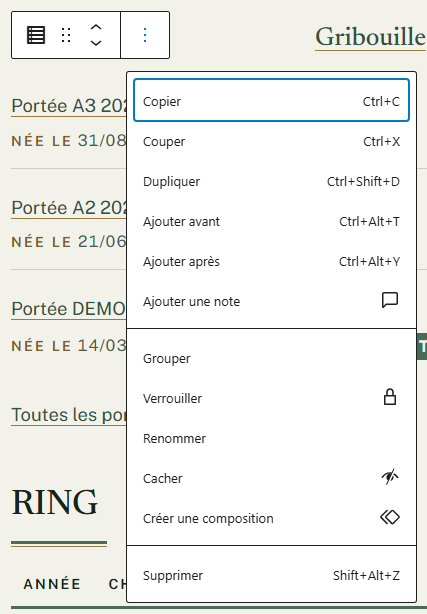
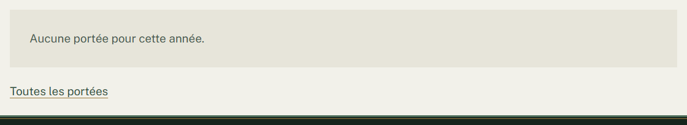

# Afficher la liste des portées dans une page

**Quand** : une seule fois, sur la page où vous voulez montrer vos portées — l'historique des portées, ou
une page qui n'en montre que les plus récentes. Ensuite, plus jamais : la liste suit vos portées toute
seule.
**Temps** : 2 minutes. **Rattrapable** : oui. Vous pouvez changer les réglages, enlever la liste et la
reposer autant de fois que vous voulez, sans rien perdre.

Le composant s'appelle **Liste de portées**. Vous le posez dans la page, et c'est tout : chaque portée
publiée y apparaît d'elle-même, de la plus récemment née à la plus ancienne, avec un lien vers sa page.

**Vous n'avez rien à recopier et rien à écrire dedans.** À chaque nouvelle portée publiée, la liste
s'allonge d'elle-même — vous ne revenez pas sur la page.

Ce composant se pose dans une **page**, jamais dans une fiche de portée, de chien ou de résultat : **les
pages se composent, les fiches se remplissent.** Sur l'écran d'une portée, il n'y a d'ailleurs pas de
bouton **+**.

---

## Les étapes

1. Dans le menu de gauche, cliquez sur **Pages**, puis sur **Toutes les pages**, puis sur le titre de la
   page à modifier.

2. Placez le curseur à l'endroit où vous voulez la liste, puis cliquez sur le bouton **+**, en haut à
   gauche de l'écran. Ce bouton s'appelle **Outil d'insertion de bloc**.

3. Tapez **portées** dans le champ **Rechercher**, en haut de la liste qui s'ouvre, puis cliquez sur
   **Liste de portées**.

   *C'est le chemin qui marche à coup sûr. Le composant est aussi rangé dans la rubrique
   **Mont Brabant**, mais **il ne montre pas d'aperçu** : seulement son nom, une petite icône de liste et
   sa phrase de présentation, « Affiche les portées publiées, de la plus récente à la plus ancienne. »
   C'est voulu — un aperçu ne vous apprendrait rien de plus sur une liste de texte.*

   

4. La liste apparaît aussitôt, **déjà remplie avec vos portées**. Il n'y a aucune portée à cocher.

5. **Vous pouvez vous arrêter là.** Si vous voulez n'en montrer qu'une partie, la colonne de droite
   propose le panneau **Réglages**, déjà ouvert, avec deux réglages (voir plus bas).

   *Si la colonne de droite n'est pas affichée, ouvrez-la avec le bouton en forme de roue dentée, en haut
   à droite de l'écran.*

6. Si vous voulez un titre au-dessus de la liste, ajoutez un composant **Titre** juste au-dessus, par le
   bouton **+**. La liste n'écrit pas de titre elle-même, exprès : c'est ainsi que votre titre se place
   au bon niveau dans la page.

7. Cliquez sur **Mettre à jour**, en haut à droite. C'est en ligne.

8. Ouvrez la page sur le site, ou cliquez sur **Aperçu** : c'est là que la liste est à sa vraie allure.

**Tant que vous n'avez pas cliqué sur Mettre à jour, rien n'est publié.** Vous pouvez quitter la page
sans enregistrer : elle reste comme elle était.

---

## Ce qui se met à jour tout seul

- **Les portées affichées.** Vous publiez une portée : elle entre dans la liste, sans que vous ouvriez la
  page. Vous corrigez une portée : la liste suit. **Une saisie sur la portée, et c'est fait partout.**
- **L'ordre.** Toujours de la portée née le plus récemment à la plus ancienne, d'après la date de
  naissance que vous avez saisie. Il n'y a pas d'ordre à régler, et rien à faire remonter à la main.
- **La disponibilité.** Vous passez une portée en **Tous réservés** ou en **Portée passée** sur sa fiche :
  la mention change ici aussitôt.
- **La date, le nombre de chiots, la photo, le lien** de chaque ligne.
- **La liste des années** proposée dans les réglages : elle se construit à partir des portées qui
  existent vraiment. Une année nouvelle y apparaît dès que vous publiez sa première portée.
- **Le lien Toutes les portées**, quand il est utile (voir plus bas). Vous ne l'écrivez jamais.

**Vous ne reviendrez jamais sur cette page pour annoncer une portée.** C'est tout ce que ce composant
sert à supprimer : plus de page recopiée à la main à chaque naissance.

---

## Ce que chaque ligne montre

- **Le nom de la portée**, tel que vous l'avez saisi. Il est cliquable et mène à la page de la portée.
- **Née le**, suivi de la date de naissance.
- **Le nombre de chiots**, mâles et femelles, tel que vous l'avez saisi dans **Nombre de mâles** et
  **Nombre de femelles**.
- **La mention de disponibilité** : **Chiots disponibles**, **Tous réservés** ou **Portée passée**.
- **Une petite photo**, si la portée a une **Photo principale**.

**Ce qui n'est pas rempli ne s'affiche pas du tout.**

- **Pas de photo** : la ligne n'a pas de photo, et **rien à sa place** — ni cadre vide, ni silhouette, ni
  image de remplacement. La ligne est juste un peu plus courte.
- **Aucun compteur de chiots saisi** : rien ne s'écrit. Le site n'écrit jamais « 0 mâle » à votre place.
- **Aucune Disponibilité choisie** : aucune mention n'apparaît.

**Vous n'avez donc jamais à remplir un champ juste pour que l'affichage soit propre.** Posez la liste,
complétez les portées quand vous savez.

---

## Les deux réglages

Ils sont dans la colonne de droite, panneau **Réglages**.

### **Nombre de portées à afficher**

Sa ligne d'aide dit : « Laissez vide pour afficher toutes les portées. »

| Ce que vous mettez | Ce que la page montre |
|---|---|
| **Vide** *(le réglage de départ)* | **Toutes** les portées |
| **5** | Les 5 portées les plus récentes, puis le lien **Toutes les portées** |

- **Vide veut dire toutes, jamais aucune.** C'est le point qui surprend : un champ vide n'éteint pas la
  liste.
- **Il n'existe aucun moyen de demander zéro portée.** Pour n'afficher aucune portée sur une page, vous
  **enlevez le composant** (voir plus bas).
- Un nombre plus grand que le nombre de portées ne fait rien de mal : la liste affiche ce qu'elle a.

### **Année**

Sa ligne d'aide dit : « La liste n'affiche que les portées nées cette année-là. »

**Cette liste déroulante n'est pas illustrée.** Elle s'ouvre quand vous cliquez dessus, et elle
propose, dans cet ordre : **Toutes les années** en premier, puis **une ligne par année où une portée
est née**, de la plus récente à la plus ancienne. Il n'y a rien d'autre dedans, et vous n'avez aucune
année à y écrire.

- Le premier choix, **Toutes les années**, est celui de départ : aucune année n'est écartée.
- Les autres choix sont les années de vos portées, de la plus récente à la plus ancienne.
- **C'est vous qui choisissez l'année, une fois, en posant la liste. Ce n'est pas un menu que le
  visiteur clique** : sur le site, personne ne filtre la liste. Si vous voulez proposer plusieurs années,
  posez **plusieurs Liste de portées** dans la même page, chacune réglée sur son année, avec un
  composant **Titre** au-dessus de chacune.
- **Une année que vous avez choisie reste dans la liste des choix**, même si sa dernière portée n'est
  plus publiée. Votre réglage n'est jamais effacé en silence.
- Une portée dont la date de naissance est vide n'appartient à aucune année : elle n'apparaît pas dans
  une liste filtrée, mais elle reste dans la liste complète.

---

## Le lien **Toutes les portées**

Quand vous avez limité la liste avec **Nombre de portées à afficher**, un lien **Toutes les portées**
s'ajoute tout seul à la fin, et mène à la page du site qui liste toutes vos portées.

- **Vous ne l'écrivez pas, et il n'y a pas de réglage pour lui.**
- Il n'apparaît **pas** quand la liste montre déjà toutes les portées : il n'y aurait rien de plus à
  aller voir.
- Ne le confondez pas avec l'entrée **Toutes les portées** du menu de gauche de l'administration : celle-là
  sert à vous, pour ouvrir vos fiches.

---

## Ce qui n'est pas réglable, et c'est normal

- **Les couleurs, les lettres, les espaces, la largeur et la taille des petites photos** sont fixés par le
  design du site. Vos pages se ressemblent d'une à l'autre sans que vous ayez à y penser.
- **L'ordre des portées ne se change pas** : la plus récemment née est toujours en tête.
- **La date s'écrit toujours de la même façon** partout sur le site.
- **Les petites photos ne s'affichent ni ne se cachent au choix** : une portée qui a une
  **Photo principale** montre sa photo, les autres non.
- **La liste n'écrit pas de titre.** Si vous en voulez un, posez un composant **Titre** juste au-dessus.
- **Il n'y a pas de « page suivante »** : la liste montre d'un coup ce que vous lui avez demandé.

Vous pouvez mettre **plusieurs Liste de portées dans une même page**, réglées différemment.

---

## Enlever la liste d'une page

Cliquez sur le composant dans la page, puis sur le bouton à trois points de sa petite barre d'outils.
Dans le menu qui s'ouvre, **tout en bas**, cliquez sur **Supprimer**. Cliquez ensuite sur
**Mettre à jour**.

*Le menu n'a pas la même longueur selon le composant, mais **Supprimer** en est toujours la dernière
entrée : descendez jusqu'au bout, c'est là.*

**Il n'y a rien à craindre :**

- **Aucune portée n'est touchée**, aucune photo n'est perdue. Vos portées vivent dans leurs propres
  fiches, sous **Portées** → **Toutes les portées** : la liste n'en est qu'un affichage.
- Vous pouvez reposer une **Liste de portées** plus tard, au même endroit, en trois clics — et elle se
  remplira toute seule, comme la première fois.
- Rien n'est définitif avant **Mettre à jour** : si vous vous êtes trompée, quittez la page sans
  enregistrer.

---

## En cas de doute

**C'est normal, vous n'avez rien à faire :**

- **La liste affiche deux lignes**, **Liste de portées** puis « Ce bloc n'affiche rien tant qu'aucune
  portée n'est publiée. » : aucune portée n'est encore en ligne. Publiez-en une par **Portées** →
  **Ajouter une portée**, et la liste se remplit d'elle-même. Aux visiteurs, une liste dans cet état **n'affiche
  rien du tout** : ni cadre, ni trou, ni message, et la page reste normale. Ces deux lignes n'existent
  que pour vous, pendant que vous modifiez.

  **Cet écran n'est pas illustré**, parce qu'il aurait fallu retirer du site toutes vos portées pour
  l'obtenir. Vous y verriez simplement un cadre gris portant ces deux lignes, à la place de la liste.

- **La page affiche « Aucune portée pour cette année. » suivi du lien Toutes les portées.** Vous avez
  choisi une **Année** qui n'a aucune portée, alors que d'autres années en ont. **C'est une réponse, pas
  une panne** : le visiteur lit une phrase claire et a de quoi continuer. Pour montrer des portées tout
  de suite, repassez **Année** sur **Toutes les années**.

  

- **Une ligne affiche Non renseigné à la place de la date.** Le champ
  **Date de naissance (obligatoire)** de cette portée est vide. Il est obligatoire pour publier une
  portée : c'est donc qu'il a été effacé après coup.
  Ouvrez la portée, remettez la date, **Mettre à jour**.
- **Une ligne n'a pas de photo.** La portée n'a pas de **Photo principale** — ouvrez-la et choisissez-en
  une quand vous en aurez, ou laissez ainsi : la liste reste juste.
- **Une portée protégée par mot de passe n'apparaît jamais dans la liste.** C'est voulu.
- **Une portée en brouillon n'apparaît pas** : elle n'est pas publiée.
- **Dans la page en cours de modification, la liste est plus étroite que sur le site.** C'est normal :
  la page en cours de modification s'affiche dans une fenêtre plus étroite que celle du site. Les
  noms, les dates, les photos et les mentions sont les bons. Cliquez sur **Aperçu**, ou ouvrez la page
  sur le site : c'est le rendu qui compte.
- **Liste de portées** ne se propose pas dans une fiche de portée, de chien ou de résultat : ces fiches
  se remplissent, elles ne se composent pas.

**Ce n'est pas normal, signalez-le :**

- Vous publiez une portée et elle n'apparaît pas dans la liste après **Mettre à jour**.
- Une portée apparaît deux fois, ou dans le désordre.
- Le nom d'une portée ne mène pas à sa page.
- Le bouton **+** ne trouve pas **Liste de portées** quand vous tapez **portées**.
- Une année manque dans le réglage **Année** alors qu'une portée de cette année est publiée.

**Ce qu'il vaut mieux ne pas faire :**

- **Ne recopiez pas vos portées à la main** dans la page — un nom, une date, une photo posés un par un.
  Vous auriez à repasser sur la page à chaque naissance et à chaque réservation : c'est exactement le
  travail que ce composant supprime.
- **N'écrivez pas 0 dans Nombre de portées à afficher** pour cacher la liste : cela affiche **toutes** les
  portées. Pour ne rien montrer, enlevez le composant.
- **Ne réglez pas une Année pour « faire un historique »** et ne l'oubliez pas : la liste resterait
  bloquée sur cette année-là, et vos nouvelles portées n'y entreraient pas. Pour un historique complet,
  laissez **Toutes les années** et **Nombre de portées à afficher** vide.

**Si quelque chose vous inquiète** : ne supprimez rien, ne cliquez pas sur **Mettre à jour**, notez le
titre de la page et l'heure, et appelez-nous. Une page en cours de modification n'a jamais cassé un site.
Et même si la liste disparaissait d'une page, **aucune portée ne serait perdue** : elles sont chacune dans
leur fiche, sous **Portées** → **Toutes les portées**.

Pour remplir ou corriger une portée, voir [Ajouter une portée](portee-ajouter-une-portee.md).
