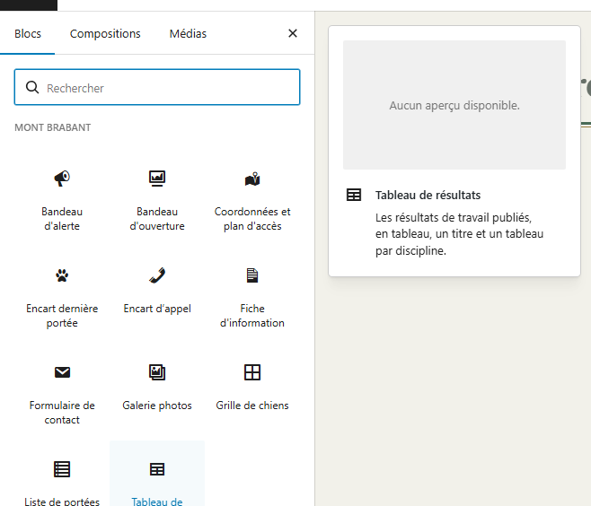
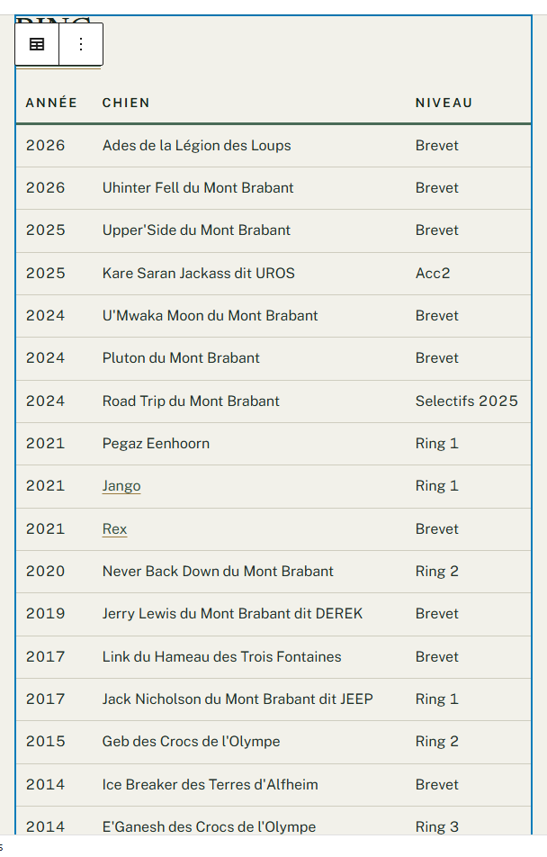
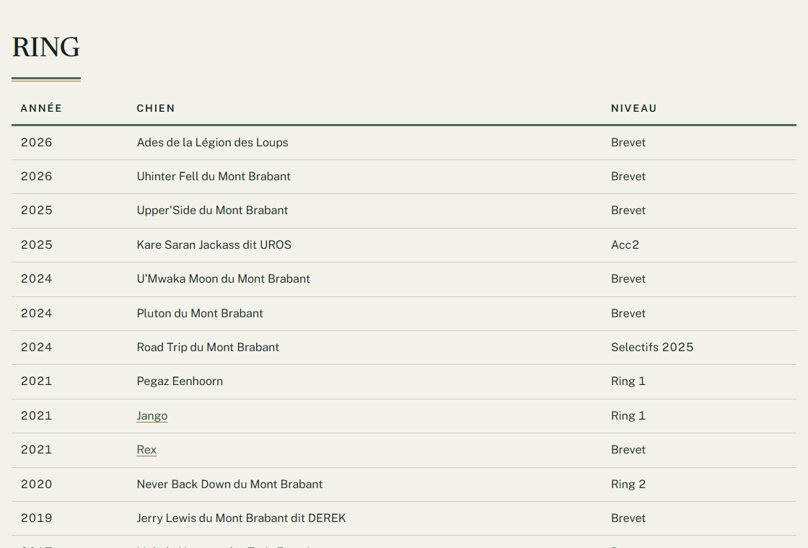
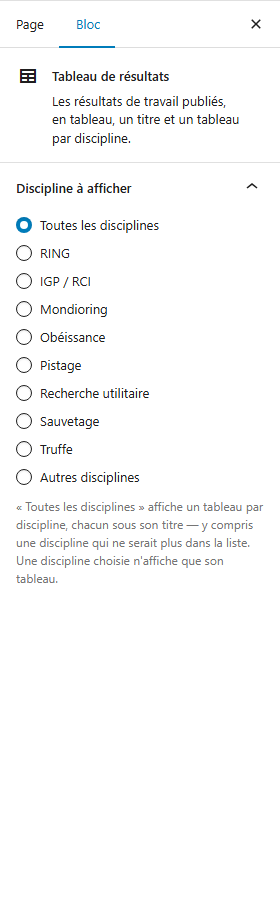
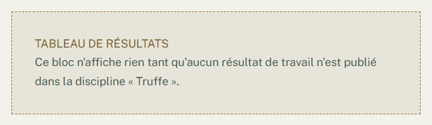
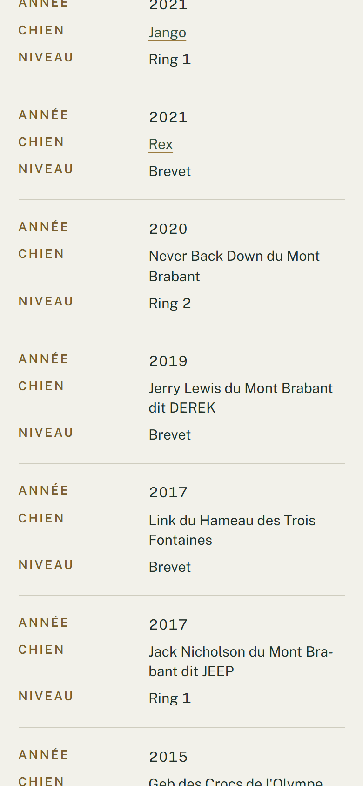

# Afficher les résultats de travail sur une page

**Quand** : sur la page **Travail**, ou sur toute page où vous voulez montrer les résultats obtenus en
concours et en épreuve.
**Temps** : 1 minute. **Rattrapable** : oui, entièrement. Vous pouvez le poser, le régler et l'enlever
autant de fois que vous voulez : **aucun résultat n'est perdu**, ils vivent dans vos
**Résultats de travail**, pas dans la page.

Le composant s'appelle **Tableau de résultats**. Sa phrase de présentation dit à quoi il sert :

> Les résultats de travail publiés, en tableau, un titre et un tableau par discipline.

**Vous le posez, et il est déjà rempli.** Il n'y a pas une ligne à retaper : il affiche les
**Résultats de travail** que vous avez publiés, et rien d'autre. Le jour où vous ajoutez un résultat,
il apparaît tout seul dans le bon tableau — vous n'avez pas à rouvrir la page.

---

## Les étapes

1. Dans le menu de gauche, cliquez sur **Pages**, puis sur **Toutes les pages**, puis sur le titre de
   la page où le tableau doit apparaître.

2. Placez le curseur à l'endroit voulu dans la page, puis cliquez sur le bouton **+**, en haut à gauche
   de l'écran. Ce bouton s'appelle **Outil d'insertion de bloc**.

3. Dans la liste qui s'ouvre, **Mont Brabant** est la première rubrique : cliquez sur
   **Tableau de résultats**. Si vous préférez chercher, tapez « résultats », « travail »,
   « discipline », « concours », « palmarès » ou « tableau » dans le champ **Rechercher**, en haut de
   la liste : il sort avec chacun de ces mots.

   

4. **Le tableau apparaît déjà rempli**, avec vos résultats publiés. **Vous pouvez vous arrêter là** :
   il est publiable tel quel, et il affiche alors **toutes les disciplines**, un titre et un tableau
   pour chacune.

   

5. *Facultatif* — pour n'afficher qu'une seule discipline, ouvrez la colonne de droite et servez-vous
   du réglage **Discipline à afficher**, décrit juste en dessous.

6. Cliquez sur **Mettre à jour**, en haut à droite. C'est en ligne.

7. Ouvrez la page sur le site, ou cliquez sur **Aperçu** : c'est là que le tableau est à sa vraie
   allure.

**Tant que vous n'avez pas cliqué sur Mettre à jour, rien n'est publié.** Vous pouvez quitter la page
sans enregistrer : elle reste comme elle était.

---

## Le seul réglage : **Discipline à afficher**

Dans la colonne de droite, le panneau **Discipline à afficher** est déjà ouvert. Il propose dix choix,
à cocher, et un seul à la fois. Sous les choix, cette phrase :

> « Toutes les disciplines » affiche un tableau par discipline, chacun sous son titre — y compris une
> discipline qui ne serait plus dans la liste. Une discipline choisie n'affiche que son tableau.

- **Toutes les disciplines** — coché d'avance, et c'est le bon choix dans presque tous les cas. Vous
  obtenez un titre et un tableau **par discipline**, toujours dans le même ordre : **RING**,
  **IGP / RCI**, **Mondioring**, **Obéissance**, **Pistage**, **Recherche utilitaire**, **Sauvetage**,
  **Truffe**, **Autres disciplines**.
- **Une discipline cochée** — **RING** par exemple : vous obtenez **son seul tableau**, avec son titre.

**Une discipline sans aucun résultat n'affiche rien** : ni titre, ni tableau vide. Vous n'avez pas à
faire le tri, il se fait tout seul.

---

## Sur une fiche de chien, vous n'avez rien à poser

Le palmarès d'un chien s'affiche **tout seul** sur sa fiche, sous le titre **Palmarès de travail**, dès
qu'un résultat publié lui est rattaché. Vous n'avez ni composant à poser, ni réglage à choisir, et il
n'y a d'ailleurs pas de bouton **+** sur l'écran d'un chien : **les fiches se remplissent, les pages se
composent.**

C'est le même tableau, présenté autrement : sur la page, une colonne **Chien** et les années de la plus
récente à la plus ancienne ; sur la fiche, une colonne **Discipline** à la place du nom, et les années
dans l'ordre où la carrière s'est faite.

---

## Ce qui se met à jour tout seul

Vous saisissez **une seule fois**, dans **Résultats de travail** — voir *Ajouter un résultat de
travail*. Ensuite :

- Un résultat **publié** apparaît dans le tableau de sa discipline, **sans que vous rouvriez la page**.
- Il apparaît **en plus** dans le palmarès de la fiche du chien, s'il est rattaché à une fiche.
- Une correction — une année, un niveau, un conducteur — se répercute aux deux endroits.
- Un résultat mis à la corbeille disparaît des deux endroits.
- Renommez la fiche d'un chien : son nom se corrige tout seul dans le tableau, et le lien continue de
  mener à sa fiche.

**Vous ne tapez jamais une ligne de tableau à la main.** Si vous vous surprenez à le faire, arrêtez-vous
et saisissez plutôt le résultat.

---

## Les colonnes, et pourquoi elles changent d'un tableau à l'autre

Un tableau de discipline montre **Année**, **Chien**, **Niveau**. Un palmarès de fiche montre
**Année**, **Niveau**, **Discipline**.

Deux colonnes apparaissent **seulement si au moins un résultat les remplit** :

- **Conducteur** ;
- **Pays**, qui ne se remplit que pour un résultat obtenu à l'étranger.

**Une case vide reste vide** : pas de tiret, pas de « Aucun », pas de « France ». Un blanc n'est pas une
réponse négative, et il n'y a rien à corriger. Les autres champs laissés vides, eux, affichent
**Non renseigné**.

---

## Ce qui n'est pas réglable, et c'est normal

- **L'ordre des années ne se règle pas** : du plus récent au plus ancien sur la page, du plus ancien au
  plus récent sur une fiche de chien. C'est la bonne lecture dans chaque cas.
- **L'ordre des disciplines ne se règle pas** : c'est celui de la liste, toujours le même.
- **Les couleurs, les lettres, les filets, la largeur du tableau** sont fixés par le design du site.
- **Les visiteurs ne peuvent ni trier ni filtrer** le tableau : ils le lisent, c'est tout.

**Vous ne pouvez rien casser avec ce composant.** Il n'a qu'un réglage, et le pire qu'il puisse produire
est un tableau qui n'affiche rien.

---

## Enlever le tableau

Cliquez sur le tableau dans la page, puis sur le bouton à trois points de sa petite barre d'outils.
Dans le menu qui s'ouvre, **tout en bas**, cliquez sur **Supprimer**. Cliquez ensuite sur
**Mettre à jour**.

*Le menu n'a pas la même longueur selon le composant, mais **Supprimer** en est toujours la dernière
entrée : descendez jusqu'au bout, c'est là.*

**Il n'y a rien à craindre :**

- **Aucun résultat n'est supprimé.** Ils restent tous dans **Résultats de travail**, et continuent de
  s'afficher partout ailleurs — sur la fiche des chiens concernés, notamment.
- Vous pouvez reposer un **Tableau de résultats** plus tard, au même endroit : il se remplira tout seul,
  comme la première fois.
- Rien n'est définitif avant **Mettre à jour** : si vous vous êtes trompée, quittez la page sans
  enregistrer.

---

## Quand il n'y a rien à afficher

**Côté visiteurs : rien du tout.** Pas de titre, pas de tableau vide, pas de « aucun résultat pour le
moment ». La page s'affiche comme si le composant n'était pas là. C'est voulu : mieux vaut une page qui
ne dit rien qu'une page qui annonce du vide.

**Côté écran de modification**, un cadre gris au contour en tirets prend la place, portant
**TABLEAU DE RÉSULTATS** puis l'une de ces phrases :

- « Ce bloc n'affiche rien tant qu'aucun résultat de travail n'est publié. » — vous n'avez encore publié
  aucun résultat.
- « Ce bloc n'affiche rien tant qu'aucun résultat de travail n'est publié dans la discipline
  « RING ». » — la discipline cochée n'a aucun résultat. La discipline citée est celle que vous avez
  cochée.

**C'est normal, c'est voulu, et ce n'est pas une panne.** Ce cadre n'existe que pour vous, pendant que
vous modifiez la page. **Ce qu'il faut faire** : publiez le résultat manquant, ou cochez
**Toutes les disciplines**, ou laissez comme cela — les visiteurs ne voient rien.

---

## En cas de doute

**C'est normal, vous n'avez rien à faire :**

- **Un cadre gris à contour en tirets porte TABLEAU DE RÉSULTATS et une phrase « Ce bloc n'affiche rien
  tant que… ».** C'est l'écran de modification qui vous prévient qu'il n'y a rien à montrer. Voir juste
  au-dessus.
- **Une discipline n'a pas de tableau.** Aucun résultat n'y est publié. Le titre ne s'affiche pas non
  plus, exprès.
- **Une colonne Pays ou Conducteur manque.** Aucun résultat de ce tableau ne la remplit. Elle
  réapparaîtra toute seule au premier résultat qui la remplit.
- **Une case est vide.** C'est un **Pays** laissé vide, donc un résultat obtenu en France. Rien à
  corriger.
- **Un tableau s'intitule Non renseigné.** Il rassemble les résultats dont la **Discipline** n'a pas été
  choisie. **Ce qu'il faut faire** : ouvrez ces résultats et choisissez leur discipline — ils
  rejoindront le bon tableau. Ce tableau-là n'apparaît que sous **Toutes les disciplines**.
- **Dans l'écran de modification, le tableau s'affiche en lignes dépliées, chaque valeur précédée de son
  étiquette, au lieu de colonnes.** C'est l'affichage prévu pour les téléphones, et il s'installe dès
  que la zone de modification devient étroite — colonne de droite ouverte, ou fenêtre réduite. **C'est
  le vrai affichage, pas un défaut.** Pour retrouver les colonnes, refermez la colonne de droite,
  cliquez sur **Aperçu**, ou ouvrez la page sur le site.

  

- **Un nom de chien n'est pas cliquable.** Ce chien n'a pas de fiche sur le site, ou sa fiche n'est pas
  publiée, ou elle est protégée par un mot de passe. Le nom s'affiche quand même, à l'identique : le
  visiteur ne voit pas qu'un lien manque, et rien ne trahit l'existence d'une page réservée.
- **Vous avez posé deux tableaux sur la même page.** C'est permis, et parfois utile — un tableau par
  discipline, séparés par du texte.
- **Une page affiche déjà plusieurs tableaux, un par discipline.** N'y touchez pas : elle fonctionne, et
  elle permet d'écrire du texte entre deux disciplines. **Sachez seulement ce qu'elle ne montre pas** :
  un résultat dont la **Discipline** n'a pas été choisie n'apparaît dans **aucun** de ces tableaux, et
  rien ne vous le signale. **Ce qu'il faut faire** : ouvrez **Résultats de travail**, parcourez la liste,
  et vérifiez que chaque résultat a bien une discipline choisie — voir *Ajouter un résultat de travail*.
  Une page réglée sur **Toutes les disciplines** les affiche, elle, sous le titre **Non renseigné**.

**Ce n'est pas normal, signalez-le :**

- Le bouton **+** ne propose aucune rubrique **Mont Brabant**.
- **Un résultat que vous avez publié ne se retrouve nulle part sur le site** : dans aucun tableau, et
  pas davantage sur la fiche du chien concerné. Appelez-nous, même si vous ne savez pas dire pourquoi.
- Un résultat mis à la corbeille s'affiche encore sur le site.
- Le nom d'un chien dont la fiche est **publiée et sans mot de passe** n'est pas cliquable dans le
  tableau.
- Sur un téléphone, il faut faire glisser le tableau de côté pour lire la fin d'une ligne.

**Ce qu'il vaut mieux ne pas faire :**

- **Ne recopiez pas un résultat dans le texte de la page.** Il faudrait le corriger à deux endroits, et
  l'un des deux finirait par mentir.
- **N'écrivez pas un titre de discipline à la main au-dessus du tableau** : chaque tableau porte déjà le
  sien.
- **Sur une page neuve, ne posez pas neuf tableaux réglés chacun sur une discipline.** Un seul tableau
  sur **Toutes les disciplines** suffit : il donne les mêmes neuf titres et les mêmes neuf tableaux,
  vous n'avez rien à ajouter le jour où une discipline arrive, et lui seul montre les résultats dont la
  discipline n'a pas été choisie.

**Si quelque chose vous inquiète** : ne cliquez pas sur **Mettre à jour**, quittez la page sans
enregistrer, notez le titre de la page et l'heure, et appelez-nous. Une page en cours de modification
n'a jamais cassé un site — et vos résultats, eux, ne sont pas rangés dans la page.

---

Pour saisir ou corriger un résultat, voyez *Ajouter un résultat de travail*.
