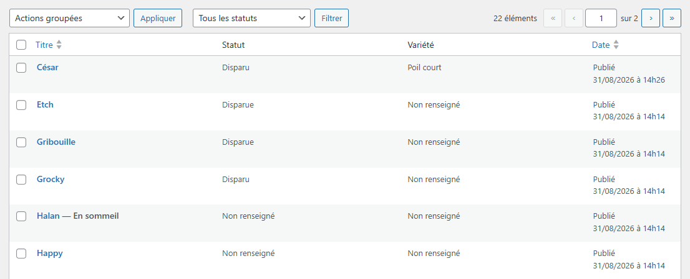
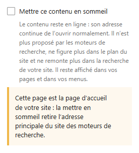

# Mettre un contenu en sommeil, et le réveiller

**Quand** : quand vous voulez qu'une portée, une fiche de chien ou une page cesse d'être proposée par
Google, sans pour autant la retirer de votre site. Et le jour où vous voulez qu'elle y revienne.
**Temps** : 1 minute. **Rattrapable** : oui, entièrement, et autant de fois que vous voulez. Vous
endormez, vous réveillez, vous rendormez — **rien n'est perdu, rien n'est supprimé, à aucun moment.**

**Le sommeil est un rangement, pas une suppression.** C'est sa propriété essentielle : vous mettez un
contenu de côté aux yeux des moteurs de recherche, et vous le ressortez quand vous voulez, d'un seul
clic, sans rien retaper.

C'est un geste **que vous refaites** : rien ne vous engage. Un contenu peut dormir six mois, se
réveiller trois semaines, se rendormir ensuite.

---

## Les étapes — sur une portée ou sur une fiche de chien

1. Dans le menu de gauche, cliquez sur **Portées**, puis sur **Toutes les portées**. *Pour un chien :
   **Chiens**, puis **Tous les chiens**.*

2. Cliquez sur le titre du contenu à endormir.

3. Regardez l'encadré **Publier**, en haut à droite. **La case est la toute dernière ligne de cet
   encadré**, tout en bas, **après la ligne « Publié le : »** — et non juste après la ligne
   **Visibilité**. Descendez jusqu'au bas de l'encadré, elle y est. *Sur un contenu que vous venez tout
   juste de créer, cette même ligne s'appelle **Publier tout de suite** ; la case est au même endroit,
   en dessous.*

4. Cochez **Mettre ce contenu en sommeil**.

5. Cliquez sur **Mettre à jour**.

**Sous la case, une phrase vous rappelle ce que le sommeil fait et ne fait pas** :

> Le contenu reste en ligne : son adresse continue de l’ouvrir normalement. Il n’est plus proposé par
> les moteurs de recherche, ne figure plus dans le plan du site et ne remonte plus dans la recherche
> de votre site. Il reste affiché dans vos pages et dans vos menus.

---

## Les étapes — sur une page

L'écran d'une page n'est pas celui d'une portée. Le mot **Publier** y est bien présent — vous le verrez,
c'est normal. Ce qui change, c'est qu'**il n'y a pas d'encadré Publier en bloc** comme sur une portée :
les réglages de la page sont de simples rangées, les unes sous les autres, et **la case est en dessous
d'elles**. Le bouton d'enregistrement, lui, ne porte pas le même nom.

1. Dans le menu de gauche, cliquez sur **Pages**, puis sur **Toutes les pages**.

2. Cliquez sur le titre de la page.

3. Regardez la **colonne de droite** : elle a deux onglets, **Page** et **Bloc**. Cliquez sur l'onglet
   **Page**. *Si vous ne voyez pas cette colonne, ouvrez-la avec le bouton en forme d'engrenage, en haut
   à droite de l'écran.*

4. Sous le titre, vous voyez une suite de rangées : **État**, **Publier**, **Adresse de la page**,
   **Auteur/autrice**, **Modèle**, **Commentaires**, **Parent**. **Descendez sous la dernière** : la
   case **Mettre ce contenu en sommeil** est là, avec sa phrase d'aide en dessous. Aucun titre ne
   l'annonce, elle est seule. *Sur une page que vous avez déjà modifiée plusieurs fois, une rangée
   **Révisions** s'ajoute juste avant **Parent** : c'est normal, et ça ne change rien au geste.*

5. Cochez la case.

6. Cliquez sur **Enregistrer**, en haut à droite. *Sur une page, le bouton s'appelle toujours
   **Enregistrer**, quel que soit l'état de la page ; sur une portée et sur une fiche de chien, il
   s'appelle **Mettre à jour**. C'est le même geste.*

---

## Réveiller un contenu

**Exactement les mêmes gestes, en décochant la case.**

1. Ouvrez le contenu : **Portées**, **Chiens** ou **Pages**, puis son titre.
2. **Décochez** **Mettre ce contenu en sommeil**.
3. Cliquez sur **Mettre à jour** (portée, fiche de chien) ou sur **Enregistrer** (page).

**Il n'y a rien d'autre à faire, rien à demander à personne, rien à ressaisir.** Le contenu n'a jamais
cessé d'exister ; vous levez simplement la consigne donnée aux moteurs de recherche.

**Si plus rien sur votre site ne relie le contenu que vous réveillez**, le réveiller ne suffit pas : il
faut aussi le relier depuis un menu ou depuis une autre page. Lisez d'abord
[Les contenus tenus à l'écart des moteurs de recherche](contenu-a-l-ecart-des-moteurs-de-recherche.md).

---

## Ce qui se fait tout seul

Dès que la case est cochée et le contenu enregistré, **sans que vous ayez rien d'autre à faire** :

- **le site demande aux moteurs de recherche de ne pas proposer ce contenu dans leurs résultats** ;
- **il disparaît du plan du site** — la liste que votre site remet aux moteurs de recherche. *Rien à
  voir avec le menu du bas de page, qui porte le même nom et que vous composez vous-même.*
- **il disparaît de la recherche de votre site** ;
- **il disparaît des flux** de votre site.

Et dès que vous décochez, **ces quatre effets tombent en même temps**, à l'enregistrement.

**La mention En sommeil s'écrit toute seule à côté du titre**, dans **Toutes les portées**, **Tous les
chiens** et **Toutes les pages**. C'est votre seul repère : vous voyez d'un coup d'œil ce qui dort.

---

## Ce que le sommeil ne fait pas — et c'est le plus important

- **Il ne supprime rien.** Pas une ligne de texte, pas une photo, pas une date.
- **L'adresse continue d'ouvrir le contenu normalement.** Une personne à qui vous donnez le lien
  l'ouvre et le lit comme avant. **Vous pouvez donc toujours transmettre l'adresse de la main à la
  main** — par téléphone, par courriel, par message.
- **Il n'y a aucun mot de passe.** Rien n'est demandé à qui arrive sur la page.
- **Le contenu reste affiché sur votre site** : une fiche endormie reste dans **La meute**, une portée
  endormie reste dans l'index des portées et dans l'encart d'accueil, et une page endormie reste dans
  vos menus si vous l'y avez mise.
- **Rien à l'écran ne signale qu'un contenu dort**, sinon la mention **En sommeil** dans vos listes
  d'administration. Une page endormie s'affiche exactement comme les autres pour qui a le lien.

**Ne confondez pas avec la protection par mot de passe.** Le mot de passe choisit **qui peut voir** ;
le sommeil choisit **qui peut trouver**. Le sommeil laisse le contenu **lisible par tous ceux qui ont
l'adresse**, il l'écarte seulement des moteurs de recherche. Si vous voulez que le contenu ne soit **pas lisible** sans autorisation, c'est l'autre
fiche qu'il vous faut : [Protéger une page par un mot de passe](page-proteger-une-page-par-mot-de-passe.md).

---

## Trois choses qui vont vous surprendre

**1. Vous ne retrouverez pas un contenu endormi par la recherche de votre site — même connectée.**
Ce n'est pas une panne : la recherche du site est justement une des choses dont le sommeil le retire,
et elle se comporte pareil pour tout le monde. **Vous le retrouvez toujours dans vos listes** :
**Portées**, **Chiens**, **Pages**. Là, **rien n'est filtré**, tout est présent, avec la mention
**En sommeil** à côté du titre. La recherche en haut de ces listes, elle, le trouve.

**2. Réveiller un contenu ne le remet pas immédiatement dans Google.** Décocher retire la consigne
donnée aux moteurs, tout de suite et sans délai de notre côté. Mais **c'est ensuite le moteur de
recherche qui décide quand il repasse** : nous ne pouvons pas le lui imposer, et nous ne vous
promettons aucun délai. Sur votre site, en revanche, tout est rétabli dès l'enregistrement.

**3. Une portée peut dormir comme une page.** Le geste existe sur les trois : portées, fiches de
chien, pages. Aucune n'en est privée.

---

## Si vous endormez la page d'accueil

**La case existe aussi sur la page d'accueil de votre site** : c'est vous, et vous seule, qui décidez
de ce que vous rangez. Mais l'écran vous prévient, en clair, par un encadré jaune posé sous la case :

> Cette page est la page d’accueil de votre site : la mettre en sommeil retire l’adresse principale du
> site des moteurs de recherche.

C'est un simple avertissement, pas une interdiction — et **il est réversible comme le reste** :
décochez, enregistrez, la consigne est levée.

---

## Ce qui est déjà en sommeil aujourd'hui

**Quelques contenus de votre site** portent déjà la mention **En sommeil**, et **chacun a sa case,
déjà cochée**. Ce n'est pas une anomalie.

**Lesquelles, combien, et d'où vient cet état** : voir
[Les contenus tenus à l'écart des moteurs de recherche](contenu-a-l-ecart-des-moteurs-de-recherche.md).

**Pour en remettre une dans Google : ouvrez-la, décochez la case, enregistrez.** C'est tout, et c'est
définitivement à vous. Vous n'avez plus rien à nous demander sur ce point.

---

## En cas de doute

**C'est normal, vous n'avez rien à faire :**

- **Un contenu endormi ne remonte pas dans la recherche de votre site, même quand vous êtes
  connectée.** C'est voulu. Retrouvez-le dans **Portées**, **Chiens** ou **Pages**.
- **Vous ouvrez l'adresse d'un contenu endormi et il s'affiche normalement.** C'est exactement la
  promesse : le sommeil l'écarte des moteurs, il ne ferme aucune porte.
- **Un chien endormi apparaît toujours dans « La meute », une portée endormie toujours dans l'index
  des portées.** C'est voulu : le sommeil ne retire rien de vos pages ni de vos menus.
- **Vous avez décoché la case, et Google propose encore le contenu.** La consigne est bien levée ;
  c'est le moteur qui n'est pas encore repassé.
- **La case est la toute dernière ligne de l'encadré Publier**, sous la ligne **Publié le :**, et non
  juste après **Visibilité**. C'est sa place.

**Ce n'est pas normal, signalez-le :**

- Une case que vous avez cochée et enregistrée, et qui revient **décochée** à la réouverture du
  contenu.
- Un contenu portant la mention **En sommeil** que Google continue de proposer **plusieurs semaines**
  après.
- Un contenu endormi dont l'adresse **n'ouvre plus rien**.
- La case **Mettre ce contenu en sommeil** absente de l'écran d'une portée, d'une fiche de chien ou
  d'une page.
- La troisième rangée, sous le titre, intitulée **Slug** et non **Adresse de la page**.

**Ce qu'il vaut mieux ne pas faire :**

- **N'endormez pas un contenu pour le retirer du site.** Ce n'est pas ce que le sommeil fait : il
  reste affiché partout où il l'était. Pour retirer un contenu du site, c'est un autre geste :
  repassez-le en brouillon.
- **N'endormez pas un contenu pour le rendre confidentiel.** Son adresse l'ouvre toujours, sans mot de
  passe. Pour cela, voir
  [Protéger une page par un mot de passe](page-proteger-une-page-par-mot-de-passe.md).
- **Ne créez pas un second contenu pour remplacer un contenu endormi.** Réveillez celui qui existe :
  il n'a rien perdu.

**Si quelque chose vous inquiète** : ne supprimez rien. Décochez la case, enregistrez, et appelez-nous.
Endormir et réveiller n'a jamais rien effacé.
