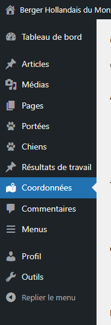
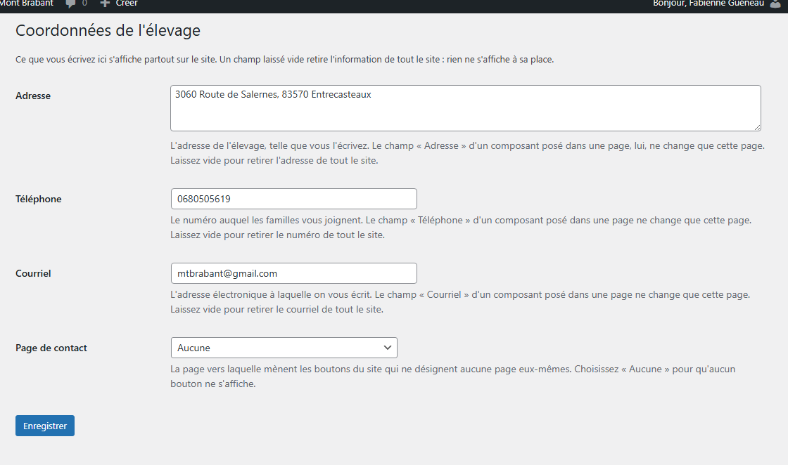
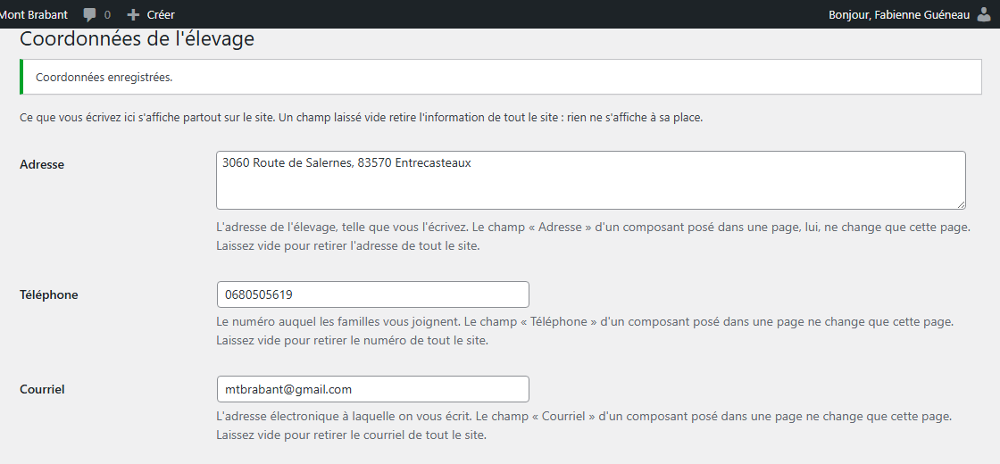
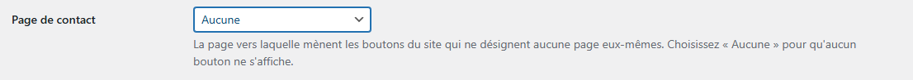

# Modifier vos coordonnées, une fois pour tout le site

**Quand** : le jour où votre numéro, votre adresse ou votre courriel change. Une fois, et c'est tout.
**Temps** : 1 minute. **Rattrapable** : oui — retapez l'ancienne valeur et enregistrez de nouveau.
L'écran ne garde pas la valeur précédente : si vous n'êtes pas sûre, notez-la avant de la remplacer.

**C'est l'endroit du site où vos coordonnées sont rangées.** Le numéro que vous écrivez ici s'affiche
partout : dans les encarts qui invitent à vous appeler, dans les composants **Coordonnées et plan
d'accès** posés dans vos pages, en bas de chaque page du site. **Vous le corrigez ici, et le site se
met à jour tout seul, partout, sans que vous rouvriez une seule page.**

**Le chemin est court.** Dans le menu de gauche de l'administration, cliquez sur **Coordonnées** :
l'entrée se trouve juste sous **Résultats de travail**. C'est le seul chemin à connaître.

---

## Les étapes

1. Dans le menu de gauche, cliquez sur **Coordonnées**.

   

2. L'écran **Coordonnées de l'élevage** s'ouvre. Il tient tout entier à l'écran : quatre champs, et un
   bouton. En haut, cette phrase vous rappelle sa portée :

   > « Ce que vous écrivez ici s'affiche partout sur le site. Un champ laissé vide retire l'information
   > de tout le site : rien ne s'affiche à sa place. »

3. Corrigez le champ qui a changé. Les autres, n'y touchez pas : ce que vous ne modifiez pas reste
   exactement comme il était.

   

4. Cliquez sur **Enregistrer**, sous les quatre champs.

5. L'avis **Coordonnées enregistrées.** apparaît en haut de l'écran. **C'est fait** : le site affiche
   déjà la nouvelle valeur. Ouvrez n'importe quelle page dans un autre onglet pour le vérifier.

   

**Tant que vous n'avez pas cliqué sur Enregistrer, rien n'a changé sur le site.** Vous pouvez quitter
cet écran sans enregistrer : vos coordonnées restent comme elles étaient.

---

## Ce qui se met à jour tout seul

Après **Enregistrer**, et sans que vous ouvriez quoi que ce soit d'autre :

- **Tous les encarts qui invitent à vous appeler**, sur toutes vos pages, y compris celles publiées il
  y a des mois.
- **Tous les composants Coordonnées et plan d'accès** posés dans vos pages.
- **Le bas de chaque page du site**, où l'adresse, le téléphone et le courriel s'affichent déjà.
- **Le formulaire de contact de votre page Contact**, qui écrit aussitôt à la nouvelle adresse.

Il n'y a **aucune page à rouvrir, aucun composant à reposer, rien à republier.**

---

## Les quatre champs

| Champ | Ce qu'il fait |
|---|---|
| **Adresse** | Une zone de trois lignes. Elle accepte les retours à la ligne : appuyez sur **Entrée** pour passer à la ligne suivante, et l'adresse s'affichera coupée exactement comme vous l'avez écrite. Son aide dit : « L'adresse de l'élevage, telle que vous l'écrivez. Le champ « Adresse » d'un composant posé dans une page, lui, ne change que cette page. Laissez vide pour retirer l'adresse de tout le site. » |
| **Téléphone** | Son aide dit : « Le numéro auquel les familles vous joignent. Le champ « Téléphone » d'un composant posé dans une page ne change que cette page. Laissez vide pour retirer le numéro de tout le site. » |
| **Courriel** | Son aide dit : « L'adresse électronique à laquelle on vous écrit. Le champ « Courriel » d'un composant posé dans une page ne change que cette page. Laissez vide pour retirer le courriel de tout le site. » **C'est aussi l'adresse qui reçoit les messages du formulaire de contact.** Le vider ne retire donc pas seulement une ligne d'affichage : **le formulaire disparaît de votre page Contact.** Voir plus bas. |
| **Page de contact** | Son aide dit : « La page vers laquelle mènent les boutons du site qui ne désignent aucune page eux-mêmes. Choisissez « Aucune » pour qu'aucun bouton ne s'affiche. » |

Aujourd'hui, l'écran arrive rempli de vos coordonnées, telles que le site les donne déjà :
**3060 Route de Salernes, 83570 Entrecasteaux**, **0680505619**, **mtbrabant@gmail.com**.

### Comment le numéro s'affiche sur le site

Il est aujourd'hui écrit d'un seul tenant : **0680505619**. Écrit ainsi, il ne s'affiche pas partout
de la même façon : **l'encart d'appel espace les chiffres par paires — 06 80 50 56 19 — pour qu'on
puisse le lire et le dicter, tandis que le composant Coordonnées et plan d'accès et le bas de page
l'affichent d'un seul tenant, tel que vous l'avez tapé.**

**Pour que tout le site l'écrive de la même façon, tapez-le espacé ici** : **06 80 50 56 19** dans le
champ **Téléphone**, puis **Enregistrer**. Il s'affiche alors ainsi **partout sur le site**, sans
exception, et il reste appelable d'un doigt sur un téléphone — les espaces sont retirées toutes
seules du lien d'appel.

**C'est le seul endroit où décider de cette écriture pour tout le site.**

---

## Le cœur de cet écran : ici pour tout le site, ailleurs pour une seule page

Il y a **deux niveaux**, et cet écran est le premier.

- **Ici, dans Coordonnées** : la valeur du site entier. C'est celle qui s'affiche par défaut, partout.
- **Dans une page** : quand vous posez un composant **Coordonnées et plan d'accès**, il porte lui aussi
  un champ **Téléphone** ; un **Encart d’appel** porte un champ **Téléphone affiché**. Ces champs-là
  sont des **exceptions qui ne valent que pour la page où le composant est posé**.

Un exemple. Vous posez un **Encart d’appel** sur une page, et vous tapez un autre numéro dans son champ
**Téléphone affiché** — parce que cette page-là, et elle seule, doit donner ce numéro. Le jour où vous
changez le numéro de l'élevage ici, **toutes vos autres pages suivent**, et celle-là garde le sien.

**Pour qu'une page revienne au numéro de l'élevage** : rouvrez-la, **videz ce champ** dans le composant,
et cliquez sur **Mettre à jour**. Un champ vide dans un composant veut dire « prends le numéro de
l'élevage ».

**La règle en une phrase :** un champ rempli dans une page l'emporte sur cet écran, mais seulement sur
cette page.

---

## Vider un champ retire l'information de tout le site

C'est permis, et c'est parfois ce que vous voudrez. Videz **Téléphone**, puis **Enregistrer** : la ligne
« Téléphone » s'en va **partout sur le site**. Ni ligne blanche, ni tiret, ni « Non renseigné » : la
ligne disparaît et le reste se resserre proprement.

**Rien n'est perdu.** Retapez la valeur, enregistrez, et elle revient partout, de la même façon.

**Un cas mérite d'être connu.** Un encart d'appel n'a que deux choses à montrer : le numéro et un
bouton. Si vous videz **Téléphone** *et* que **Page de contact** vaut **Aucune**, cet encart n'a plus
rien à dire : **il ne s'affiche plus du tout** au visiteur — pas d'encadré vide, pas de trou dans la
page. Vous, en modifiant la page, vous verrez à sa place un cadre annonçant qu'il n'affiche rien. Pour
le faire revenir : retapez le numéro ici, ou choisissez une **Page de contact**.

**Un second cas, et celui-là compte davantage.** Le champ **Courriel** ne sert pas qu'à afficher votre
adresse : **c'est lui qui dit où partent les messages du formulaire de contact.** Videz-le, enregistrez,
et **le formulaire disparaît entièrement de votre page Contact** — plus de champs, plus de bouton, pas
de cadre vide, pas de trou dans la page.

**Et le titre que vous aviez tapé au-dessus du formulaire, lui, reste.** C'est le piège : le visiteur
lit une invitation à vous écrire, et il n'y a plus rien en dessous pour le faire.

**Ce qu'il faut faire :** retapez votre adresse dans **Courriel**, puis **Enregistrer**. Le formulaire
revient tout seul sur la page Contact, **sans rouvrir ni republier cette page**. Si vous vouliez
vraiment retirer le formulaire, rouvrez la page Contact et **retirez aussi ce titre**, pour ne pas
laisser une invitation sans suite.

En modifiant la page Contact, vous verrez alors un cadre gris annonçant que le composant n'affiche rien
tant qu'aucun courriel n'est enregistré dans le menu **Coordonnées** ; le formulaire reste dessiné en
dessous, **rien n'est perdu**. Voir *Recevoir les messages des visiteurs par courriel*.

---

## La page de contact

La liste **Page de contact** propose **Aucune** en tête, puis toutes vos pages publiées, par ordre
alphabétique.

- **Aucune** — c'est le cas aujourd'hui, et **c'est normal** : personne n'a encore choisi de page.
  Les encarts s'affichent avec le numéro, **sans bouton**, et il ne manque rien. La page **Contact**
  figure dans la liste : choisissez-la le jour où vous voudrez que ces boutons y mènent.
- **Une page choisie** — les boutons du site qui n'ont pas de page à eux mènent à celle-là, et ils
  **portent son nom**. Vous renommez la page, les boutons se renomment tout seuls.

**L'image ci-dessus montre la liste fermée, telle que vous la trouverez.** Quand vous cliquez dessus,
elle s'ouvre et propose **Aucune** en première ligne, puis **une ligne par page publiée de votre
site**, par ordre alphabétique. Il n'y a rien d'autre dedans, et rien à y taper.

**Une page que vous avez choisie puis remise en brouillon reste dans cette liste**, sous son vrai titre.
C'est voulu : votre choix n'est jamais effacé dans votre dos. Sur le site, en revanche, **aucun bouton
ne s'affiche** tant que la page n'est pas republiée — jamais de bouton qui ne mène nulle part. Le reste
des encarts, lui, ne bouge pas.

---

## Ce qui n'est pas réglable, et c'est normal

- **Un seul numéro, une seule adresse, un seul courriel.** L'écran n'en propose qu'un de chaque.
- **Le site ne réécrit jamais vos coordonnées.** Il n'ajoute pas d'indicatif, ne corrige pas une
  majuscule, ne change ni un chiffre ni son rang. **Une seule exception, et c'est un affichage** :
  l'encart d'appel espace les chiffres par paires, comme dit plus haut.
- **Le nom d'un bouton ne se tape pas ici** : c'est le nom de la page choisie. Pour le changer,
  renommez la page.
- **Les couleurs, les lettres et la place de vos coordonnées sur le site** sont fixées par le design du
  site. Vous décidez du contenu ; l'allure ne bouge pas.
- **Un champ vidé n'affiche jamais « Non renseigné »**, ni tiret, ni ligne blanche. La ligne s'en va.
  **Un cas va plus loin** : le **Courriel** vidé ne retire pas une ligne, il retire le formulaire de
  contact tout entier — voir plus haut.

**Vous ne pouvez rien casser depuis cet écran.** Au pire, une information disparaît du site — le
formulaire de contact compris — et il suffit de la retaper ici pour qu'elle revienne partout.

---

## En cas de doute

**C'est normal, vous n'avez rien à faire :**

- **Page de contact affiche Aucune.** Personne n'a encore choisi de page. Les encarts s'affichent
  sans bouton, et il ne manque rien. La page **Contact** est proposée dans la liste : vous viendrez
  l'y choisir le jour où vous voudrez ces boutons.
- **L'encart d'appel écrit le numéro par paires, le bas de page d'un seul tenant.** C'est voulu :
  l'encart espace les chiffres pour qu'on puisse les lire et les dicter. Pour que les deux
  s'accordent, tapez le numéro espacé dans le champ **Téléphone** ci-dessus.
- **Une page publiée il y a longtemps affiche déjà votre nouveau numéro**, sans que vous l'ayez
  rouverte. C'est exactement ce que fait cet écran.
- **Une page affiche encore l'ancien numéro alors que les autres ont changé.** Un numéro a été tapé
  dans le composant de cette page-là. Rouvrez-la, videz son champ **Téléphone** (ou **Téléphone
  affiché**), puis **Mettre à jour**.
- **Une ligne a disparu du site.** Le champ correspondant est vide ici. Retapez-le, enregistrez : elle
  revient partout.
- **Le formulaire de contact ne s'affiche plus sur la page Contact.** Le champ **Courriel** est vide
  ici. Retapez votre adresse, enregistrez : le formulaire revient tout seul, sans rouvrir ni republier
  la page Contact. Regardez ensuite cette page : **le titre que vous aviez tapé au-dessus du
  formulaire, lui, était resté** pendant tout ce temps.
- **Un encart d'appel ne s'affiche plus du tout sur le site.** Le champ **Téléphone** est vide *et*
  **Page de contact** vaut **Aucune** : cet encart n'a plus rien à montrer. Retapez le numéro, ou
  choisissez une page.
- **Une page remise en brouillon figure encore dans la liste Page de contact.** C'est voulu : votre
  choix est conservé. Sur le site, aucun bouton ne s'affiche tant qu'elle n'est pas republiée.

**Ce n'est pas normal, signalez-le :**

- L'entrée **Coordonnées** a disparu du menu de gauche.
- Vous cliquez sur **Enregistrer** et l'avis **Coordonnées enregistrées.** n'apparaît pas.
- Une coordonnée s'affiche sur le site avec un chiffre, une lettre ou un mot que vous n'avez pas
  tapés ici — l'espacement du numéro par paires dans les encarts d'appel mis à part, qui est normal.
- Vous avez enregistré, et le site affiche encore l'ancienne valeur après avoir rechargé la page.
- Un bouton mène à une autre page que celle choisie dans **Page de contact**.

**Ce qu'il vaut mieux ne pas faire :**

- **Ne recopiez pas votre numéro dans le champ d'un composant, page par page.** Il ne suivrait plus le
  jour où il change, et il faudrait le corriger page par page — c'est exactement ce que cet écran vous
  évite.
- **N'écrivez pas votre adresse ou votre numéro à la main dans le texte d'une page.** Même raison.
- **Ne videz pas un champ pour « faire propre ».** Un champ vide retire l'information de tout le site,
  y compris du bas de page. **Et le Courriel va plus loin** : le vider fait aussi disparaître le
  formulaire de contact de votre page Contact, en laissant en place le titre écrit au-dessus.

**Si quelque chose vous inquiète** : ne cliquez pas sur **Enregistrer**, quittez l'écran, notez l'heure
et appelez-nous. Un écran quitté sans enregistrer n'a jamais rien changé au site.

---

Pour poser vos coordonnées dans une page, voir *Afficher vos coordonnées et un plan d'accès*. Pour
inviter les visiteurs à vous appeler en fin de page, voir *Inviter les visiteurs à vous appeler*. Pour
le formulaire qui reçoit les messages à l'adresse écrite ici, voir *Recevoir les messages des visiteurs
par courriel*.
