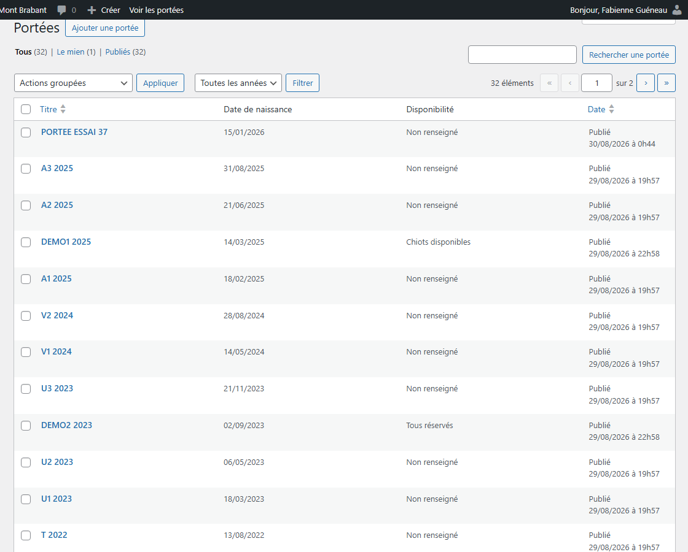
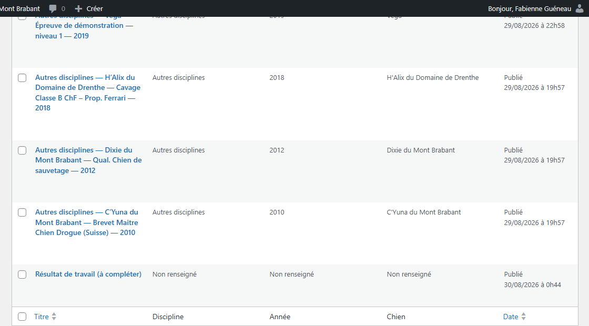
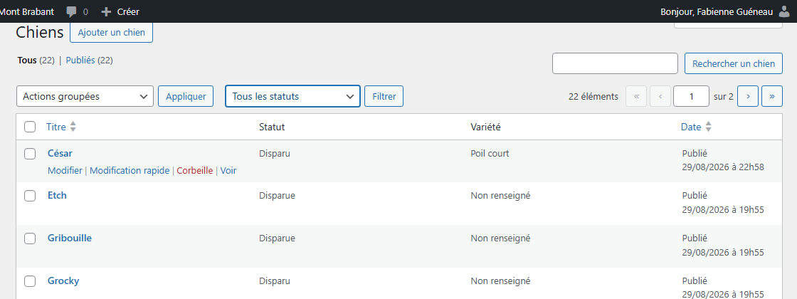
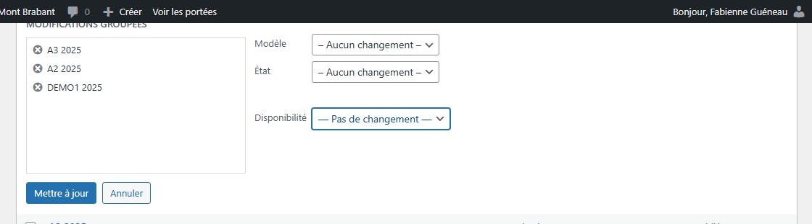
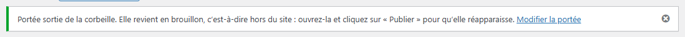

# Retrouver un contenu dans vos listes

**Quand** : chaque fois que vous cherchez une portée, un chien ou un résultat à corriger. Et le jour où
vous voulez changer la disponibilité de plusieurs portées d'un coup.
**Temps** : 1 minute pour retrouver un contenu, 2 minutes pour la modification groupée.
**Rattrapable** : oui. **Filtrer et parcourir ne modifie jamais rien** — ni ici, ni sur le site. La
modification groupée, elle, se refait à l'identique autant de fois que vous voulez.

Il y a **trois listes** dans l'administration, et elles fonctionnent toutes les trois de la même façon :

- **Portées** → **Toutes les portées**
- **Chiens** → **Tous les chiens**
- **Résultats de travail** → **Tous les résultats de travail**

**Ne confondez pas avec la page publique.** La page **Les portées**, à l'adresse `/portees/`, est celle
que voient les visiteurs — voir [La liste de toutes les portées](portee-la-liste-des-portees.md). Cette
fiche-ci parle des **écrans de l'administration**, ceux que vous seule voyez.

---

## Ce que chaque liste montre

Deux ou trois colonnes ont été ajoutées, entre **Titre** et **Date** :

| Liste | Colonnes ajoutées |
|---|---|
| **Toutes les portées** | **Date de naissance** · **Disponibilité** |
| **Tous les chiens** | **Statut** · **Variété** |
| **Tous les résultats de travail** | **Discipline** · **Année** · **Chien** |

**Une case qui n'a rien à montrer n'est jamais vide** : elle écrit **Non renseigné**. Jamais un tiret,
jamais un blanc, et jamais une valeur devinée à votre place.

Trois précisions qui évitent une surprise :

- **Statut** s'écrit au féminin pour une chienne : la colonne affiche **Retraitée** là où le filtre
  propose **Retraités**. C'est voulu, les deux formes sont justes.
- **Année** s'écrit en chiffres, sans espace : **2021**, jamais « 2 021 ».
- **Chien**, sur un résultat, affiche le nom de la fiche quand vous en avez choisi une, sinon le nom
  que vous avez recopié à la main. Si la fiche choisie n'existe plus, la case dit **Fiche introuvable**
  au lieu de faire disparaître la ligne. Si la fiche existe mais n'a pas de nom, elle dit
  **Fiche n° …** suivi d'un numéro. Dans les deux cas, ouvrez le résultat et choisissez une fiche.

---

## Dans quel ordre les listes se rangent

Vous n'avez rien à régler : l'ordre est posé une fois pour toutes.

- **Toutes les portées** : de la **plus récente à la plus ancienne**, selon la **date de naissance** —
  **exactement l'ordre du site public**. Une portée sans date de naissance se range **en fin de liste**,
  jamais en tête, et n'est jamais escamotée.
- **Tous les chiens** : par **ordre alphabétique** du nom d'usage.
- **Tous les résultats de travail** : dans **l'ordre de la page Travail**, discipline par discipline.
  Dans une discipline, de l'année la plus récente à la plus ancienne, les résultats sans année en fin
  de groupe. **Les résultats sans discipline se rassemblent tout à la fin** : c'est l'endroit à
  regarder pour trouver ce qui reste à compléter.

---

## Filtrer une liste

1. Ouvrez la liste : **Portées** → **Toutes les portées**, par exemple.
2. Au-dessus du tableau, ouvrez la liste déroulante. Elle s'ouvre sur **Toutes les années** pour les
   portées, **Tous les statuts** pour les chiens, **Toutes les disciplines** pour les résultats.
3. Choisissez une valeur, puis cliquez sur **Filtrer**, juste à côté.

Ce que chaque liste propose :

| Liste | Première ligne | Puis |
|---|---|---|
| **Toutes les portées** | **Toutes les années** | Les années où une portée est née, de la plus récente à la plus ancienne. **Seules les années réellement présentes sont proposées.** |
| **Tous les chiens** | **Tous les statuts** | **Reproducteurs** · **En cours de confirmation** · **Retraités** · **Disparus** |
| **Tous les résultats de travail** | **Toutes les disciplines** | **RING** · **IGP / RCI** · **Mondioring** · **Obéissance** · **Pistage** · **Recherche utilitaire** · **Sauvetage** · **Truffe** · **Autres disciplines** |

**Pour revenir à la liste entière** : remettez la première ligne — **Toutes les années**, **Tous les
statuts**, **Toutes les disciplines** — puis cliquez de nouveau sur **Filtrer**.

**La recherche en haut de la liste fonctionne toujours**, et elle reste pratique pour retrouver un nom
précis. Le filtre ne la remplace pas : il sert à voir **un groupe entier**.

**Une fois ouverte, la liste déroulante ne contient rien d'autre que les lignes du tableau ci-dessus** :
la première ligne, puis les valeurs.

---

## Changer la disponibilité de plusieurs portées d'un coup

C'est le geste qui vous fera gagner le plus de temps : **aucune fiche à ouvrir**.

1. Dans le menu de gauche, cliquez sur **Portées**, puis sur **Toutes les portées**.
2. Cochez la case de chaque portée à changer, dans la colonne de gauche du tableau.
3. Au-dessus du tableau, ouvrez la liste **Actions groupées** et choisissez **Modifier**.
4. Cliquez sur **Appliquer**. Un panneau s'ouvre au-dessus de la liste, avec les portées cochées dans
   un encadré, à gauche.
5. Dans ce panneau, ouvrez la liste **Disponibilité** et choisissez **Chiots disponibles**,
   **Tous réservés** ou **Portée passée**.
6. Cliquez sur **Mettre à jour**, en bas à gauche du panneau.

*(Le mot **Modifier**, dans la liste **Actions groupées**, est celui de WordPress lui-même et non le
nôtre : nous ne l'avons pas relevé à l'écran. Si vous lisez autre chose à cet endroit, c'est la même
ligne. La liste **Disponibilité**, elle, est bien la nôtre.)*

**La liste Disponibilité s'ouvre sur « — Pas de changement — », et c'est votre filet de sécurité.**
Tant que vous ne touchez pas à cette ligne, **aucune disponibilité n'est modifiée**, quoi que vous
fassiez d'autre dans ce panneau. Vous pouvez donc ouvrir la modification groupée sans crainte : elle
n'écrit rien tant que vous n'avez pas choisi vous-même une valeur.

**Pour corriger une erreur** : refaites exactement les mêmes six étapes avec la bonne valeur. Rien
d'autre n'a été touché entre-temps — ni les chiots, ni les photos, ni les dates, ni les parents.

**Ce panneau ne propose pas « Non renseigné »**, et c'est délibéré : vider la disponibilité de
plusieurs portées d'un coup est trop facile à faire par erreur. Pour retirer la mention sur **une**
portée, ouvrez-la et choisissez **Non renseigné** dans son encadré **La portée** — voir
[Ajouter une portée](portee-ajouter-une-portee.md), section « Changer une disponibilité ».

**Une fois ouverte, cette liste propose quatre lignes**, dans cet ordre : **— Pas de changement —** en
tête, puis **Chiots disponibles**, **Tous réservés** et **Portée passée**. **Non renseigné** n'y est
pas, comme expliqué juste au-dessus.

---

## Ce qui se met à jour tout seul

Après une modification groupée, **sans rien rouvrir ni republier** :

- **Le badge de disponibilité sur la page publique des portées** et sur la page de chaque portée
  concernée.
- **L'encart de la dernière portée**, là où vous l'avez posé, si c'est cette portée-là.
- **La colonne Disponibilité** de la liste, dès le rechargement de l'écran.

Les listes d'administration, elles, **se remplissent toutes seules** : une portée publiée y est, à sa
place selon sa date de naissance. Il n'y a **aucun ordre à tenir à la main**.

---

## Ce qui est normal, et n'est pas une panne

- **Beaucoup de portées affichent « Non renseigné » en Disponibilité.** Ce sont les **27 portées
  reprises de l'ancien site**. **Rien n'a été perdu** : l'ancien site n'écrivait jamais la
  disponibilité d'une portée, et nous n'avons pas voulu la deviner à votre place — une disponibilité
  devinée aurait été un fait inventé. C'est justement ce que la modification groupée ci-dessus permet
  de corriger, en un seul passage.
- **Les nouvelles colonnes ne se cliquent pas pour classer la liste.** C'est voulu, ce n'est pas un
  manque : l'ordre est déjà celui qui a du sens pour l'élevage, et il ne peut pas être mis dans un
  état surprenant.
- **Titre et Date, eux, restent cliquables** — ce sont les colonnes d'origine de WordPress.
  **Attention : cliquer sur Date quitte l'ordre par date de naissance** et range la liste sur la date
  d'enregistrement dans le site, qui ne veut rien dire pour l'élevage. **Pour revenir** : recliquez sur
  **Toutes les portées** dans le menu de gauche, l'ordre par date de naissance revient aussitôt. C'est
  le seul piège de cet écran.
- **La liste déroulante des mois a disparu** des trois listes. Elle filtrait sur la date
  d'enregistrement du contenu dans le site, pas sur la date de naissance ni sur l'année d'un résultat :
  elle ne vous servait à rien et pouvait cacher du contenu. Le filtre décrit plus haut la remplace.
- **Une liste filtrée s'affiche vide.** Aucun chien ne porte ce statut, aucun résultat cette
  discipline. Ce n'est pas une panne, et rien n'a disparu : remettez **Tous les statuts** ou
  **Toutes les disciplines**, cliquez sur **Filtrer**, tout revient. *(Le filtre des années, lui, ne
  propose que des années réellement présentes : il ne peut jamais donner un écran vide.)*
- **Un filtre reste actif quand vous cliquez sur Titre ou sur Date.** C'est voulu : vous ne perdez pas
  votre sélection en changeant de classement.

**Un contenu mal rempli ne disparaît jamais d'une liste.** Une portée sans date de naissance se range
en fin de liste et reste visible. Un chien sans variété affiche **Non renseigné** et reste là. Un
résultat sans discipline se range en fin de liste et reste là. **Aucun filtre, aucun classement ne
peut faire disparaître un contenu incomplet.**

---

## Quand vous sortez un contenu de la corbeille

Le bandeau qui s'affiche alors se lit maintenant en **deux phrases**, et la seconde est celle qui
compte :

> **Portée sortie de la corbeille.** Elle revient en brouillon, c'est-à-dire hors du site :
> ouvrez-la et cliquez sur « Publier » pour qu'elle réapparaisse.

**Le lien Modifier la portée, en fin de bandeau, vous emmène directement à la fiche** : c'est le chemin
le plus court pour la republier.

La même chose est écrite pour une fiche de chien (**Fiche sortie de la corbeille.**) et pour un
résultat (**Résultat de travail sorti de la corbeille.**), accordée au contenu. Quand vous en sortez
plusieurs d'un coup, le bandeau se met au pluriel tout seul.

**Ne vous arrêtez pas au bandeau.** Un contenu rétabli et non republié reste invisible pour les
visiteurs : ouvrez-le et cliquez sur **Publier**.

---

## Ce qu'il vaut mieux ne pas faire

- **Ne cochez pas « tout » avant d'ouvrir la modification groupée** sans regarder ce qui est coché : la
  case en haut de la colonne coche **toutes les lignes de l'écran en cours**. Filtrez d'abord, cochez
  ensuite.
- **Ne cherchez pas à classer la liste en cliquant sur Disponibilité, Statut ou Discipline.** Ces
  colonnes ne se cliquent pas. Pour ne voir qu'un groupe, servez-vous du **filtre**.
- **Ne modifiez pas une portée à la main pour « remettre l'ordre ».** L'ordre se déduit tout seul de la
  date de naissance.

---

## En cas de doute

**C'est normal, vous n'avez rien à faire :**

- Des portées affichent **Non renseigné** en **Disponibilité** — ce sont les portées reprises de
  l'ancien site.
- Une case affiche **Non renseigné** : le champ correspondant est vide dans la fiche.
- La liste filtrée est vide : aucun contenu ne porte cette valeur.
- La colonne **Statut** dit **Retraitée** alors que le filtre dit **Retraités**.

**Ce n'est pas normal, signalez-le :**

- Un contenu que vous voyiez hier n'apparaît plus, **filtre remis sur la première ligne**.
- L'onglet **Corbeille** d'une liste s'affiche vide alors que vous venez d'y mettre un contenu.
- Une case affiche un mot que vous n'avez jamais tapé et qui n'est pas **Non renseigné**.

**Si quelque chose vous inquiète** : ne supprimez rien, notez l'heure et le nom de la liste, et
appelez-nous. Regarder, filtrer et classer n'a jamais rien changé au site.
