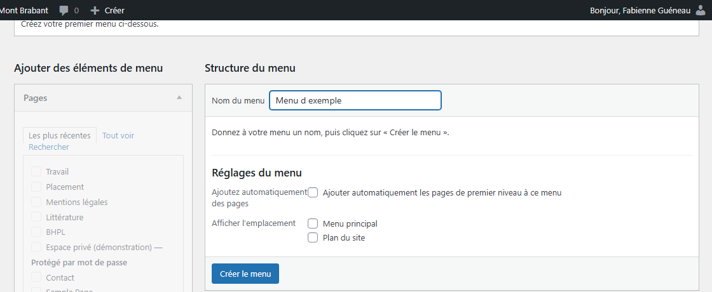
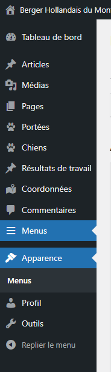
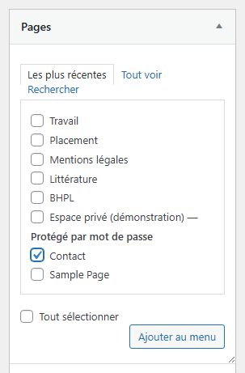
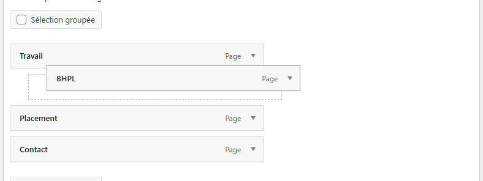
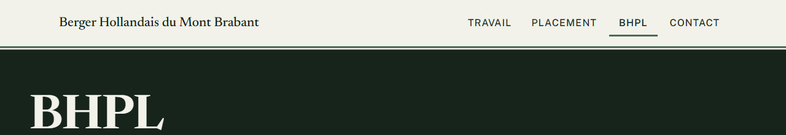
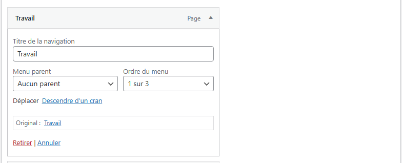
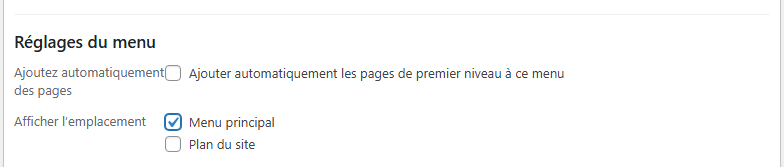

# Modifier le menu du site

**Quand** : quand une page doit apparaître dans le menu, quand l'ordre des entrées ne vous convient
plus, ou quand une entrée doit changer de nom.
**Temps** : 2 minutes. **Rattrapable** : oui. Tout se remet comme avant, et **retirer une entrée du
menu ne supprime jamais la page** : elle reste sur le site, avec son texte et ses photos.

Le site a **deux endroits où un menu peut s'afficher**, et c'est au même écran que vous composez les
menus qui les occupent :

- **Menu principal** — l'endroit qui s'affiche **en haut de chaque page**.
- **Plan du site** — l'endroit qui s'affiche **en bas de chaque page**.

Ce sont deux **emplacements**, pas deux menus tout faits : c'est vous qui composez les menus, et qui
dites lequel sert à quel endroit. Les deux sont indépendants — une entrée ajoutée à l'un n'apparaît
pas dans l'autre. **Avant toute chose, vérifiez lequel des deux est ouvert à l'écran.**

**Si l'écran ne vous propose aucun menu à modifier**, c'est qu'aucun n'a encore été composé :
commencez par « Créer un menu », juste en dessous. C'est à faire une fois, puis plus jamais.

**Le chemin est court.** Dans le menu de gauche de l'administration, cliquez sur **Menus** : l'entrée
se trouve **sous Commentaires**, deux crans sous **Coordonnées**. C'est le seul chemin à connaître.

**Une modification enregistrée est visible tout de suite** sur le site. Il n'y a rien à publier
ensuite, rien à vider, rien à attendre.

> **Les menus montrés en image dans cette page sont un exemple.** **Aucun menu n'est livré avec le
> site** : les entrées **Travail**, **Placement**, **BHPL** et **Contact** que vous verrez sur les
> images ont été composées pour vous montrer les écrans. **C'est à vous de composer le vôtre**, et
> vous choisissez librement les pages qui y entrent — commencez par « Créer un menu », juste en
> dessous.

---

## Créer un menu

**À faire une fois par menu**, et seulement s'il n'en existe pas encore : le site n'est livré avec
aucun menu tout fait, c'est vous qui les composez.

1. Dans le menu de gauche, cliquez sur **Menus**.

2. En haut de l'écran, cliquez sur le lien **créez un nouveau menu**. *S'il n'existe encore aucun
   menu, l'écran vous propose directement d'en créer un : vous y êtes déjà.*

3. Dans le champ **Nom du menu**, tapez son nom. L'écran vous le dit ainsi : « Donnez à votre menu
   un nom, puis cliquez sur « Créer le menu ». »

   **Prenez le nom de l'endroit qu'il servira** — **Menu principal** pour le haut du site,
   **Plan du site** pour le bas. Rien ne vous y oblige, mais c'est ce qui vous évitera plus tard de
   modifier le mauvais menu.

4. Cliquez sur **Créer le menu**.

   

5. **Le menu est créé, et vide.** Deux choses restent à faire, dans cet ordre : lui ajouter ses
   entrées — « Les étapes », ci-dessous — puis dire à quel endroit il s'affiche — « Choisir où un
   menu s'affiche ».

**Tant qu'aucun menu n'est coché pour un endroit, le site n'affiche rien à cet endroit** : ni liste
de pages inventée, ni trou, ni message. Le haut ou le bas de page s'affiche simplement sans sa liste
de liens. Rien n'est cassé pour autant.

---

## Les étapes — ajouter une page au menu

1. Dans le menu de gauche, cliquez sur **Menus**.

   

2. En haut de l'écran, la ligne **Sélectionnez le menu à modifier :** propose les menus déjà
   composés. Choisissez celui que vous voulez modifier, puis cliquez sur **Sélectionner**.
   **S'il n'y en a aucun, ou s'il vous en manque un**, voir « Créer un menu », ci-dessus.

   

   *L'image ci-dessus montre la liste fermée, telle que vous la trouverez. Quand vous cliquez dessus,
   elle s'ouvre et ne contient que **les menus que vous avez composés**, par leur nom.*

3. Dans la colonne de gauche de l'écran, l'encadré **Pages** propose **trois onglets** :
   **Les plus récentes**, **Tout voir** et **Rechercher**. **Cliquez sur Tout voir.**

   **C'est l'étape qui fait perdre dix minutes.** L'onglet **Les plus récentes**, ouvert par défaut,
   ne montre que vos pages les plus récemment créées — **vos pages anciennes n'y sont pas**, la page
   **Contact** comprise. Si vous ne trouvez pas la vôtre, ce n'est pas qu'elle a disparu : **c'est
   qu'il faut cliquer Tout voir.**

4. Dans la liste qui s'affiche, **cochez la case** de la page à ajouter — **Contact**, par exemple —
   puis cliquez sur **Ajouter au menu**, sous cette liste.

   

5. L'entrée se pose **en bas** de la liste centrale, intitulée **Structure du menu**.

6. Attrapez l'entrée avec la souris et **faites-la glisser** à la place que vous voulez, plus haut ou
   plus bas dans la liste.

   

7. Cliquez sur **Enregistrer le menu**, en bas à droite de la liste. Ouvrez le site dans un autre
   onglet : l'entrée y est déjà.

**Tant que vous n'avez pas cliqué sur Enregistrer le menu, rien n'a changé sur le site.** Vous pouvez
quitter cet écran sans enregistrer : le menu reste comme il était.

---

## Ce qui se met à jour tout seul

- **Le menu du haut, sur toutes les pages du site**, en même temps. Il n'y a pas une page à reprendre
  une par une.
- **La page en cours de lecture est signalée toute seule** dans le menu : le visiteur voit où il se
  trouve. Vous n'avez rien à régler pour cela.
- **Le nom d'une page renommée** ne change pas tout seul dans le menu. C'est voulu : l'entrée du menu
  porte son propre nom, souvent plus court. Voir « Renommer une entrée ».

---

## Changer l'ordre des entrées

1. Dans le menu de gauche, cliquez sur **Menus**, et vérifiez le menu ouvert sur la ligne
   **Sélectionnez le menu à modifier :**.
2. Dans la liste **Structure du menu**, attrapez une entrée avec la souris et faites-la glisser plus
   haut ou plus bas.
3. Cliquez sur **Enregistrer le menu**, en bas à droite.

L'ordre de la liste est exactement l'ordre affiché sur le site, de gauche à droite.

---

## Renommer une entrée

1. Dans la liste **Structure du menu**, cliquez sur la flèche à droite de l'entrée : elle s'ouvre.
2. Dans le champ **Titre de la navigation**, effacez le nom et tapez celui que vous voulez.
3. Cliquez sur **Enregistrer le menu**, en bas à droite.

**Seule l'entrée du menu change de nom.** Le titre de la page, lui, ne bouge pas : elle garde son
titre sur le site et dans **Pages**.

---

## Retirer une entrée

1. Dans la liste **Structure du menu**, cliquez sur la flèche à droite de l'entrée : elle s'ouvre.
2. En bas de l'encadré qui s'ouvre, cliquez sur **Retirer**.
3. Cliquez sur **Enregistrer le menu**, en bas à droite.

**La page n'est pas supprimée.** Elle reste entière dans **Pages**, avec son texte et ses photos ;
elle n'est simplement plus proposée dans le menu. Pour la remettre, ajoutez-la de nouveau : les trois
clics des étapes 3 à 7.

---

## Choisir où un menu s'affiche

Un menu ne s'affiche sur le site que si vous avez dit **à quel endroit** il sert.

1. Dans le menu de gauche, cliquez sur **Menus**, et vérifiez le menu ouvert sur la ligne
   **Sélectionnez le menu à modifier :**.
2. Descendez tout en bas de l'écran, sous la liste **Structure du menu** : l'encadré
   **Réglages du menu** propose **trois cases**, dans cet ordre.
3. **La première ne concerne pas les emplacements : laissez-la décochée.** Elle s'intitule
   **Ajouter automatiquement les pages de premier niveau à ce menu**, et elle ferait entrer dans le
   menu, toute seule, chaque nouvelle page que vous créez. Vous perdriez la maîtrise de vos entrées,
   et de leur ordre. **Si elle est cochée, décochez-la et cliquez sur Enregistrer le menu.**
4. Cochez ensuite celle des deux suivantes qui convient :
   - **Menu principal** — le menu s'affiche **en haut de chaque page**.
   - **Plan du site** — le menu s'affiche **en bas de chaque page**.
5. Cliquez sur **Enregistrer le menu**, en bas à droite.

**Une case ne se coche jamais toute seule** : un menu fraîchement créé n'en a aucune, et c'est ici,
une fois, que vous lui donnez sa place. Si vous avez nommé vos menus d'après les endroits qu'ils
servent, cochez pour chacun la case qui porte son nom : le menu **Menu principal** s'affiche alors en
haut, le menu **Plan du site** en bas — et vous n'avez plus à y revenir.

**Une case ne peut servir qu'à un seul menu à la fois.** Si vous cochez **Menu principal** sur un
second menu, c'est lui qui s'affichera en haut, et le premier ne s'affichera plus — sans être perdu
pour autant : il reste composé, prêt à resservir.

---

## Le pied de page : vos coordonnées y sont déjà

**Vous n'avez rien à taper en bas du site.** L'adresse, le téléphone et le courriel de l'élevage s'y
affichent tout seuls. Le jour où l'un d'eux change, vous le corrigez **une seule fois**, dans
**Coordonnées** : le bas de toutes les pages suit. Le geste tient en une minute, et la fiche
**Modifier vos coordonnées, une fois pour tout le site** vous le montre pas à pas.

Le **Plan du site**, lui, ne sert qu'aux **liens** : les pages que le visiteur doit pouvoir retrouver
depuis le bas du site. C'est là que vous ajouterez, le jour où cette page existera, un lien vers vos
mentions légales — exactement comme aux étapes 3 à 7.

---

## Le retrait ne se voit pas sur le site

Dans la liste **Structure du menu**, une entrée que vous faites glisser **vers la droite** se place en
retrait sous celle du dessus. **Rien de fâcheux n'arrive** : sur le site, cette entrée s'affiche bien,
juste après celle du dessus.

Mais elle s'affiche **comme toutes les autres**, à la même hauteur : le retrait ne se voit pas. Le
visiteur ne devine pas qu'elle dépendait de l'entrée du dessus.

**Le retrait ne sert donc à rien pour l'instant.** Ce n'est ni une faute ni un risque, c'est un
déplacement sans effet. Si vous préférez que la liste de cet écran ressemble à ce que voit le
visiteur, gardez vos entrées **contre le bord gauche**, les unes sous les autres.

**Aucune liste ne se déroule** sous une entrée, ni au survol ni au clic : toutes les entrées du menu
sont visibles d'un seul coup d'œil, sur un ordinateur comme sur un téléphone. C'est voulu — un menu
qui se déroule s'ouvre mal au doigt, et il disparaît pour qui navigue au clavier.

---

## Ce qui n'est pas réglable, et c'est normal

- **Les couleurs, les lettres et la place du menu** sont fixées par le design du site. Vous choisissez
  les entrées et leur ordre ; le reste ne bouge pas.
- **Le menu reste entièrement visible sur un téléphone** : rien ne se cache derrière un bouton à
  ouvrir. Vous n'avez rien à régler pour les petits écrans.
- **Le nom de l'élevage, en haut à gauche, ne fait pas partie du menu** : il est là sur toutes les
  pages et ramène à l'accueil.

**Vous ne pouvez rien casser depuis cet écran.** Au pire, une entrée est mal placée ou ne s'affiche
pas — et il suffit de revenir la corriger.

---

## En cas de doute

**C'est normal, vous n'avez rien à faire :**

- **Vous ne trouvez pas une page dans la colonne de gauche.** L'onglet **Les plus récentes** ne
  montre qu'une poignée de pages. **Cliquez sur Tout voir**, à côté : toutes vos pages publiées y
  sont, dans l'ordre alphabétique.
- **Une page toute neuve n'apparaît pas dans la liste des pages à ajouter.** Rien n'est cassé : cet
  écran ne propose que les pages **publiées**, et l'onglet **Rechercher** n'atteint pas non plus un
  brouillon. **L'ordre est donc : publier la page d'abord, la poser dans le menu ensuite** — les
  quelques clics des étapes 3 à 7, le jour où elle est en ligne. Il n'y a rien à préparer avant.
- **Le bas du site n'affiche aucune liste de liens.** Aucun menu n'est coché pour **Plan du site** —
  ou aucun menu n'a encore été composé. Ce n'est pas une erreur, et il n'y a ni trou ni message : le
  bas de page s'affiche simplement sans cette liste. Pour en avoir une, voir « Créer un menu », puis
  « Choisir où un menu s'affiche ».
- **Une entrée n'apparaît pas sur le site alors qu'elle est dans la liste.** Deux causes possibles :
  la page visée n'est pas publiée, ou le champ **Titre de la navigation** de l'entrée a été effacé.
  Republiez la page, ou retapez le nom dans ce champ.
- **Une entrée mise en retrait s'affiche comme les autres.** Sur le site, le retrait ne se voit pas :
  l'entrée prend simplement sa place à la suite de celle du dessus. Vous n'avez rien à corriger.
- **Le haut et le bas du site affichent la même liste.** Les deux cases ont été cochées sur le même
  menu. Composez un second menu, ou décochez l'une des deux.

**Ce n'est pas normal, signalez-le :**

- L'entrée **Menus** a disparu du menu de gauche.
- Vous avez cliqué sur **Enregistrer le menu**, et le site affiche encore l'ancien menu après avoir
  rechargé la page.
- Une entrée mène à une autre page que celle que vous avez choisie.
- Le menu du haut affiche une entrée que vous n'avez jamais ajoutée.

**Ce qu'il vaut mieux ne pas faire :**

- **Ne recopiez pas l'adresse ou le téléphone de l'élevage dans le Plan du site.** Ils s'affichent
  déjà tout seuls en bas de chaque page, et se corrigent une seule fois dans **Coordonnées**.
- **Ne supprimez pas une page pour la retirer du menu.** Retirez seulement son entrée : la page reste
  en ligne, et ceux qui en ont l'adresse continuent d'y accéder.

**Si quelque chose vous inquiète** : ne cliquez pas sur **Enregistrer le menu**, quittez l'écran,
notez l'heure et appelez-nous. Un menu en cours de modification n'a jamais cassé un site.
