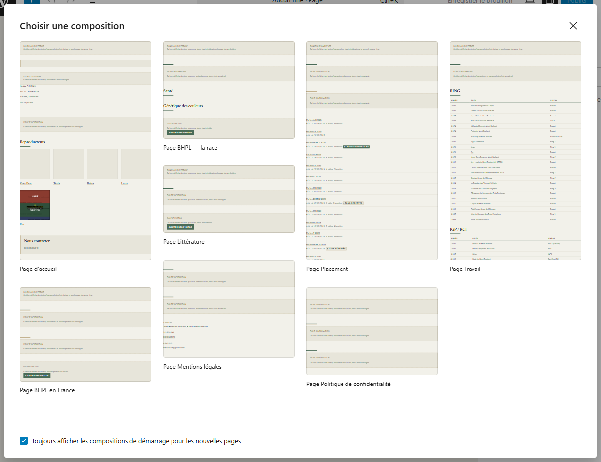
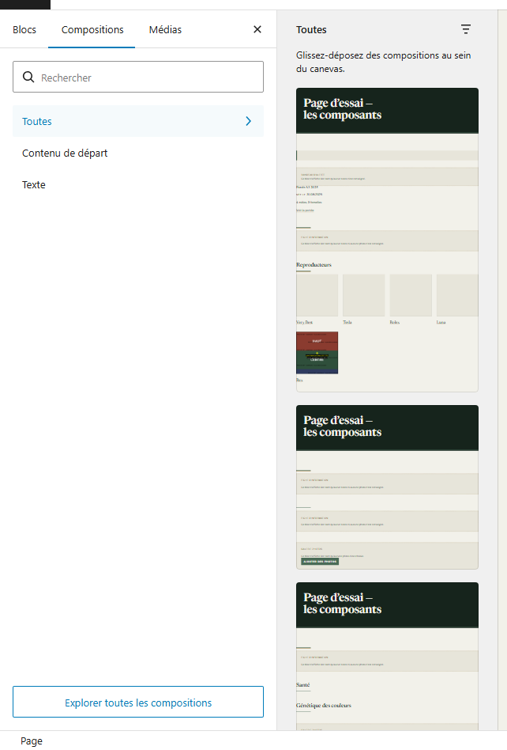
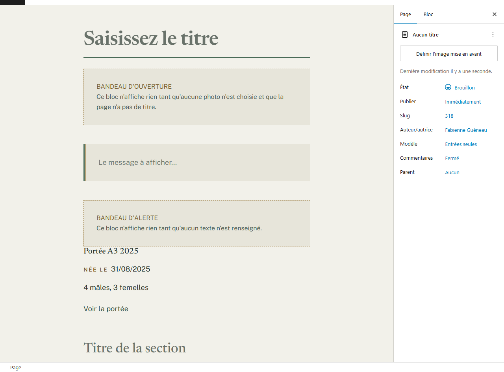
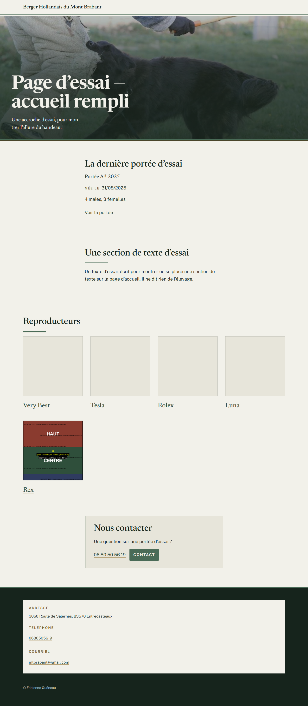
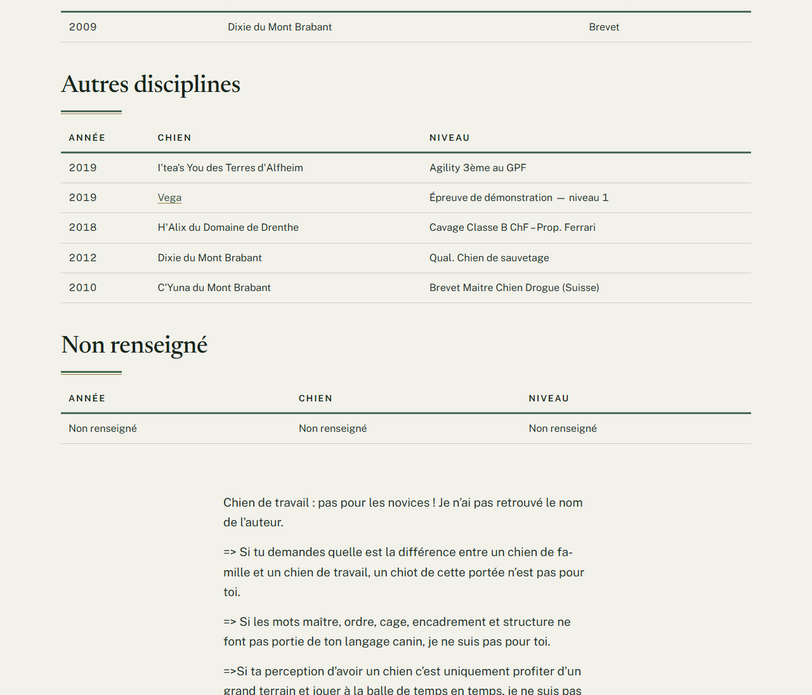
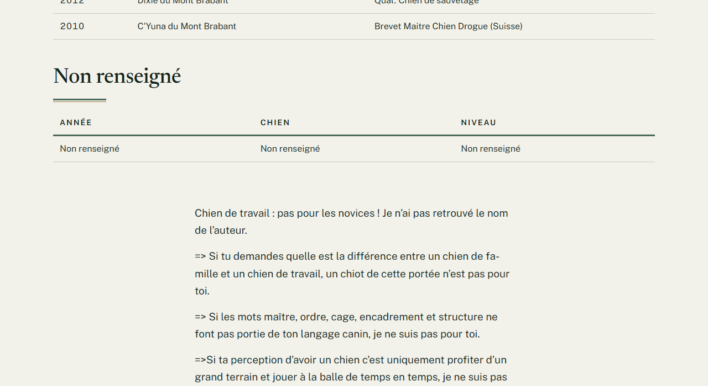
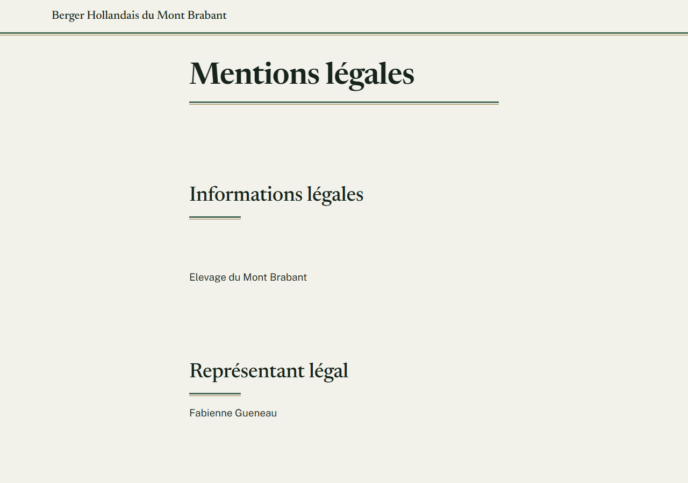
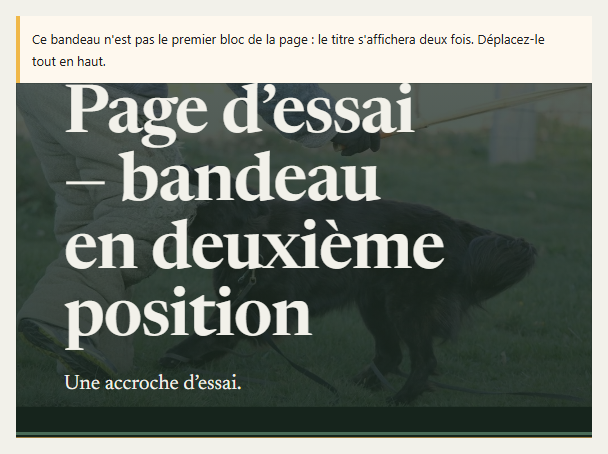

# Créer une page à partir d'un modèle

**Quand** : chaque fois que vous créez une des grandes pages du site — l'accueil, la race, le travail,
le placement, les mentions légales.
**Temps** : 10 minutes pour la charpente. **Rattrapable** : oui, entièrement. Tant que vous n'avez pas
cliqué sur **Publier**, rien n'est en ligne ; ensuite, tout se modifie.

**Ce qui est nouveau : huit modèles de page vous attendent.** Chacun pose d'un coup la charpente d'une
page — les bons composants, dans le bon ordre — et vous n'avez plus qu'à remplir.

**Vous ne recopiez rien, vous ne dupliquez aucune page.** Un modèle n'est pas une page existante que
l'on copie : c'est un point de départ vide, que vous remplissez avec vos mots.

*Sur les écrans, WordPress appelle ces modèles des **compositions** — c'est le mot que vous lirez dans
la fenêtre **Choisir une composition** et sur l'onglet **Compositions**. C'est la même chose.*

---

## Les étapes

1. Dans le menu de gauche, cliquez sur **Pages**, puis sur **Toutes les pages**.

2. En haut de l'écran, à côté du titre **Pages**, cliquez sur le bouton **Ajouter une page**.

3. La fenêtre **Choisir une composition** s'ouvre toute seule. Cliquez sur le modèle qui correspond à
   votre page — les huit sont listés juste en dessous.

   *Si vous préférez partir d'une page entièrement vide, refermez cette fenêtre avec la croix en haut à
   droite : elle s'appelle **Fermer**, mais n'affiche pas ce mot à l'écran. Rien n'est perdu — vous
   pourrez toujours poser un modèle ensuite par le bouton **+**, onglet **Compositions**.*

   

4. Dans le champ du titre, en haut, tapez le titre de votre page. **Si la page commence par un bandeau,
   votre titre apparaît aussitôt dedans**, sur la photo.

5. Remplissez chaque section : cliquez sur le titre en gris **Titre de la section** et tapez le vôtre,
   puis cliquez juste en dessous et tapez votre texte.

6. Ajoutez les photos si vous en voulez : celle du bandeau et celles de la galerie se choisissent dans
   la colonne de droite — voir *Mettre une photo en haut d'une page* et *Ajouter des photos dans une
   page*.

7. Cliquez sur **Publier**, en haut à droite, puis confirmez.

8. Ouvrez la page sur le site, ou cliquez sur **Aperçu** : c'est là qu'elle est à sa vraie allure.

**Tant que vous n'avez pas cliqué sur Publier, rien n'est en ligne.** Vous pouvez quitter la page sans
enregistrer.

---

## Les huit modèles

| Le modèle s'appelle | Il pose |
|---|---|
| **Page d'accueil** | le bandeau, le message temporaire, la dernière portée, une section de présentation, les reproducteurs, l'encart d'appel |
| **Page BHPL — la race** | le bandeau, une section libre, une section **Santé**, une section **Génétique des couleurs**, une galerie |
| **Page BHPL en France** | le bandeau, deux sections libres, une galerie |
| **Page Littérature** | le bandeau, une section libre, une galerie |
| **Page Travail** | le bandeau, une section libre, les résultats de travail, puis une seconde section libre |
| **Page Placement** | le bandeau, deux sections libres, la liste des portées, l'encart d'appel |
| **Page Mentions légales** | deux sections libres, puis vos coordonnées et le plan d'accès |
| **Page Politique de confidentialité** | trois sections libres |

Deux titres arrivent déjà écrits, dans **Page BHPL — la race** : **Santé** et
**Génétique des couleurs**. Vous pouvez les garder, les corriger, ou les effacer.

**Le modèle Page d'accueil pose la charpente de l'accueil ; il ne décide pas quelle page sert d'accueil
au site.** Ce choix-là a été fait une fois pour toutes, et **vous ne pouvez pas le changer vous-même** :
l'écran qui le porte n'est pas dans votre menu de gauche, et c'est normal. Créer une page avec ce
modèle ne la met donc pas à la place de l'accueil actuel. **Si vous avez besoin d'en changer,
appelez-nous** — c'est l'affaire de deux minutes de notre côté.

**En revanche, ce qu'on lit sur votre accueil est à vous, entièrement.** La page d'accueil s'ouvre et
se corrige comme n'importe quelle autre : **Pages**, puis **Toutes les pages**, puis son titre. Vous y
changez le texte, les photos, l'ordre des sections, et vous cliquez sur **Mettre à jour**. **Une seule
chose vous échappe : dire quelle page tient ce rôle. Pas ce qu'elle raconte.**

---

## Si la fenêtre s'est refermée, ou si la page existe déjà

Vous pouvez poser un modèle à tout moment, dans une page neuve comme dans une page déjà écrite :

1. Placez le curseur à l'endroit voulu, puis cliquez sur le bouton **+**, en haut à gauche de l'écran.
2. En haut de la liste qui s'ouvre, cliquez sur l'onglet **Compositions**.
3. **Aucun modèle ne s'affiche encore : c'est normal.** L'onglet ne montre d'abord que **trois noms de
   catégories** — **Toutes**, **Contenu de départ**, **Texte**. **Cliquez sur l'une des trois** pour
   voir les modèles. Les huit sont dans chacune : prenez **Toutes**, c'est le plus simple.
4. Cliquez sur le modèle : ses composants s'ajoutent à la suite, à l'endroit du curseur.

**Attention** : dans une page qui commence déjà par un bandeau, poser un modèle qui en porte un aussi
donne **deux bandeaux**. **Ce qu'il faut faire** : enlevez le second bandeau (voir plus bas), ou
quittez la page sans enregistrer et repartez d'une page neuve.

---

## Une section vide ne se voit pas, et ne casse rien

C'est le point qui vous laisse tranquille : **un composant sans texte et sans photo ne s'affiche pas du
tout sur le site.** Ni cadre, ni trou, ni message, ni « à compléter ». La page se lit comme si le
composant n'était pas là.

**Vous pouvez donc poser la charpente aujourd'hui et remplir dans trois semaines**, sans qu'un visiteur
voie quoi que ce soit d'inachevé.

**Pendant que vous modifiez la page**, chaque section encore vide affiche un cadre beige au contour en
tirets, portant le nom du composant en majuscules et une phrase qui commence par
« Ce bloc n'affiche rien tant que… ». **C'est normal, c'est voulu, et ce n'est pas une panne.** Ce
cadre n'existe que pour vous. Une page fraîchement créée à partir d'un modèle en montre plusieurs d'un
coup, parfois beaucoup : c'est simplement la charpente qui attend vos mots.

**Côté visiteurs, il n'y en a aucun** — pas un seul, même sur une page à moitié remplie et publiée.
Si vous publiez une page dont vous n'avez encore rempli que la première section, le site montre cette
section, et rien d'autre.

Une fois remplie et publiée, la même page se lit ainsi sur le site :

---

## Ce qui se remplit tout seul

Certains composants des modèles **ne se remplissent pas à la main** : ils vont chercher ce que vous
avez déjà saisi ailleurs.

- **Sur la page Travail, le tableau des résultats se remplit tout seul.** Il affiche **toutes les
  disciplines**, chacune sous son titre, à partir de vos **Résultats de travail**. Le jour où vous
  ajoutez un résultat, **vous n'avez rien à faire sur cette page** : il y apparaît sans que vous la
  rouvriez. Les deux sections de texte, elles, sont à vous : celle qui précède les tableaux, et celle
  qui les suit.

  

- **La dernière portée** de l'accueil et **la liste des portées** de la page Placement se mettent à
  jour à chaque portée publiée.
- **Les reproducteurs** de l'accueil suivent vos fiches de chien.
- **Le téléphone de l'encart d'appel** et **les coordonnées des mentions légales** viennent de l'écran
  **Coordonnées**, dans le menu de gauche.

**Vous ne tapez jamais deux fois la même chose.** Si vous vous surprenez à recopier un résultat, une
portée, un nom de chien ou votre adresse dans le texte d'une page, arrêtez-vous : c'est le signe qu'il
faut plutôt le saisir à sa place.

> **N'écrivez jamais vous-même les titres de discipline** — **RING**, **IGP / RCI** et les autres — sur
> la page Travail. Ils s'écrivent tout seuls au-dessus de chaque tableau. Écrits à la main, ils
> apparaîtraient **en double**. Voir *Afficher les résultats de travail sur une page*.

**Un seul tableau sur la page Travail, et c'est voulu.** Le modèle pose **un** composant de résultats,
pas un par discipline, et il n'y a aucun réglage à choisir : il affiche à lui seul toutes les
disciplines qui ont des résultats.

**C'est ce qui garantit que rien de ce que vous saisissez ne disparaît.** Un résultat dont la
**Discipline** n'a pas été choisie s'affiche quand même, tout en bas, sous le titre **Non renseigné**.
**Ce qu'il faut faire quand vous le voyez** : ouvrez ce résultat, choisissez sa **Discipline**,
enregistrez — il rejoint aussitôt le bon tableau, et le titre **Non renseigné** disparaît de lui-même
quand plus aucun résultat n'est dans ce cas. Voir *Ajouter un résultat de travail*.

---

## Le grand titre de la page, et pourquoi il change de place

**Six modèles commencent par un bandeau** : l'accueil, la race, la race en France, la littérature, le
travail, le placement. Sur ces pages, **c'est le bandeau qui porte le grand titre**, écrit sur la
photo. Le titre n'apparaît donc pas une seconde fois au-dessus du texte. C'est bien le vôtre, celui que
vous avez tapé en haut de la page.

**Deux modèles n'ont pas de bandeau** : **Page Mentions légales** et
**Page Politique de confidentialité**. Sur ces deux pages, le titre s'affiche normalement en haut,
comme sur n'importe quelle page.

Dans les deux cas, **le titre est écrit une fois et une seule**. Vous n'avez rien à régler.

### Si vous déplacez le bandeau, le titre revient en haut

C'est la seule chose à savoir, et vous la rencontrerez le jour où vous réorganiserez une page.

**Le bandeau ne porte le grand titre que s'il est le tout premier élément de la page.** Si vous le
descendez sous une section de texte, ou si vous le glissez à l'intérieur d'un **Groupe**, alors le
titre de la page **réapparaît en haut**, au-dessus du texte — et reste aussi écrit sur la photo du
bandeau. Vous le voyez donc **deux fois**.

**Rien n'est cassé, rien n'est perdu**, et l'écran vous le dit lui-même : un message jaune s'affiche
sur le bandeau, « *Ce bandeau n'est pas le premier bloc de la page : le titre s'affichera deux fois.
Déplacez-le tout en haut.* »

**Ce qu'il faut faire** : remontez le bandeau tout en haut avec la petite flèche de sa barre d'outils,
jusqu'à ce que le message jaune disparaisse. Le titre redevient unique aussitôt.

Le bandeau est décrit en entier dans *Mettre une photo en haut d'une page*.

---

## Un modèle n'est pas un cadre rigide

**Rien n'est verrouillé.** Une fois le modèle posé, la page est à vous :

- **Ajouter une section** : placez le curseur, cliquez sur **+** — le bouton
  **Outil d'insertion de bloc** — puis, dans la rubrique **Mont Brabant**, la première de la liste, sur
  **Fiche d'information**.
- **Enlever un composant** : cliquez dessus, puis sur le bouton à trois points de sa petite barre
  d'outils. Dans le menu qui s'ouvre, **tout en bas**, cliquez sur **Supprimer**. Cliquez ensuite sur
  **Mettre à jour**. *Le menu n'a pas la même longueur selon le composant, mais **Supprimer** en est
  toujours la dernière entrée : descendez jusqu'au bout, c'est là.*
- **Déplacer un composant** : servez-vous des deux petites flèches de sa barre d'outils.

**Enlever un composant ne supprime jamais vos données.** Vos portées, vos chiens, vos résultats et vos
photos vivent dans leurs propres écrans, pas dans la page. Vous pouvez reposer le même composant plus
tard : il se remplira tout seul, comme la première fois.

**Sauf un cas** : si vous enlevez le **Bandeau d'ouverture**, le grand titre de la page revient à sa
place habituelle, au-dessus du texte. Rien n'est perdu, la page reste juste.

---

## Ce qui ne se saisit jamais dans une page

**Votre adresse, votre téléphone et votre courriel ne se tapent dans aucune page.** Ils sont saisis à
un seul endroit, dans l'écran **Coordonnées** du menu de gauche, et s'affichent ensuite partout où le
site en a besoin — y compris dans les mentions légales.

Voir *Modifier vos coordonnées, une fois pour tout le site*.

**Si vous les recopiiez dans une page**, il faudrait les corriger à deux endroits le jour d'un
changement — et l'un des deux finirait par mentir.

---

## En cas de doute

**C'est normal, vous n'avez rien à faire :**

- **Des cadres beiges à contour en tirets partout dans la page qui vient d'être créée.** C'est la
  charpente qui attend votre texte. Les visiteurs ne voient rien. Voir plus haut.
- **La page Travail n'affiche pas un tableau par discipline.** Le site en connaît **neuf**, et
  n'affiche que celles où vous avez au moins un résultat : une discipline sans aucun
  résultat n'affiche ni titre ni tableau, exprès. Le nombre de tableaux se règle donc tout seul, et il
  change le jour où vous ajoutez un résultat dans une discipline qui n'en avait pas.
- **Le titre de la page n'apparaît pas au-dessus du texte.** Il est dans le bandeau, sur la photo.
- **Le titre s'affiche au-dessus du texte alors que vous attendiez un bandeau.** Ce modèle-là n'en a
  pas : ce sont les mentions légales et la politique de confidentialité.
- **Le titre s'affiche deux fois, et un message jaune le dit sur le bandeau.** Le bandeau n'est plus le
  premier élément de la page. **Ce qu'il faut faire** : remontez-le tout en haut. Voir plus haut.
- **La galerie ne montre encore aucune photo.** Aucune n'a été choisie ; côté visiteurs, il n'y a rien
  du tout à cet endroit.
- **Dans l'écran de modification, la page est plus étroite que sur le site.** C'est la fenêtre de
  travail qui est étroite. **C'est le site qui compte** : cliquez sur **Aperçu**.

**Ce n'est pas normal, signalez-le :**

- La fenêtre **Choisir une composition** ne propose aucun des huit modèles.
- Le bouton **+** ne propose pas d'onglet **Compositions**.
- Le titre de la page s'affiche **deux fois** sur le site **alors que le bandeau est bien tout en haut
  de la page et qu'aucun message jaune ne s'affiche**.
- Un titre de discipline apparaît en double sur la page Travail.

**Ce qu'il vaut mieux ne pas faire :**

- **Ne dupliquez jamais une page existante pour en créer une autre.** Partez d'un modèle : c'est
  exactement à cela qu'ils servent, et vous ne traînerez pas le texte de la page précédente.
- **Ne posez pas deux fois le même modèle dans une page.**
- **Sur la page Travail, ne posez pas un tableau de résultats par discipline.** Le modèle en pose un
  seul, et c'est le bon : lui seul montre aussi les résultats dont la **Discipline** n'a pas été
  choisie. Plusieurs tableaux réglés chacun sur une discipline les laisseraient de côté, sans rien
  vous dire.
- **Ne recopiez pas une portée, un chien ou un résultat dans le texte d'une page.** Ils se saisissent
  dans leurs écrans et s'affichent tout seuls.

**Si quelque chose vous inquiète** : ne supprimez rien, ne cliquez pas sur **Publier** ni sur
**Mettre à jour**, notez le titre de la page et l'heure, et appelez-nous. Une page en cours de
modification n'a jamais cassé un site.

---

Pour le détail de chaque composant posé par un modèle, voyez sa fiche : *Mettre une photo en haut d'une
page*, *Afficher un message temporaire sur une page*, *Afficher la dernière portée sur une page*,
*Écrire un texte et une photo dans une page*, *Afficher les chiens dans une page*,
*Inviter les visiteurs à vous appeler*, *Ajouter des photos dans une page*,
*Afficher la liste des portées dans une page*, *Afficher les résultats de travail sur une page*,
*Afficher vos coordonnées et un plan d'accès*.
