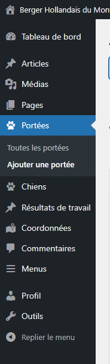
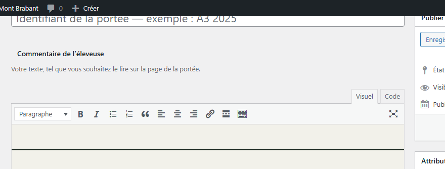
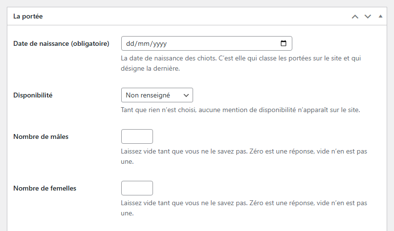
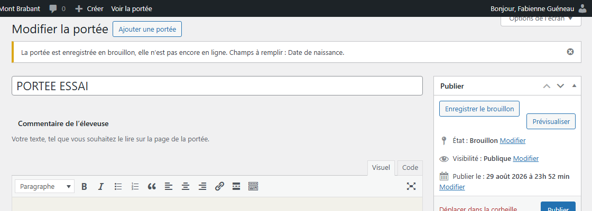
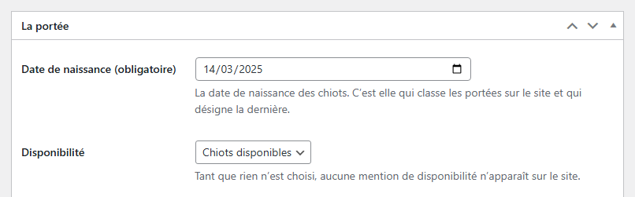
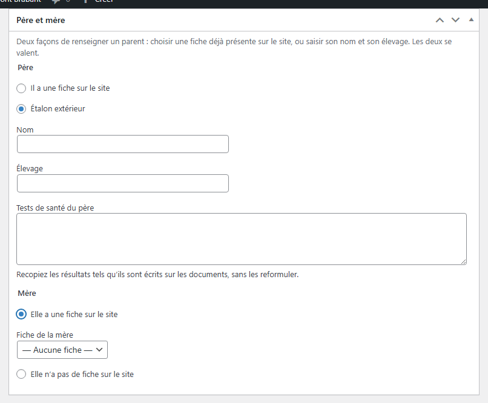
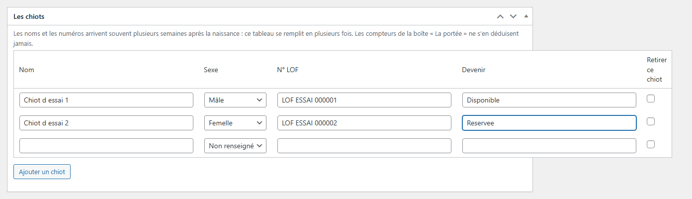
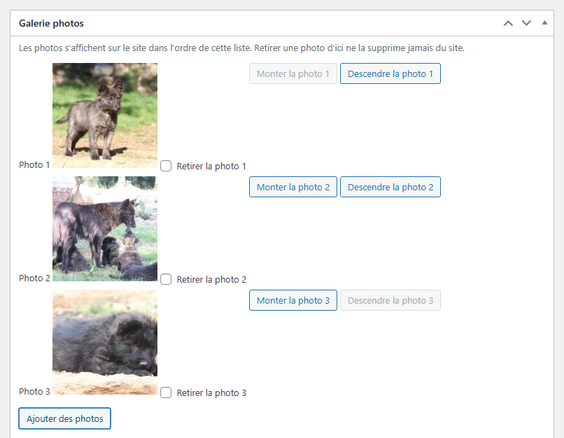

# Ajouter une portée

**Quand** : à la naissance des chiots, ou dès que vous voulez annoncer la portée.
**Temps** : 5 minutes pour l'essentiel. **Rattrapable** : oui. Tout se modifie ensuite, autant de fois
que vous voulez.

**Deux champs seulement sont obligatoires** : l'identifiant de la portée et la date de naissance. Tout
le reste attend — les noms des chiots, les numéros, les photos, la disponibilité. Un champ laissé vide
affiche **Non renseigné** sur le site : jamais un tiret, jamais un blanc, et jamais une valeur inventée
à votre place.

L'écran d'une portée n'est pas celui d'une page : il n'y a rien à composer, rien à mettre en forme,
juste des cases à remplir de haut en bas. **Les pages se composent, les fiches se remplissent.**

---

## Les étapes

1. Dans le menu de gauche, cliquez sur **Portées**, puis sur **Ajouter une portée**. La page qui
   s'ouvre porte ce même titre.

   

2. Tout en haut, dans le grand champ, tapez l'identifiant de la portée. Le texte gris vous rappelle ce
   qu'on y attend : « Identifiant de la portée — exemple : A3 2025 ». Ce que vous tapez là devient le
   titre de la portée et son adresse sur le site.

3. Sous ce champ, écrivez votre **Commentaire de l'éleveuse** : votre texte, tel que vous souhaitez le
   lire sur la page de la portée. Vous pouvez le laisser vide et y revenir plus tard.

   

4. Dans l'encadré **La portée**, remplissez **Date de naissance (obligatoire)**. Les trois autres
   champs de l'encadré peuvent attendre.

   

5. Descendez dans les encadrés suivants — **Père et mère**, **Les chiots**, **Galerie photos** — et
   remplissez seulement ce que vous avez sous la main.

6. Dans la colonne de droite, encadré **Photo principale**, cliquez sur
   **Choisir la photo principale** et prenez la photo qui représente la portée.

   

7. Cliquez sur **Publier**, en haut à droite. Le bandeau **Portée publiée.** s'affiche.

8. Lisez le message affiché en haut de la page après l'enregistrement : c'est là que le site vous dit
   ce qui manque ou ce qu'il n'a pas compris.

> Vous pouvez vous arrêter après l'étape 7 : la portée existe, elle est en ligne, et vous la reprendrez
> quand vous voudrez par **Portées** → **Toutes les portées** → son identifiant → **Mettre à jour**.

---

## Ce qui se met à jour tout seul

- **L'adresse de la portée sur le site** se compose toute seule à partir de l'identifiant.
- **Le classement des portées** se fait sur la date de naissance : c'est elle qui désigne la dernière
  portée. Vous n'avez aucun ordre à régler à la main.
- **Les tests de santé d'un parent qui a sa fiche sur le site ne se recopient jamais ici** : ils sont
  déjà sur sa fiche, et c'est cette fiche qui fait foi.

---

## Ce qui se passe si vous publiez sans avoir tout rempli

Rien n'est perdu, jamais.

| Situation | Ce que fait le site |
|---|---|
| Il manque un champ obligatoire, la portée n'était pas encore en ligne | Elle est enregistrée **en brouillon** : « La portée est enregistrée en brouillon, elle n'est pas encore en ligne. Champs à remplir : … » |
| Il manque un champ obligatoire, la portée était déjà en ligne | **Elle reste en ligne.** Le message dit : « La portée reste en ligne, mais tout n'est pas rempli. Champs à remplir : … » |
| Un autre identifiant identique existe déjà | La portée est enregistrée, avec l'avertissement « Une autre portée porte déjà l'identifiant « … ». Vérifiez qu'il ne s'agit pas d'un doublon. » |
| La date n'a pas été comprise | La date précédente est conservée, le message cite ce que vous aviez tapé et vous rappelle la notation jour/mois/année |

Une portée déjà en ligne n'est jamais retirée du site à cause d'un champ vide.

---

## L'encadré **La portée**

- **Date de naissance (obligatoire)** — la date de naissance des chiots. C'est elle qui classe les
  portées sur le site et qui désigne la dernière.
- **Disponibilité** — quatre lignes dans la liste : **Non renseigné**, **Chiots disponibles**,
  **Tous réservés**, **Portée passée**. Tant que rien n'est choisi, aucune mention de disponibilité
  n'apparaît sur le site.
- **Nombre de mâles** et **Nombre de femelles** — laissez vide tant que vous ne le savez pas.
  **Zéro est une réponse, vide n'en est pas une.**

---

## Changer une disponibilité

C'est la modification que vous ferez le plus souvent. Elle prend trente secondes.

1. Dans le menu de gauche, cliquez sur **Portées**, puis sur **Toutes les portées**.
2. Cliquez sur l'identifiant de la portée.
3. Dans l'encadré **La portée**, ouvrez la liste **Disponibilité** et choisissez :
   **Chiots disponibles**, **Tous réservés** ou **Portée passée**.
4. Cliquez sur **Mettre à jour**. Le bandeau **Portée mise à jour.** s'affiche.

Pour retirer toute mention de disponibilité, choisissez **Non renseigné** : le site n'affiche alors
plus rien à cette place.

**L'image ci-dessus montre la liste fermée, telle que vous la trouverez.** Quand vous cliquez dessus,
elle s'ouvre et propose quatre lignes, dans cet ordre : **Non renseigné**, **Chiots disponibles**,
**Tous réservés**, **Portée passée**. Il n'y a rien d'autre dedans, et rien à y taper.

---

## L'encadré **Père et mère**

Deux façons de renseigner un parent : choisir une fiche déjà présente sur le site, ou saisir son nom et
son élevage. **Les deux se valent.** La seconde est probablement la plus fréquente : beaucoup d'étalons
viennent d'autres élevages, et ils n'ont pas de fiche ici. Ne cherchez pas une fiche qui n'existe pas.

**Pour le père**, cochez :

- **Il a une fiche sur le site** — puis choisissez-la dans la liste **Fiche du père**. La liste s'ouvre
  sur **— Aucune fiche —**.
- **Étalon extérieur** — puis remplissez **Nom**, **Élevage** et **Tests de santé du père**.

**Pour la mère**, cochez :

- **Elle a une fiche sur le site** — puis choisissez-la dans la liste **Fiche de la mère**.
- **Elle n'a pas de fiche sur le site** — puis remplissez **Nom**, **Élevage** et
  **Tests de santé de la mère**.

**Les tests de santé ne se saisissent que pour un parent sans fiche.** Quand le parent a sa fiche sur le
site, ses tests y sont déjà : on ne les recopie pas ici.

Dans ces champs, **recopiez les résultats tels qu'ils sont écrits sur les documents, sans les
reformuler.** Le site ne corrige rien, ne reformate rien. Une valeur qui commence par un chevron passe
sans dommage.

Vous pouvez passer d'un chemin à l'autre autant de fois que vous voulez : ce que vous aviez saisi dans
l'autre chemin reste enregistré.

---

## L'encadré **Les chiots**

Un tableau à cinq colonnes : **Nom** · **Sexe** · **N° LOF** · **Devenir**, et **Retirer ce chiot**
en dernier. **Le tableau compte trois lignes**, remplies ou non ; le bouton **Ajouter un chiot** en
ajoute une de plus, autant de fois que vous voulez.

**Les noms et les numéros arrivent souvent plusieurs semaines après la naissance : ce tableau se
remplit en plusieurs fois.** Vous pouvez enregistrer une portée sans aucun chiot, puis ajouter les
lignes au fur et à mesure.

**Les compteurs de l'encadré La portée ne s'en déduisent jamais.** **Nombre de mâles** et
**Nombre de femelles** d'un côté, la liste des chiots de l'autre : ce sont deux choses séparées, et
c'est voulu. Vous connaissez les nombres le jour de la naissance ; les noms viennent bien plus tard.
Le site ne signalera jamais un écart entre les deux.

- **Sexe** — la liste s'ouvre sur **Non renseigné**, puis **Mâle** et **Femelle**. Rien n'est
  présélectionné.
- **N° LOF** — recopié tel quel, sans mise en forme, sans majuscules ajoutées.
- **Devenir** — écrivez-y ce que vous voulez.
- Une ligne dont les quatre cases restent vides est simplement ignorée à l'enregistrement.
- Pour retirer une ligne, cochez sa case dans la colonne **Retirer ce chiot**, puis cliquez sur
  **Mettre à jour**. Retirer une ligne du milieu ne décale rien.

---

## Les photos

Deux endroits, et deux seulement.

**Photo principale**, dans la colonne de droite : la photo qui représente la portée. Cliquez sur
**Choisir la photo principale** ; la fenêtre s'ouvre sur l'onglet **Téléverser des fichiers**, passez
sur l'onglet **Médiathèque** pour voir les photos déjà présentes ; cliquez sur la vôtre, puis sur
**Utiliser comme photo principale**, en bas à droite. **Retirer la photo principale** l'enlève.

**Galerie photos**, dans un encadré à part : toutes les autres photos de la portée.

1. Cliquez sur **Ajouter des photos**.
2. La fenêtre s'ouvre sur l'onglet **Téléverser des fichiers**. Si vos photos sont déjà sur le site,
   cliquez sur l'onglet **Médiathèque**, juste à côté, pour les voir. Cliquez ensuite sur une ou
   plusieurs photos.
3. Prenez trente secondes pour décrire chaque photo, dans la colonne de droite de cette fenêtre, dans
   le champ **Description de la photo (pour les personnes aveugles)** — c'est le premier des quatre,
   avant **Titre**, **Légende** et **Description**. Ce texte est **lu à voix haute** aux personnes
   aveugles qui visitent le site, et il s'affiche à la place de la photo quand celle-ci ne se charge
   pas. Écrivez ce que l'on voit : le chien de profil dans l'herbe, la portée dans son parc.
   N'écrivez rien dans le dernier des quatre, celui qui s'appelle **Description** tout court : il ne
   sert à rien ici. *Si ce premier champ porte un jour un autre nom, dites-le-nous — rien ne sera
   cassé, et c'est bien le bon champ en attendant.*
4. Cliquez sur **Ajouter des photos**, en bas à droite de la fenêtre — le bouton y porte le même nom
   que celui qui l'a ouverte. Les photos s'ajoutent en bas de la liste, sous les mentions **Photo 1**,
   **Photo 2**…
5. Rangez-les avec les boutons **Monter la photo 1** et **Descendre la photo 1**. Le chiffre suit la
   position de la photo dans la liste et se recalcule tout seul. Elles s'affichent sur le site dans
   l'ordre de cette liste.
6. Cliquez sur **Mettre à jour**.

**Retirer une photo ne la supprime jamais du site** : cochez sa case — **Retirer la photo 1** pour la
première, **Retirer la photo 2** pour la deuxième — puis **Mettre à jour**. La photo sort de la galerie
de cette portée et reste disponible pour la remettre ou pour l'employer ailleurs.

Si une ligne affiche **Photo introuvable**, la photo n'est plus disponible : cochez la case
**Retirer la photo 1** de cette ligne — le chiffre est celui de son rang —, puis ajoutez-en une autre.

### Les photos s'ajoutent dans **Galerie photos**

C'est le seul chemin, et c'est celui qui donne le bon résultat : une photo posée dans **Galerie photos**
garde le bon cadrage et la bonne taille partout sur le site, sur un grand écran comme sur un téléphone.
La barre d'outils du **Commentaire de l'éleveuse** ne propose donc pas d'y insérer une photo.

**Votre texte prend tout seul la mise en forme du site** : mêmes lettres, mêmes couleurs, même allure
que sur toutes les autres pages. Vous n'avez aucune couleur à choisir, ni pour le texte ni pour le fond.
**Le gras et l'italique, eux, fonctionnent toujours** : servez-vous-en autant que vous voulez.

---

## L'encadré **Adresse de la page**

Tout en bas de l'écran. C'est l'adresse de cette portée sur le site. Elle se remplit toute seule à
partir de l'identifiant ; **ne la modifiez que si l'adresse est fausse.** Laissée vide, elle se
réécrit toute seule au prochain enregistrement.

---

## En cas de doute

**Ce que vous pouvez faire sans risque :**

- Publier une portée à moitié remplie. Rien ne casse.
- Laisser un champ vide : le site écrit **Non renseigné** et passe à la suite.
- Revenir sur une portée autant de fois que vous voulez : **Portées** → **Toutes les portées** → son
  identifiant → **Mettre à jour**.
- Changer la disponibilité, les compteurs, le père, la mère, l'ordre des photos : rien n'est perdu.
- Retirer une portée du site : ouvrez-la et cliquez sur **Déplacer dans la corbeille**, dans l'encadré
  **Publier**. Elle disparaît aussitôt du site, et elle reste récupérable : vous la retrouvez dans
  **Corbeille**, en haut de la liste **Toutes les portées**.
- Ressortir une portée de la corbeille : cliquez sur **Restaurer**, tout revient — les champs, les
  chiots, les photos. La portée revient **en brouillon** : ouvrez-la et cliquez sur **Publier** pour
  qu'elle réapparaisse sur le site.
- Corriger l'identifiant après publication, puis corriger l'adresse dans **Adresse de la page** si
  elle ne vous convient plus.

**Ce qui n'a aucune importance :**

- L'ordre dans lequel vous remplissez les encadrés.
- Un écart entre les compteurs et le nombre de lignes de chiots.
- Les lignes de chiots restées vides.

**Ce qu'il vaut mieux ne pas faire :**

- **Ne recopiez jamais une portée précédente.** Chaque portée s'ajoute par **Portées** →
  **Ajouter une portée**.
- **N'inventez jamais une date, un numéro ni un résultat** pour ne pas laisser un vide. Un vide honnête
  vaut mieux qu'une valeur fausse, qui finira recopiée ailleurs.
- **Ne videz pas une ligne de chiot déjà remplie pour « faire de la place ».** Corrigez-la, ou ajoutez
  une ligne avec **Ajouter un chiot** : une ligne retirée se retape entièrement.

**Trois choses normales, qui peuvent surprendre :**

- La liste **Fiche du père** ou **Fiche de la mère** ne propose rien et affiche
  « Aucune fiche de chien n'est encore enregistrée. » : il n'y a pas encore de fiche de chien sur le
  site. Saisissez le parent avec **Nom** et **Élevage**.
- Une ligne de la liste affiche **Fiche introuvable** : la fiche choisie n'est plus là. Le site vous le
  dit et ne l'efface pas tout seul. Choisissez une autre fiche, ou saisissez le parent avec **Nom** et
  **Élevage**.

**Pour retrouver une portée.** La liste **Toutes les portées** affiche une colonne **Date de
naissance** et une colonne **Disponibilité**, elle se range de la portée la plus récente à la plus
ancienne, et elle porte un filtre par année. La recherche en haut de la liste reste là et reste
pratique pour un identifiant précis. Voir
[Retrouver un contenu dans vos listes](listes-retrouver-un-contenu.md), qui explique aussi comment
**changer la disponibilité de plusieurs portées d'un coup**, sans en ouvrir une seule.

**Si quelque chose vous inquiète** : ne supprimez rien, notez l'identifiant de la portée et l'heure, et
appelez-nous. Une portée mal remplie n'a jamais cassé un site.

---

## Des portées que vous n'avez pas saisies, dans « Toutes les portées »

En ouvrant **Portées** → **Toutes les portées**, vous verrez peut-être **quelques portées que vous
n'avez pas créées**. Ce sont des **exemples de test**, posés là pour vérifier que les écrans
s'affichent bien. **Elles ne viennent pas de votre élevage et elles disparaîtront** quand le site
sera installé pour de vrai.

**Ne les supprimez pas vous-même** : c'est notre affaire, pas la vôtre.

**Comment les reconnaître.** Ici, c'est visible dès la liste : leur identifiant **commence par
`DEMO`** — là où les vôtres commencent par une lettre suivie de l'année, comme `M 2016` ou `A3 2025`.

En cas de doute sur une portée, **laissez-la et signalez-la** — c'est toujours la bonne réponse.
